# Testing Mediational Models With Longitudinal Data: Questions and Tips in the Use of Structural Equation Modeling

David A. Cole Vanderbilt University

Scott E. Maxwell University of Notre Dame

R. M. Baron and D. A. Kenny (1986) provided clarion conceptual and methodological guidelines for testing mediational models with cross-sectional data. Graduating from cross-sectional to longitudinal designs enables researchers to make more rigorous inferences about the causal relations implied by such models. In this transition, misconceptions and erroneous assumptions are the norm. First, we describe some of the questions that arise (and misconceptions that sometimes emerge) in longitudinal tests of mediational models. We also provide a collection of tips for structural equation modeling (SEM) of mediational processes. Finally, we suggest a series of 5 steps when using SEM to test mediational processes in longitudinal designs: testing the measurement model, testing for added components, testing for omitted paths, testing the stationarity assumption, and estimating the mediational effects.

Tests of mediational models have been an integral component of research in the behavioral sciences for decades. Perhaps the prototypical example of mediation was Woodsworth's (1928) S-O-R model, which suggested that active organismic processes are responsible for the connection between stimulus and response. Since then, propositions about mechanisms of action have pervaded the social sciences. Psychopathology theory and research are no exceptions. For example, Kanner, Coyne, Schaeffer, and Lazarus (1981) proposed that minor life events or hassles mediate the effect of major negative life events on physical and psychological illness. A second example was the proposition that norepinephrine depletion mediates the relation between inescapable shock and learned helplessness (e.g., Anisman, Suissa, & Sklar, 1980; cf. Seligman & Maier, 1967). A third example is the drug gateway model, which suggested that the connection between initial legal drug use and hard drug use is mediated by regular legal drug use and exposure to a drug subculture (Ellickson, Hays, & Bell, 1992). A fourth example involves an elaboration of the transgenerational model of child maltreatment, positing that parents who were abused as children are more likely to abuse their own children because of the parents' unmet needs and unrealistic expectations (Steele & Pollack, 1968; Twentyman & Plotkin, 1982). The list goes on.

In all of these examples, a mediator is a mechanism of action, a vehicle whereby a putative cause has its putative effect. The causal chain that must pertain for a variable to be a mediator is most easily described with the aid of path diagrams. For cross-sectional data, Model 1 (in Figure 1) depicts the hypothetical situation in which the mediator variable M at least partially explains the causal relation between the exogenous variable X and the outcome variable Y. As such, M is endogenous relative to X, but exogenous relative to Y. This path diagram is a pictorial representation of two related regression equations. When X, M, and Y are standardized, these equations are Mt a-Xt eM and Yt b-Mt c-Xt eY, where all data are collected at the same time (t). Path coefficients a-, b-, and c are standardized regression weights. (We use primes after the path coefficients to indicate that they derive from a cross-sectional research design and to distinguish them from a, b, and c, which are their counterparts in longitudinal designs.) Finally, eM and eY are the residuals (i.e., that part of M and X not explained by their respective sets of upstream variables).1

In path analysis, we commonly refer to three types of effects: total effects, direct effects, and indirect effects. The total effect is the degree to which a change in an upstream (exogenous) variable such as X has an effect on a downstream (endogenous) variable such as Y. A direct effect is the degree to which a change in an upstream (exogenous) variable produces a change in a downstream (endogenous) variable without "going through" any other variable. Thus the direct effect of X on M is represented by Path Coefficient a-; the direct effect of M on Y is Path b-; and the direct effect of X on Y is Path c-. An indirect effect is the degree to which a change in an exogenous variable produces a change in an endogenous variable by means of an intervening variable. In Model 1, X has an indirect effect on Y through M. Given that the variables are standardized, the indirect effect of X on Y through M is equal to the product of associated paths, ab-. In the current example, there

David A. Cole, Psychology and Human Development, Vanderbilt University; Scott E. Maxwell, Psychology Department, University of Notre Dame.

Correspondence concerning this article should be addressed to David A. Cole, 315 Hobbs Building, Box 512, Peabody College, Psychology Department, Vanderbilt University, Nashville, Tennessee 37203. E-mail: david.cole@vanderbilt.edu

1 For heuristic purposes, we have frequently used examples in which the measures are standardized. In general, investigators should use unstandardized variables when conducting structural equation modeling (Tomarken & Waller, 2003). This is especially true when one is testing the equality of various parameters, as occurs when testing the stationarity assumption.

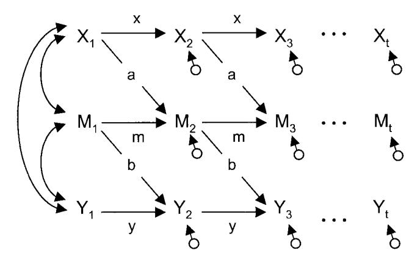

*Figure 1.* Path diagrams of cross-sectional and longitudinal models of mediation. Subscripts denote the time or wave at which a given measure was obtained.

is only one indirect effect; however, if there were more than one route (or tracing) through intervening variables, the overall indirect effect would equal the sum of the product terms representing each of the tracings (see Kenny, 1979, for an excellent review of the tracing rules in path analysis). Finally, the total effect is simply the overall effect that an exogenous variable has on an endogenous variable whether or not the effect runs through an intervening variable. The total effect equals the direct effect plus all indirect effects. In Model 1 the total effect of X on M equals c- ab-.

According to Kenny et al. (Baron & Kenny, 1986; Judd & Kenny, 1981; Kenny, Kashy, & Bolger, 1998; see also MacKinnon & Dwyer, 1993), a variable serves as a mediator under the following conditions. First, X has a direct effect on M (i.e., a- 0). Second, M has a direct effect on Y, controlling for X (i.e., b- 0). Third, if M completely mediates the X-Y relation, the direct effect of X on Y (controlling for M) must approach zero (i.e., c- 3 0). Alternatively, if M only partially mediates the relation, c may not approach zero. Nevertheless, an indirect effect of X on Y through M must be present (i.e., ab- 0). In the social science, c never completely disappears, leading MacKinnon and Dwyer (1993) to recommend computing the proportion of the total effect that is explained by the mediator (in this case, ab-/(c- ab-).2

These formulations and their associated statistical tests (Baron & Kenny, 1986; Sobel, 1982) have been enormously helpful in guiding researchers who study mediational models. These procedures are limited, however, in that they do not provide explicit extensions to longitudinal designs. This is unfortunate, in that mediation is a causal chain involving at least two causal relations (e.g., X 3 M and M 3 Y), and a fundamental requirement for one variable to cause another is that the cause must precede the outcome in time (Holland, 1986; Hume, 1978; Sobel, 1990).

Inferences about causation (and hence mediation) that derive from cross-sectional data teeter on (often fallacious) assumptions about stability, nonspuriousness, and stationarity (Kenny, 1979; Sobel, 1990). We submit that without clear methodological guidelines for longitudinal tests of mediational hypotheses, problematic procedures will emerge and potentially erroneous conclusions will be drawn. Consequently, the goals of the current article are to review some of the more common problems, to highlight some of the possible consequences, and to propose a procedure that extends Kenny et al.'s cross-sectional methodology to the longitudinal case.

In this article, we limit ourselves to the examination of changes in individual differences over time. Thus our focus is on traditional regression-based designs (following in the Baron & Kenny, 1986, tradition) in general, and on linear relations in particular. We acknowledge alternative conceptualizations that focus on latent growth curves (Curran & Hussong, 2003; Rogosa & Willett, 1985) and individual differences in change (Bryk & Raudenbush, 1992). For an example, see Chassin, Curran, Hussong, and Colder's (1996) study on the effect of parent alcoholism on growth curves in adolescent substance use. We also acknowledge longitudinal models that combine latent state and latent trait variables, as described by Kenny and Zautra (1995) and by Windle and Dumenci (1998). Finally, we note the importance of randomized experimental designs in testing mediational and other causal relations. In the current article, however, our focus is on observational data, such as might be gathered when the actual manipulation of variables is impractical or unethical.

#### Some Common Questions

In our review of the clinical and psychopathology literatures, we found a substantial number of studies that purport to test mediational models with longitudinal data. Interestingly, we found almost as many methods as articles and almost as many problems as methods. In this section, we highlight some of the more common questions and problems that arise. Our goal is not to cast aspersions on particular research groups; rather, we seek to provide better guidelines for future research. (Indeed, some of our own studies exemplify one of the problem areas.) In fact, we found no study that avoided all of the potential pitfalls.

Here we use three ostensibly similar terms that refer to different types of change over time: stability, stationarity, and equilibrium. First, Kenny (1979) stated that *stability* "refers to unchanging

2 Shrout and Bolger (2002) point out that c can be negative, in which case the proportion can exceed 1.0, either in a sample or in the population. Previous work by MacKinnon, Warsi, and Dwyer (1995) suggests that quite large samples (e.g., 500) are often needed to obtain estimates of this proportion with acceptably small standard errors.

levels of a variable over time" (pp. 231–232). For example, children's vertical physical growth ceases at about age 20, at which point the variable height exhibits stability. Second, Kenny noted that stationarity "refers to an unchanging causal structure" (p. 232). In other words, stationarity implies that the degree to which one set of variables produces change in another set remains the same over time. For example, if nutrition were more important for physical growth at some ages than at others, the causal structure would not exhibit stationarity. Researchers interested in causal modeling often assume stationarity; however, we should note that changes in causal relations over time can have substantive implications in their own right. Third, Dwyer (1983) stated that equilibrium refers to a causal system that displays "temporal stability (or constancy) of patterns of covariance and variance" (p. 353). In the previous example, the system is at equilibrium when the cross-sectional variances and covariance (and thus the correlation) of nutrition and physical growth are the same at every point in time.3

Somewhat surprisingly, a system that exhibits stationarity is not necessarily at equilibrium. For example, in Figure 2 the reciprocal effects between X and Y have just begun. (Note that there is no Time 1 correlation.) Nevertheless, the system instantly manifests stationarity, in that the magnitudes of the causal paths are identical at every lag. Nevertheless, the system is not at equilibrium during the early waves, because the within-wave correlation continues to increase. At about Wave 5, we see that the within-wave correlation converges at a relatively constant value, .40, from which it will never change (unless there is a change in the causal parameters). At this point, the system has reached equilibrium.4

### Question 1: What Do Cross-Sectional Studies Tell Us About Longitudinal Effects?

We might all agree that longitudinal designs enable us to test for mediation effects in a more rigorous manner than do cross-sectional designs; however, most of us would like to think that cross-sectional evidence of mediation surely tells us something about the longitudinal case. In fact, cross-sectional designs are often used to justify the added time and expense of longitudinal studies. In reality, testing mediational hypotheses with cross-sectional data will be accurate only under fairly restrictive conditions. Furthermore, estimating mediational effect sizes will only be accurate under even more restrictive circumstances. When these conditions do not pertain, cross-sectional studies provide biased and potentially very misleading estimates of mediational processes (see Gollob & Reichardt, 1985).

Let us imagine the longitudinal variable system depicted by Model 2 in Figure 1. In this model, X at time t is a function only of X at time t -1 and error:  $X_t = xX_{t-1} + \varepsilon_{Xt}$ . The mediator M is a function of prior M and prior X:  $M_t = mM_{t-1} + aX_{t-1} + \varepsilon_{Mt}$ . Similarly, the outcome Y is a function of prior Y and prior M:  $Y_t = yY_{t-1} + bM_{t-1} + \varepsilon_{Yt}$ . Thus, Path a represents the effect of  $X_{t-1}$  on  $M_t$ , controlling for  $M_{t-1}$ . Likewise, Path b represents the effect of  $M_{t-1}$  on  $Y_t$ , controlling for  $Y_{t-1}$ . As there is no direct effect of X on Y, M completely mediates the  $X \to Y$  relation. In this model, we assume that two simplifying conditions pertain: (1) The processes are stationary (i.e., the causal parameters are constant for all time intervals of equal duration), and (2) the system

has reached equilibrium (i.e., the cross-sectional variances and covariances of  $X_t$ ,  $M_t$ , and  $Y_t$  are constant for all values of t).

Now let us imagine that we have data only at time t. In other words, we have three cross-sectional correlations with which to address the mediational hypothesis. The critical question is: When complete longitudinal mediation truly exists (as in Model 2), can we ever expect cross-sectional data to show that M completely mediates the relation between X and Y? Complete cross-sectional mediation occurs when c' = 0 in Model 1, in which case  $\rho_{xy}$ equals a'b', which implies that  $\rho_{XY} = \rho_{XM} \rho_{MY}$ . If complete longitudinal mediation truly exists and the system has reached equilibrium, the equation for complete cross-sectional mediation (i.e.,  $\rho_{XY} = \rho_{XM} \rho_{MY}$ ) holds under only three circumstances: (1) the trivial case when a = 0 or b = 0, (2) the unlikely case when x = 0, or (3) the peculiar case when X and M are equally stable over time (i.e.,  $\rho_{XtXt-1} = \rho_{MtMt-1}$ ). (Proof of these conditions is available from the first author upon request.) Under all other circumstances, the XY correlation will not be explained by the XM and MY correlations, even when M completely mediates the X-Y relation in Model 2.

Even when these (very) special conditions do hold, there is no guarantee that the cross-sectional paths a' and b' will accurately represent their longitudinal counterparts, a and b. Given the same assumptions described above, a' will equal a and b' will equal b only when m = y = (1 - x)/x. (Proof of these conditions is also available from the first author upon request.) To show how limiting this condition is, we graphed this function in Figure 3. Only when the values of x, m, and y fall exactly on the plotted line will a' = a and b' = b. When the values for x, m, and y fall above the line in the vertically shaded area, the cross-sectional correlations will overestimate the longitudinal effects a and b. When the values for x, m, and y fall below the line in the horizontally shaded area, the cross-sectional correlations will underestimate Paths a and b. In sum, the conditions under which cross-sectional data accurately reflect longitudinal mediational effects would seem to be highly restrictive and exceedingly rare.5

An important aside. Simply allowing a time lag between the predictor and the outcome is not sufficient to make a' and b' unbiased estimates of a and b, respectively. One of the most important potential benefits of longitudinal designs is the opportunity to control for an almost ubiquitous "third variable" confound, prior levels of the dependent variable (Gollob & Reichardt, 1991). When predicting a dependent variable at time t from an independent variable at time t-1, we cannot use regression to infer causation if there are any unmeasured and uncontrolled exogenous variables that correlate with the predictor variable and cause the dependent variable. In most longitudinal designs, prior levels of the dependent variable (at time t-1) represent such a

&lt;sup>3 In the time-series literature, these three concepts are combined under a single term, "stationarity," referring to constancy of means, causal processes, and variances—covariances over time.

&lt;sup>4 It is also possible for a nonstationary system to be in equilibrium, although such processes are more difficult to exemplify.

&lt;sup>5 Gollob and Reichardt (1991) described a creative longitudinal model that can be tested with cross-sectional data (see Question 5). Their approach nicely forces the investigator to make explicit a rather large number of assumptions.

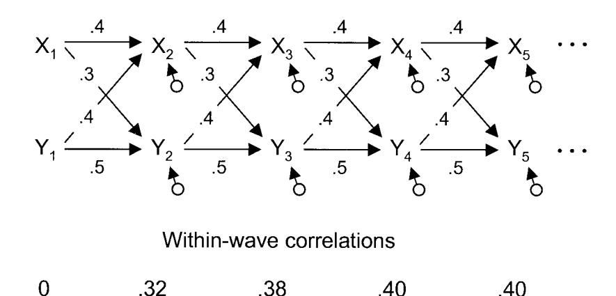

Figure 2. Example of how stationarity produces equilibrium over time. Subscripts denote the time or wave at which a given measure was obtained.

variable. Without controlling for such potential confounds, we will obtain spuriously inflated estimates of the causal path of interest. In mediational models,  $M_{t-1}$  must be controlled when predicting  $M_{t}$ , and  $Y_{t-1}$  must be controlled when predicting  $Y_{t}$ .

Modeling tip. Structural equation modeling (SEM) cannot atone for shortcomings in the research design. To make the kinds of causal inferences implied by a mediational model, the researcher should collect data in a fashion that allows time to elapse between the theoretical cause and its anticipated effect. Ideally, the researcher will collect data on the cause, the mediator, and the effect at each of these time points (or waves). Such data allow the investigator to implement statistical controls for prior levels of the dependent variables using SEM.

# Question 2: When Is a "Third Variable" Really a Mediator?

The discovery that some third variable, Z, statistically explains the relation between X and Y is not sufficient to make it a mediator. The mere fact that a nonzero correlation between X and Y goes to zero when some variable Z is covaried does not mean that Z "mediates" the  $X \rightarrow Y$  relation. In Models 3 and 4, controlling for Z can completely eliminate the direct effect of X on Y, but in neither situation does Z act as a mediator (see Figure 4). Sobel (1990) pointed out that a

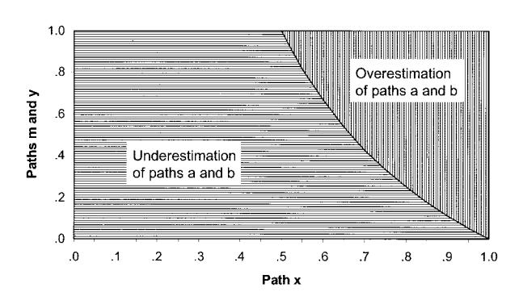

Figure 3. Values for Paths m, x, and y for which cross-sectional estimates a' and b' over- or underestimate longitudinal Path Coefficients a and b. Longitudinal models of X causing M and of M causing Y.

mediator must satisfy at least two additional requirements: Z must truly be a dependent variable relative to X, which implies that X must precede Y in time; and Z must truly be an independent variable relative to Y, implying that Z precedes Y in time.

A mediator cannot be concurrent with X. Time must elapse for one variable to have an effect on another. Disentangling the effects of concurrent, correlated predictors is an important enterprise, but it does not represent a test of a mediational model. Such situations frequently arise in comorbidity research. For example, Jolly et al. (1994) attempted to disentangle the effects of depression and anxiety on adolescent somatic complaints. In a series of regressions, they noted that the relation between depression and somatic symptoms was nonsignificant after controlling for anxiety. Concluding that anxiety "mediated" the relation between depression and somatic complaints, Jolly et al. interpret their results in light of the tripartite model of negative affectivity (e.g., Watson & Clark, 1984). We argue that the use of the term "mediation" is misleading here because it implies that depression causes anxiety, a stipulation that is neither made by the tripartite model nor supported by the data. The actual situation is represented by Model 4 (see Figure 4), in which the apparent relation between depression (X) and somatic symptoms (Y) is spurious. Anxiety (Z), which is correlated with X, is the actual cause of Y.

The timing of the measure may be different than the timing of the construct. The distinction between the measurement of the constructs and the constructs themselves is absolutely critical. Sometimes researchers appear to assume that measuring X before Y somehow makes it true that the construct X actually precedes Y in time. In many cases, the measure of Y (or M) actually assesses a condition that began long before the occurrence of X. For example, McGuigan, Vuchinich, and Pratt (2000) examined the degree to which parental attitudes about their infant (M) mediated the relation between spousal abuse (X) and child maltreatment (Y). Because they assessed risk for child maltreatment 6 months after they assessed parental attitudes, they concluded that child abuse must be a consequence of parental attitudes, not a cause (p. 615). The

&lt;sup>6 Indeed, some research actually suggests the reverse may be true (Cole, Peeke, Martin, Truglio, & Seroczynski, 1997; Brady & Kendall, 1992).

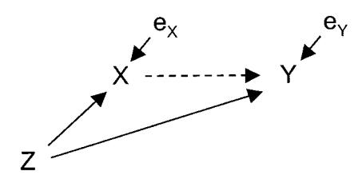

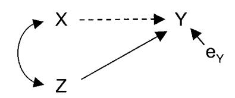

*Figure 4.* Nonmediational models in which the apparent X 3 Y effect is spurious.

trouble is that their measure of Y (child abuse risk) included some potentially very stable factors such as the parents' social support network and the stability of the home environment. In other words, their measure of Y may have tapped into a construct that predated both X and M.

*Modeling tip.* The causal ordering of X and M cannot be determined using cross-sectional data. Models 1, 3, and 4 cannot be empirically distinguished from one another. (Technically speaking, they are all just-identified.) In all three models, the apparent relation between X and Y is explained (to the same extent) by the third variable. Although these models are conceptually very different, they are mathematically equivalent to one another. In the context of a longitudinal design, however, such models are not equivalent. Indeed, tests are possible that at least begin to distinguish among them. For example, the causal effects (a, b, and c) that are implied by mediation are represented by longitudinal Model 5 in Figure 5, whereas alternative causal processes (Paths d, e, and f) can be represented by Model 6 (see Figure 5). Although these models are not hierarchically related to each other, they are nested under the fuller Model 7 (see Figure 5). The comparison of Models 6 and 7 tests the significance of Paths a, b, and c. The comparison of Models 5 and 7 tests the significance of Paths d, e, and f. Such comparisons help clarify causal order and to identify concurrent causal processes in which the mediational model of interest may be imbedded. (Later we present a more general framework for model comparisons, which allows for the testing and estimation of an even wider variety of effects.)

*Question 3: What Are the Strengths and Weaknesses of the "Half-Longitudinal" Design?*

Many longitudinal studies rigorously test the prospective relation between M and Y, but examine only the contemporaneous relation between X and M. This is one manifestation of what we call a "half-longitudinal design." For example, Tein, Sandler, and Zautra (2000) examined the capacity of psychological distress to mediate the effect of undesirable life events on various parenting behaviors. The study has much to commend it, including the control for prior parenting behavior and the rigorous examination of indirect effects. A weak point, however, is that the measures of negative life events (X) and perceived distress (M) were obtained concurrently. Consequently, in the assessment of the X 3 M relation, prior levels of M could not be controlled. In cases such as this, the effect of X on M will be biased, in part because X and M coincide in time and in part because prior levels of M were not controlled. Indeed, the nature of this bias is identical to that depicted in Figure 3.

Another manifestation of the "half-longitudinal design" tests the prospective relation between X and M, but examines only the contemporaneous relation between M and Y. Measures of M and Y are obtained concurrently. In one of our own studies (Cole, Martin, & Powers, 1997), we hypothesized that self-perceived competence (M) mediated the relation between appraisals by others (X) and the emergence of children's depressive symptoms (Y). Testing the effect of others' appraisals (X) on self-perceived competence (M) was longitudinal and rigorous, but the examination of the relation between self-perceived competence (M) and depression (Y) was cross sectional. The mediator and the outcome variable were measured at the same time. In such cases (even though prior depression was statistically controlled), the estimate of the effect of M on Y will be biased.

*Modeling tip.* When the design has only two waves, all is not lost. Let us assume that X, M, and Y are measured at both times, as in the first two waves of Model 5 (in Figure 5). In such designs, we recommend a pair of longitudinal tests: (1) estimate Path a in the regression of M2 onto X1 controlling for M1 and (2) estimate Path b in the regression of Y2 onto M1 controlling for Y1. If we can assume stationarity, Path b between M1 and Y2 would be equal to Path b between M2 and Y3. Under this assumption, the Product ab provides an estimate of the mediational effect of X on Y through M. We submit that this approach is superior to the biased approaches typically applied to the half-longitudinal design.7 Nev-

7 Collins, Graham, and Flaherty (1998) stated that three waves are necessary to test mediation. However, they are dealing with transitions from one stage (category) to another, such as in stages of smoking. They essentially assume that the X variable influences M at the same time for everyone, and then at some later time M influences Y. They argued that three waves are needed, because a pair of waves is needed to assess the X to M influence, and a separate pair of waves is needed to influence the M to Y relationship. This is sensible given their initial assumption that X starts the causal chain at the same time for everyone, such as in a randomized treatment design. Our perspective is more general in that we focus on ongoing process, whereas they assume that the process has not yet begun until X has been measured. As a consequence, a second wave is needed to observe the effect of X on M and then a third wave to observe the effect of M on Y.

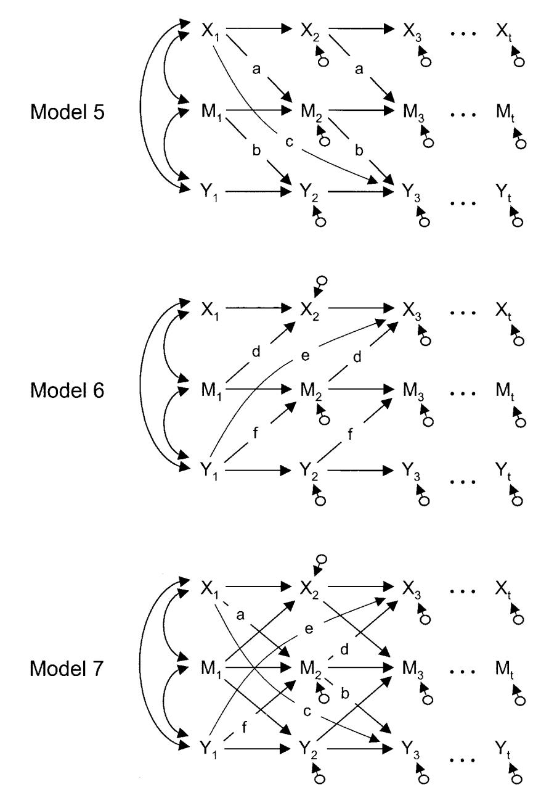

*Figure 5.* Longitudinal models for testing causal order. Subscripts denote the time or wave at which a given measure was obtained.

ertheless, two shortcomings do emerge. First, although we can estimate ab, we cannot directly test the significance of Path c. In other words, we can test whether M is a partial mediator, but we cannot test whether M completely mediates the X-Y relation. Second, the stationarity assumption may not hold. If the mediation assumption is false, the ab estimate will be biased. And without at least three waves of data, the stationarity assumption cannot be tested. Despite these shortcomings, we suspect that failing to control for prior levels of the dependent variables typically creates much greater problems than does failing to take into account violations of stationarity.

## *Question 4: How Important Is the Timing of the Assessments?*

In other disciplines (e.g., biology, chemistry, physics), researchers engage in substantial pilot research designed to assess the optimal time interval between assessments. In the social sciences, the timing of assessments seems to be determined more by convenience or tradition than by theory or careful research.

How the timing of assessments affects mediational research depends on the nature of the underlying causal relation. For the purposes of this discussion, we make two assumptions. First, we assume that a certain time interval (I) must elapse for one variable to have an effect on another. This implies that the causal relation will not be evident when the assessment interval is less than I. Second, for a specific causal relation (e.g.,  $X \to M$  or  $M \to Y$ ), we assume that the causal effect is the same for all such time intervals throughout the duration of the study (although the interval for one causal relation,  $I_{XM}$ , need not be the same for another,  $I_{MY}$ ). In other words, the processes are stationary. These assumptions may not be appropriate for certain kinds of causal relations. Nevertheless, they are the assumptions that underlie most regression-based studies of causal modeling.

Under these assumptions, a rather counterintuitive situation arises: The assessment time interval that maximizes the magnitude of a simple causal relation (e.g.,  $X \rightarrow M$  or  $M \rightarrow Y$ ) is not typically the proper interval for estimating the mediational relation,  $X \rightarrow M$  $\rightarrow$  Y, even when  $I_{XM} = I_{MY} = I$ . Furthermore, use of intervals other than IXM and IMY can seriously affect the estimation of mediational relations. To see how this is true, consider the models depicted in Figure 6. In the first case (in the upper panel), the interassessment time interval is exactly I, and the estimated effect of X on M is represented by  $X_1 \rightarrow M_2$  (and  $X_2 \rightarrow M_3$ ,  $X_3 \rightarrow M_4$ , etc.), which is exactly a. In the second case (middle panel of Figure 6), the interval is twice as long (2I). Consequently, the researcher cannot assess  $X_1 \rightarrow M_2$  (one lag), but is compelled to evaluate two-lag relations (e.g.,  $X_1 \rightarrow M_3$ ). At first glance, this relation appears to be a single tracing; however, from the upper panel of Figure 6, we see that it actually consists of two tracings: am and ax. Hence, the  $X_1 \rightarrow M_3$  relation is equal to am + ax. In the third case, the interval is 3I, and the causal effect  $X_1 \rightarrow M_4$  becomes even more complex,  $am^2 + amx + ax^2$ , as shown in the lower panel of Figure 6. In general, the estimated causal effect of X on M will equal

$$a\left(\sum_{i=1}^{T} m^{i-1}x^{T-i}\right),\,$$

where T is the number of time points in the study.

The practical effect of timing can be remarkable. For example, let us assume that the top panel of Figure 6 is the correct model. In that model, we let the causal effect a = .2. To simplify the math, we also let x = m. In Figure 7, we consider the effect of increasing the time lag between assessments (from 1I to 10I) on our estimate of the  $X \rightarrow M$  relation. In Figure 7, we see that the effect of timing on these estimates varies as a function of x (and m). The time interval that yields the largest  $X \rightarrow M$  effect might be 1I, 2I, 3I, 4I, or 10I, depending on the stability of X and M.8 For example, when x = m = .2, the maximum effect of X on M is found for a time interval of 1I; however, when X and M are more stable (.8), the maximum effect is not found until the time interval is four or five times longer! We hasten to add that we do not mean to imply that the interval that maximizes the effect is the "correct" interval and that all other intervals are incorrect. Instead, our intent is simply to demonstrate that the magnitude of the effect can vary greatly depending on the chosen interval. For this reason, researchers would often be well advised to report such effects for a variety of

When estimating mediational effects, however, the proper interval between assessments is always 1I. Gollob and Reichardt (1991) showed that estimates of mediational effects are almost

always wrong when intervals larger than 1I are used. To demonstrate this, let us consider the upper panel of Figure 8, which contains a three-variable extension of Figure 6. In Figure 8, the five-wave model represents a completely mediational model in which assessments occur at intervals of 11. The mediational effect from X1 to M2 to Y3 is simply ab; however, this is probably not the effect of greatest interest, especially if the researchers took the pains to continue the study for two more waves. Gollob and Reichardt defined this time-specific indirect effect as the degree to which M at exactly Time 2 mediates the effect of X at exactly Time 1 on Y at exactly Time 3. Most researchers would suggest, however, that mediation does not occur at a discrete point in time but unfolds over the course of the study. Therefore, most researchers will be more interested in the degree to which M at any time between Wave 1 and Wave 5 mediates the effect of X1 on Y5. Gollob and Reichardt dubbed this the overall indirect effect. The concept of *overall effects* is critical in longitudinal designs, and yet this methodology remains conspicuously underutilized in mediational studies. For these reasons, we digress to reintroduce Gollob and Reichardt's terms and to describe their calculation in the Appendix.

In the five-variable case of Figure 8, we see that the overall indirect effect consists of six time-specific effects,

1. 
$$X1 \rightarrow X2 \rightarrow X3 \rightarrow M4 \rightarrow Y5$$
 (abx2)

$$2. \ X1 \ \rightarrow \ X2 \ \rightarrow \ M3 \ \rightarrow \ Y4 \ \rightarrow \ Y5 \quad (abxy)$$

3. 
$$X1 \rightarrow X2 \rightarrow M3 \rightarrow M4 \rightarrow Y5$$
 (abmx)

4. 
$$X1 \rightarrow M2 \rightarrow M3 \rightarrow M4 \rightarrow Y5 \text{ (abm}^2)$$

5. 
$$X1 \rightarrow M2 \rightarrow M3 \rightarrow Y4 \rightarrow Y5$$
 (abmy)

6. 
$$X1 \rightarrow M2 \rightarrow Y3 \rightarrow Y4 \rightarrow Y5$$
 (aby2),

which must be summed:

$$abx^{2} + abxy + abmx + abm^{2} + abmy + aby^{2}$$
  
=  $ab(x^{2} + xy + mx + m^{2} + my + y^{2})$ . (1)

In other words, the *overall indirect effect* of  $X_1 \rightarrow Y_5$  will be  $ab(x^2 + xy + mx + m^2 + my + y^2)$  when the assessment interval is 1I.

The three-wave model (in the lower panel of Figure 8) represents the same variables, assessed at intervals that are twice as long as those in the five-wave model (i.e., 2I, not 1I). Our estimation of the overall indirect effect in this design is the product of the X1  $\rightarrow$  M3 path (am + as) and the M3  $\rightarrow$  Y5 path (bm + by). Multiplying the terms reveals that

$$(am + ax)(bm + by) = abm^2 + abmx + abmy + abxy$$
  
=  $ab(m^2 + xy + mx + my)$ . (2)

In other words, our estimate of the *overall indirect effect* of  $X_1 \rightarrow Y_5$  will be  $ab(m^2 + xy + mx + my)$  when the assessment interval is 21

Comparing Equation 1 to Equation 2, we see that they are identical in the unlikely case in which  $x^2 = y^2 = 0$  and in the

&lt;sup>8 We should note that the optimal time interval between assessments is not necessarily the same as the overall duration of the study. The overall duration should reflect the time period of theoretical interest and may consist of multiple iterations of the optimal assessment interval.

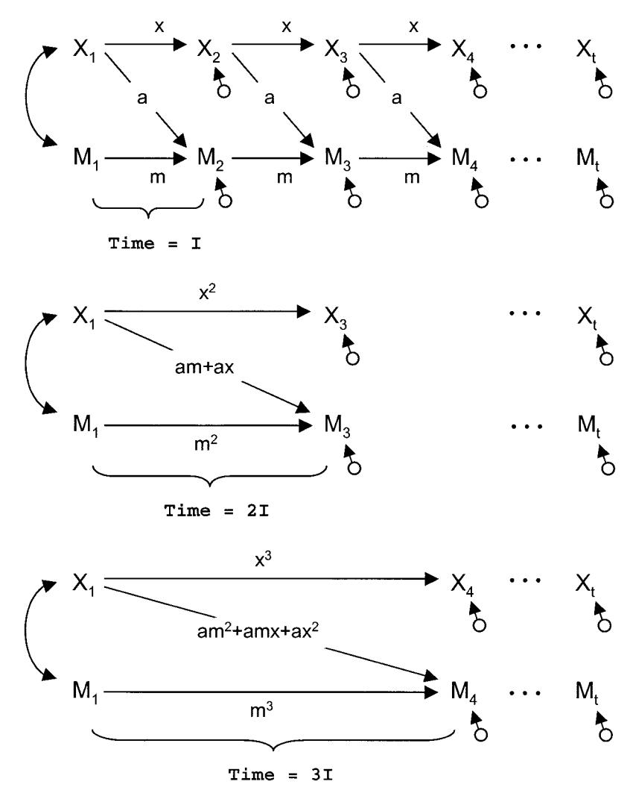

*Figure 6.* Models depicting the effects of interwave time interval on the estimation of causal parameters. Subscripts denote the time or wave at which a given measure was obtained. I interval.

trivial case in which ab 0. In summary, when the assessment interval is longer than 1t, the calculation of the overall indirect (or mediational) effect will misrepresent the true overall indirect effect to the extent that x and y are nonzero. Only by assessing X, M, and Y at intervals of 1t (no longer and no shorter) can we obtain accurate estimates of the mediational effect of interest.

*A related question.* If the constructs represented by M or Y do not exist at the beginning of the study, can we safely assume they do not need to be statistically controlled? As an example of this situation, Emery, Waldron, Kitzmann, and Aaron (1999) examined the effect of parent marital variables (e.g., married– not married when having children) on child externalizing behavior. In this context, controlling for child externalizing behavior at Time 1 would require the ludicrous task of assessing externalizing symptoms at birth! Nevertheless, we must bear in mind that the dependent variable does exist at time points prior to the end of the study, albeit not as early as the beginning of the study. Every such time point generates another possible tracing between Time 1 marital status and the child outcome variable at time t. To ignore these points results in a test of the *time-specific effect* of X1 on Yt , not the overall effect over this time interval.

*Modeling tip.* Three specific recommendations for SEM emerge from this set of concerns. First, researchers interested in estimating mediational effects in longitudinal designs should first conduct studies designed to detect the time interval that must elapse for X to have an effect on M (time interval tMX) and for M to have an effect on Y (time interval tYM). Waves of assessment should be separated by these empirically determined time intervals. The second seems self-evident, but is implemented only rarely. Researchers should specify the developmental time frame over which the mediation supposedly unfolds. Furthermore, their studies and analyses should be designed to represent this period of time in its entirety. Third, we echo Gollob and Reichardt's (1991) recommendation that researchers use the *overall* indirect effects, not just the *timespecific* indirect effects, to represent the mediational effect of interest.

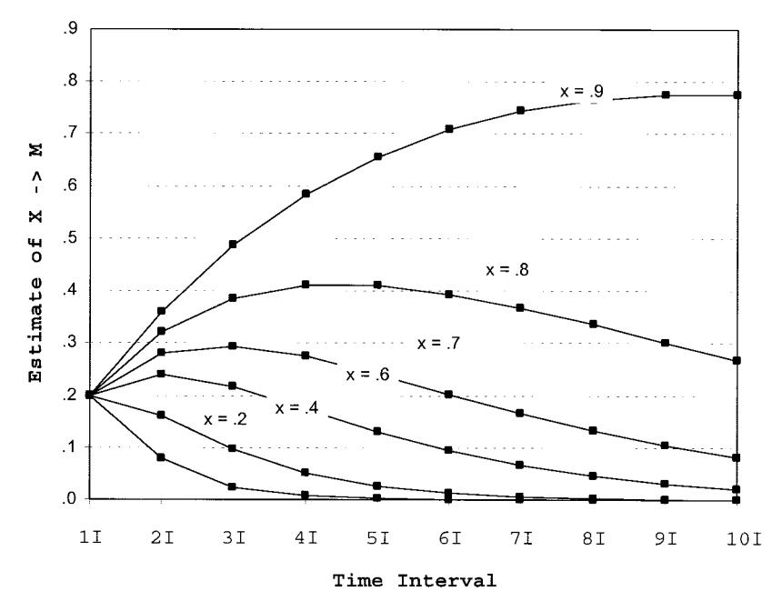

*Figure 7.* Extending the time interval may increase or decrease the estimated effect of X on M (in bivariate causal models) depending on the stability of X. I interval.

## *Question 5: When Are Retrospective Data Good Proxies for Longitudinal Data?*

In many attempts to test mediational models, researchers use retrospective measures of the exogenous variables. That is, researchers use data gathered at one point in time to represent the construct of interest at a prior point in time. For example, Andrews (1995) attempted to show that feelings of bodily shame mediated the effect of childhood physical and sexual abuse on the emergence of depression in adulthood. The measure of childhood abuse (X), however, was a retrospective self-report obtained at the end of the study, *after* the assessment of depression (Y). Given the likelihood that depression will affect memory, a retrospective measure of abuse history may well be biased by the same variable it purportedly predicts (Monroe & Simons, 1991).

The often cantankerous assumptions associated with this procedure are similar to those described for cross-sectional tests of mediation. First, the retrospective measure must be a remarkable proxy for the original construct. To the degree to which the retrospective measure (R) imperfectly represents the true exogenous variable X, the effect of X on either M or Y will be *underestimated.* (Such problems can be partially alleviated with the use of multiple retrospective measures of X.) Second, the retrospective measure cannot be directly affected by current levels of the underlying construct; that is, any relation between R and current levels of X must be due to the stability of X. Any direct relation between R and current levels of X will lead to the *overestimation* of the relation between exogenous X and other downstream variables. Third, the retrospective measure must not be affected by prior or concurrent levels of M or Y. As many retrospective measures rely on the participants' memories (and knowing that many factors affect memory), such assumptions are frequently questionable. On the one hand, if the retrospective measure is positively affected by other variables in the study, the effect of X on either M or Y will be *overestimated.* On the other hand, if other variables impair the efficacy of the retrospective measure, the effect of X on M or Y may be *underestimated.* Faced with threats of both over- and underestimation, the investigator may retain little confidence in the mediational tests of interest.

*Modeling tip.* Our most fervent recommendation is that researchers avoid relying on retrospective measures. If this is impossible, however, the researcher should review Gollob and Reichardt's (1987, 1991) procedures for fitting longitudinal models with cross-sectional data. Such procedures are especially helpful in clarifying the various assumptions that the researcher must make. Some (but not all) of these problems can be diminished with the use of multiple measures. Other problems involve assumptions that are themselves immanently testable; however, testing such assumptions requires longitudinal data.

# *Question 6: What Are the Effects of Random Measurement Error?*

Most researchers are aware of the attenuating effects of random measurement error on the estimation of correlations. As the reliability of one's measures diminishes, uncorrected correlations (between manifest variables) will systematically underestimate the true correlations (between latent variables). Some researchers may be tempted to rationalize such problems as errors of overconservatism: By underestimating true correlations, one may occasionally fail to reject the null hypothesis, but at least one is unlikely to commit the more egregious Type I error by rejecting the null hypothesis inappropriately. In tests of mediational models, however, the problems are more complex and insidious. Not only does measurement error contribute to the underestimation of some parameters, but it systematically

### Five-wave Model

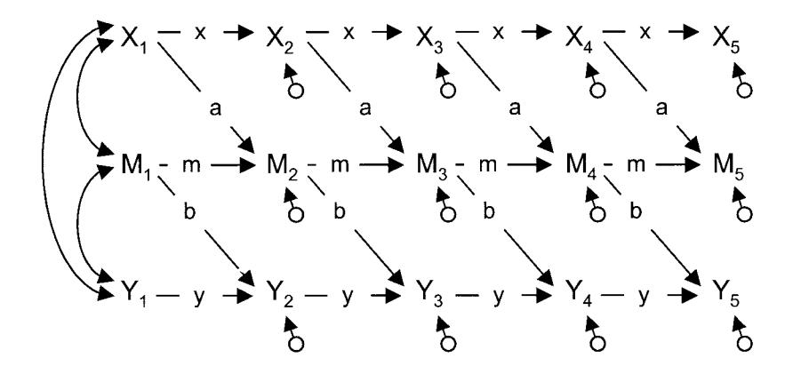

## Three-wave Model

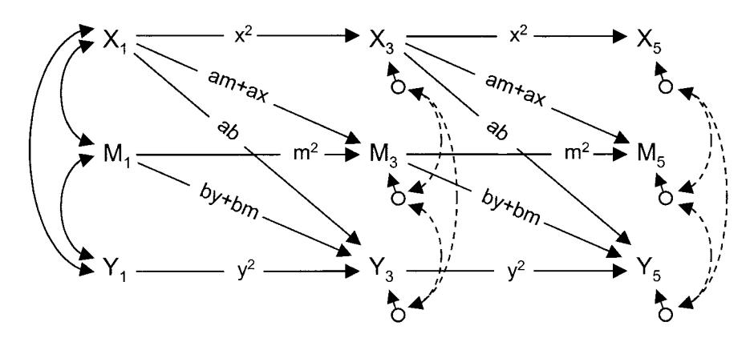

Figure 8. Three- and five-wave longitudinal models covering the same period of time. Subscripts denote the time or wave at which a given measure was obtained.

results in the *overestimation* of others. Depending on the parameter in question, measurement error can increase the likelihood of *both* Type I and Type II errors in ways that render the mediational question almost unanswerable. This occurs, in part, because measurement error in X, M, and Y have different effects on estimates of Paths a', b', and c'.

To present these effects most clearly, we use the hypothetical example depicted by Model 1 (see Figure 1). Let us imagine that in this example, where M completely accounts for the X-Y relation, the true correlations are  $\rho_{\rm XM}=.80$ ,  $\rho_{\rm MY}=.80$ , and  $\rho_{\rm XY}=.64$ . If we had perfect measures of these constructs, the standardized path coefficients would be a' = .80, b' = .80, and c' = 0. In most cases, however, our measures will contain random error. Consequently, our observed correlations will not be as large as the true correlations, and our estimates of a', b', and c' will be distorted. We examine the effects of measurement

error one variable at a time in the context of this (perfect) mediational model.

When X is measured with error (but M and Y are not), Path a' will be systematically biased. If  $\rho_{XX}$  is the reliability of our measure of X, Path a' will be underestimated by a factor of  $\rho_{XX}^{1/2}$ . As shown in Table 1, the resulting bias in Path a' can be considerable, whereas the estimates of Paths b' and c' are utterly unaffected. When Y is measured with error (but X and M are not), Path b' becomes the underestimated path; however, Paths a' and c' remain unaffected (see

&lt;sup>9 In general, Path c will also be biased toward zero. In the current example of complete mediation, Path c is already zero and cannot be biased any further in that direction. In examples of partial mediation, however, unreliability in X will cause Path c to be underestimated. See Greene and Ernhart (1991) for examples.

Table 1 Example of the Effect of Reliability in X, Y, and M (Taken Separately) on Paths a, b, and c in a Model of Complete Mediation

| Reliability | Impact of r XX only |        |        | Impact of r YY only |        |        | Impact of r MM only |        |        |
|-------------|--------------------------------|--------|--------|--------------------------------|--------|--------|--------------------------------|--------|--------|
|             | Path a                         | Path b | Path c | Path a                         | Path b | Path c | Path a                         | Path b | Path c |
| 1.0         | .80                            | .80    | .00    | .80                            | .80    | .00    | .80                            | .80    | .00    |
| .9          | .76                            | .80    | .00    | .80                            | .76    | .00    | .76                            | .64    | .15    |
| .8          | .72                            | .80    | .00    | .80                            | .72    | .00    | .72                            | .53    | .26    |
| .7          | .67                            | .80    | .00    | .80                            | .67    | .00    | .67                            | .44    | .35    |
| .6          | .62                            | .80    | .00    | .80                            | .62    | .00    | .62                            | .36    | .42    |
| .5          | .57                            | .80    | .00    | .80                            | .57    | .00    | .57                            | .30    | .47    |
| .4          | .51                            | .80    | .00    | .80                            | .51    | .00    | .51                            | .24    | .52    |
| .3          | .44                            | .80    | .00    | .80                            | .44    | .00    | .44                            | .20    | .55    |
| .2          | .36                            | .80    | .00    | .80                            | .36    | .00    | .36                            | .15    | .59    |
| .1          | .25                            | .80    | .00    | .80                            | .25    | .00    | .25                            | .10    | .62    |
| .0          | .00                            | .80    | .00    | .80                            | .00    | .00    | .00                            | .00    | .64    |

Table 1). Taken together, the effects of unreliability in X and Y combine to underestimate dramatically the indirect effect a'b' and diminish our power to detect its statistical significance.

Perhaps most interesting (or disturbing) is the effect of unreliability in the measurement of the mediator. When M is measured with error, Paths a' and b' are underestimated, but Path c' is actually overestimated (see Kahneman, 1965). As shown in Table 1. unreliability in the measure of M creates a downward bias in our estimate of Path a', an even larger downward bias in Path b', and a substantial upward bias in Path c'; that is, the indirect effect a'b' will be spuriously underestimated, and the direct effect c' will be spuriously inflated (artificially increasing the chance of rejecting the null hypothesis). When the mediator is measured with error, all path estimates in even the simplest mediational model are biased. In more complex longitudinal tests of mediational models, investigators typically seek to control not just the mediator but prior levels of the dependent variable as well. Under such circumstances, the biasing effects of measurement error become utterly baffling.

Modeling tip. Few (if any) psychological measures are completely without error. Consequently, psychological researchers who are interested in mediational models almost always face problems such as these (Fincham, Harold, & Gano-Phillips, 2000; Tram & Cole, 2000). Fortunately, as various authors have noted, the judicious use of latent variable modeling represents a potential solution (Bollen, 1989; Kenny, 1979; Loehlin, 1998). When each variable is represented by multiple, carefully selected measures, the investigator can extract latent variables with which to test the mediational model. Assuming that each set of manifest variables contains congeneric measures of the intended underlying construct, these latent variables are without error. Therefore, estimates of Paths a', b', and c' between latent X, M, and Y will not be biased by measurement error. Indeed, researchers are turning to latent variable SEM with increasing regularity in order to test their mediational hypotheses (e.g., Dodge, Pettit, Bates, & Valente, 1995).

Never is the selection of measures more important than in longitudinal designs, if only because the researcher must live with these instruments wave after wave. We urge researchers to obtain multiple measures of X, M, and Y (but especially M), for then the

investigator can examine the relations among latent variables, not among manifest variables, using SEM. In the ideal case, such measures will involve the use of maximally dissimilar methods of assessment, reducing the likelihood that the extracted factor will contain nuisance variance. Of course, simply obtaining multiple measures is not sufficient (Cook, 1985). The measures must converge if they are to be used to extract a latent variable.

# Question 7: How Important Is Shared Method Variance in Longitudinal Designs?

Successful control of shared method variance begins with the careful selection of measures; it does not begin with data analysis. Investigators who implement post hoc corrections for such problems will at best incompletely control for shared method variance and at worst render their results hopelessly uninterpretable. In the ideal study, shared method variance would not exist, either because the measures contain no method variance or because every construct is measured by methods that do not correlate with one another. Unfortunately, neither of these scenarios is particularly likely in the social sciences. As an alternative, Campbell and Fiske (1959) proposed the multitrait-multimethod (MTMM) design, in which researchers strategically assess each construct with the same collection of methods. In its complete form, the design is completely crossed, with every trait assessed by every method. Several papers have described latent variable modeling procedures for the analysis of MTMM data (Cole, 1987; Kenny & Kashy, 1992; Widaman, 1985).

In longitudinal research, problems with shared method variance are almost inevitable. When assessing the same constructs at several points in time, researchers typically use the same measures. Therefore, the covariation between data gathered at two points in time will reflect both the substantive relations of interest and some degree of shared method variance. Marsh (1993) noted that failure to account for shared method variance in longitudinal designs can result in substantial overestimation of the cross-wave path coefficients of interest. On the one hand, if the investigator measured each construct with a set of methodologically distinct measures, advanced latent variable SEM (allowing correlated errors) provides a possible solution. On the other hand, if the investigator

used measures that were methodologically similar to one another, shared method variance may be inextricably entwined with the constructs of interest. Even the most sophisticated data analytic strategy may be unable to sift the wheat from the chaff.

For example, Trull (2001) proposed that impulsivity and negative affectivity mediate the relation between family history of abuse (X) and the emergence of borderline personality disorder features (Y). By necessity, most of the constructs were assessed by various forms of self-report (e.g., interview, paper-and-pencil questionnaire). As a consequence, relatively few opportunities arose in which shared method variance could be modeled (and potentially controlled). Such residual covariance can inflate estimates of key path coefficients.

*Modeling tip.* Researchers should carefully select measures to allow for the systematic extraction of shared method variance using SEM. Three kinds of shared method variance can be extracted depending on the sophistication of the measurement model. In Figure 9, we represent three types of shared method variance as correlations between the disturbance terms for measures that use the same method (Kenny & Kashy, 1992). The first type consists of within-trait, cross-wave error covariance (e.g., Path s). Whenever the same measure is administered at more than one point in time, this type of shared method variance almost always exists. When a construct such as X, M, or Y is represented by the same set of measures at each time point, such shared method variance can be modeled by allowing correlations between appropriate pairs of disturbance terms.

An even more sophisticated measurement model could involve the addition of a within-wave MTMM structure. In other words, each construct at a given wave is represented by the same set of methods (e.g., clinical interview, behavioral observation, self-report questionnaire, standardized test, physiological assay, significant other reports). An example of such withinwave covariation is path u in Figure 9. For latent variable SEM to control for shared method variance using the correlated errors approach, the methods must be as dissimilar as possible. If the methods are correlated with one another, an approach such as Widaman's (1985) use of oblique method factors must be implemented. If the MTMM structure is replicated over time, cross-wave/cross-trait error covariance can be extracted (see Cole, Martin, Powers, & Truglio, 1996, for an example). Path v in Figure 9 represents such covariation. In our experience, these path coefficients are often small. We do not suggest, however, that they can be ignored. That decision will vary from study to study and should be based on sound theoretical and empirical arguments.

Sometimes structural limitations of the model or empirical limitations of the data prevent the inclusion of paths that are clearly justifiable and anticipatable. In such cases, the researcher is forced to omit paths that (theoretically) are not negligible. Whenever nonzero paths are omitted, the estimates of other path coefficients will be biased. Indeed, one can argue that no path is ever truly zero and that some degree of bias is inevitable. If the effect sizes of the omitted paths are small (and the model is otherwise correctly specified), the resulting bias is typically small. Unfortunately, we often cannot truly know the magnitude of paths that could not be included in the model. In such cases, the researcher should frankly and completely dis-

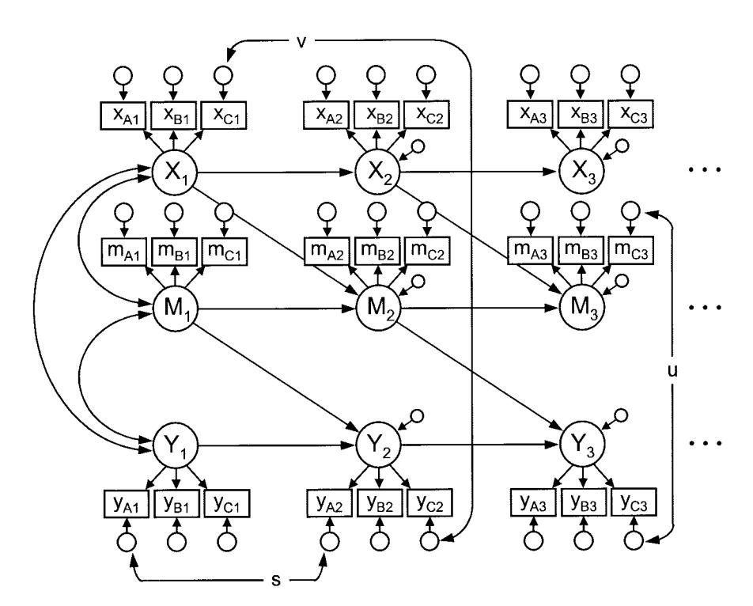

*Figure 9.* Latent variable *SEM* of mediation with examples of three kinds of shared method variance. Subscripts denote the time or wave at which a given measure was obtained.

570 COLE AND MAXWELL

cuss the degree to which their omission may have biased the results.

#### *Summary*

The preceding questions about mediational models bring to light only some of the more common threats to statistical conclusion validity. We hope that our tips suggest possible ways to negotiate these threats. We want to emphasize, however, that this list is far from complete, and the tips are hardly a panacea. The most important ingredients in the application of SEM to questions about mediational processes will always be an awareness of the problems that might exist, the ingenuity to apply the full range of SEM techniques to such problems, and the humility to acknowledge the problems that these methods cannot resolve.

### Structural Equation Modeling Steps

In this section, we describe five general steps for the use of SEM in testing mediational effects with longitudinal data. Not every research design will allow all five of these steps. For example, Steps 1 and 2 are only possible when X, M, and Y are represented by multiple measures. In Steps 3 and 4, we recommend that there be at least three waves of data (to avoid the problems described in Questions 1 and 3). In all of these tests we require the use of unstandardized data. Standardized data will yield inaccurate parameter estimates, standard errors, and goodness-of-fit indices in many of the following tests (see Cudek, 1989; Steiger, 2002; Willett, Singer, & Martin, 1998). Sometimes features of the data, the design, or the model make it impossible to conduct some of these steps. Under such circumstances, the investigator tacitly makes one or more assumptions, the violation of which jeopardizes the integrity of the results.

#### *Step 1: Test of the Measurement Model*

Everything hinges on the supposition that the manifest variables relate to one another in the ways prescribed by the measurement model. If the measurement model does not provide a good fit to the data (see Tomarken & Waller, this issue), we may not have measured what we intended. In such cases, clear interpretation of the structural model is impossible. To conduct this test, we begin with a model in which every latent variable is simply allowed to correlate with every other latent variable. The structural part of this model is completely saturated (i.e., the structural part of this model has zero degrees of freedom; it is just-identified). The overall model, however, is overidentified; it has positive degrees of freedom, which derive from constraints placed on the factor loadings and the covariances between the disturbance terms. Consequently, the test of the overall model tells us nothing about the structural paths, as none of them are constrained. Instead, the test of this model assesses the degree to which either of two types of measurement-related problems might exist.

First, it tests whether the manifest variables relate only to the latent variables they were supposed to represent. If the model provides a poor fit to the data, the problem might be that one or more of the measures loads onto a latent variable it was not anticipated to measure. Second, the model tests whether disturbance terms only relate to one another in the ways that have been anticipated. Whenever two measures share the same method (and certainly when the same measure is administered wave after wave), we urge researchers to allow (and test) correlations among their disturbances. (See Question 7 for examples.) If the model fits the data poorly, the problem might be that some of the manifest variables share nuisance variance in unexpected ways. Sometimes theory-driven modification of the measurement model will improve the fit; however, our opinion is that such post hoc model modification is undertaken far too often. Cavalier, empirically driven modifications frequently result in a model that may provide a good statistical fit at the cost of theoretical meaningfulness and replicability. Ultimately, if the measurement model fails to fit the data, one cannot proceed with tests of structural parameters. Alternatively, if this model fits the data well, it provides a basis (i.e., a full model) against which we can begin to compare more parsimonious structural models.10

#### *Step 2: Tests of Equivalence*

The second phase of analysis involves testing the equality of various parameters across waves. The first of these procedures tests examines the equilibrium assumption. The second tests for factorial invariance across waves.

The latent variable system is in equilibrium if the variances and covariances of the latent variables are invariant from one wave to the next. The equilibrium of a system is testable within the context of the measurement model described in Step 1. This test involves the comparison of a previous (full) model to a reduced model in which the variances and covariances of the Wave 1 latent variables are constrained to equal their counterparts at every subsequent wave. (One must fix one factor loading per latent variable to a nonzero constant in order to identify this model.) If the comparison were significant, the equilibrium hypotheses would be rejected. The assumption that the latent variable variances–covariances are constant across wave would not be tenable. Either the causal parameters are not stationary across time, or the causal processes began only recently and have not had time to reach equilibrium.

Factorial invariance implies that the relation of the latent variables to the manifest variables is constant over time. Some longitudinal studies follow children across noteworthy developmental periods (e.g., Kokko & Pulkkinen, 2000; Mahoney, 2000; Waters, Hamilton, & Weinfield, 2000) or track families from generation to generation (e.g., Cairns, Cairns, Xie, Leung, & Hearne, 1998; Cohen, Kasen, Brook, & Hartmark, 1998; Hardy, Astone, Brooks-Gunn, Shapiro, & Miller, 1998; Serbin & Stack, 1998). Over such developmental or historical spans, the very meaning of the original variables can change. Such changes can complicate (if not completely confound) the interpretation of longitudinal results. One way to test for such shifts in meaning is to compare the preceding model with one in which the Wave 1 factor loadings are constrained to equal their counterparts at subsequent waves. (One must standardize the latent variables and release the previous constraint that selected loadings equal a nonzero constant in order

10 When all constructs are measured perfectly (e.g., sex), there may be no need to test a measurement model. In the social sciences, however, perfectly measured constructs are relatively rare, and models containing nothing but perfectly measured constructs are almost nonexistent.

to test this model.) When this comparison is significant, some or all of the factor loadings are not constant across waves. The meaning of either the manifest or the latent variables changes over the course of the study. (See Byrne, Shavelson, & Muthen, 1989, for approaches to coping with partial invariance.)

### *Step 3: Test of Added Components*

This step tests the possibility that variables not in the model could help explain some of the relations among variables that are in the model. This test involves the comparison of a full model to a reduced model. In the full model, three sets of structural paths are included: (1) Every upstream variable has a direct effect on every downstream latent variable, (2) all exogenous latent variables are allowed to correlate with one another, and (3) all residuals of latent downstream variables are allowed to correlate with one another within each wave. (Although this model looks quite different from the measurement model described in Step 1, the two models are actually equivalent; see Kline, 1998.) The reduced model is identical to the full model except that the residuals of the downstream latent variables are no longer allowed to correlate. Specifically, we compare the full model to a reduced model in which all correlations between residual terms for the endogenous latent variables are constrained to be zero. If this comparison is significant, some of the covariation among the downstream latent variables remains unexplained by the exogenous variables in the model. The existence of such unexplained covariation suggests that potentially important variables are missing from the model. These variables may be confounds such as those depicted in Figure 4. Ignoring such confounds may produce biased estimates of the causal parameters of interest. Identifying and controlling for such variables should become a focus for future research.

In reality, all models are incomplete. The finite collection of predictors included in any given study will never completely explain the covariation among the downstream variables. In other words, some omitted variable inevitably exists that will explain more of the residual covariation. Any failure to detect significant residual covariation is simply a function of power and effect size. The detection of significant (and sizable) residual covariance should lead investigators to search for and incorporate additional causal constructs in their models. Failure to detect significant residual covariation, however, should not be taken as license to abandon this search, nor should it lead investigators simply to drop all correlated disturbances from their models. Such practices perpetuate bias, in the long run as well as in the short run. We recommend that these covariances be estimated, tested, and retained in the model even if they appear to be nonsignificant.

### *Step 4: Test of Omitted Paths*

The third test examines the causal paths that are not construed as part of the mediational model of interest. This test involves the comparison of a full model to a reduced model in which selected *causal* paths are restricted to zero. The reduced model is identical to the full model except all paths that are not part of a longitudinal mediational model have been eliminated. The structural part of the reduced model is the same as that in Model 2 (see Figure 1). If this comparison is significant, we learn that the reduced model is too parsimonious, implying that some of the paths that distinguish it from the full model are significant. Careful, theory-driven follow-up tests may be possible to determine which of these paths must be reinstated. In other words, the mediational model of interest (if it pertains) exists in a system of other causal relations that cannot be ignored without potentially biasing estimates of the mediational paths.

At least three specific follow-up tests are often of particular theoretical interest. One is the test for the possible existence of direct effects of X on Y. The existence of paths that connect X at one time to Y at some subsequent time, without going through M, suggests that M is only a partial mediator of the X 3 Y relation (at best). Given the complexities of psychological phenomena, we suspect that any single construct M will completely mediate a given relation only rarely, making this follow-up test particularly compelling. The second is the test for the presence–absence of wave-skipping paths. In Model 2, we have included only Lag 1 auto-correlational relations. However, more-complex models are often needed even to represent the relation of a variable to itself over time. The presence of Lag 2 (or greater) paths suggests the existence of potentially interesting nonlinear relations: The system may not be stationary, causal relations may be accelerating or decelerating, or the selected time lag between waves might not be optimal to represent the full causal effect of one variable on another. The third is to test for the presence–absence of "theoretically backward" effects. By this we do not mean effects that go backward in time, but effects that are backward relative to the theory that compelled the study (e.g., Y1 3 M2, M2 3 X3, Y1 3 X3). For decades, psychologists speculated about the causal effect of stressful life events on depression, sometimes to the exclusion of other possibilities, until the emergence of the stress-generation hypothesis by Hammen (1992). Compelling cases can often be made for "reverse" causal models. When the data are at our fingertips, why not conduct the test?

# *Step 5: Estimating Mediational (and Direct) Effects*

Estimates and tests of specific mediational parameters can be conducted in the context of any of the preceding models. The optimal choice is the most parsimonious model that provides a good fit to the data. We recommend several steps.

- 1. *Estimate the total effect of X1 on YT .* As Baron and Kenny (1986) pointed out, the very idea that M mediates the X-Y relation is based on the premise that the X-Y relation exists in the first place. Thus a logical place to start is with the estimation of the total effect of X at time 1 on Y at time T (where Time 1 and time T represent the beginning and end, respectively, of the time period covered by the study). This effect represents the sum of all nonspurious, time-specific effects of X1 on YT. This estimate represents the effect a one-unit change in X1 will have on YT over the course of the study. (One might also be interested in the total effect over only one part of the study, especially if the effect waxes or wanes over time. In such cases, time T represents the end of the interval of interest and not necessarily the end of the study.)
- 2. *Estimate the overall indirect effect.* The overall indirect effect of X1 on YT through M provides a good estimate of the degree to which M mediates the X-Y relation over the entire interval from Time 1 to time T, provided that the waves are optimally spaced and sufficient in number (see Question 4).

This overall indirect effect consists of the sum of all time-specific indirect effects that start with  $X_1$ , pass through  $M_i$ , and end with  $Y_T$ , where 1 < i < T. (Such time-specific effects can also pass through  $X_i$  or  $Y_i$ , as long as 1 < i < T.) The number of such time-specific effects depends on the number of waves in the study and the number of added processes that exist (see *Step 3* above). A five-wave model with no "added processes" has six time-specific indirect effects, as described under Question 4. We can interpret the overall indirect effect as that part of the total effect of  $X_1$  on  $Y_T$  that would disappear if we were to control for M at all points between Time 1 and time T.

- 3. Estimate the overall direct effect. The overall direct effect of  $X_1$  on  $Y_T$  is that part of the total effect of  $X_1$  on  $Y_T$  that is not mediated by M. The overall direct effect consists of the sum of all time-specific effects that start with  $X_1$  and end with  $Y_T$ , but never pass through M. Alternatively, the overall direct effect can be computed as the partial correlation between  $X_1$  and  $Y_T$  after controlling for all measures of M that fall between Time 1 and time T. The magnitude of this effect reflects the degree to which M fails to explain completely the X-Y relation. The sum of the overall direct effect and the overall indirect effect will equal the total effect of  $X_1$  on  $Y_T$ .
- 4. Tests of statistical significance. Statistical tests for the overall indirect effect and the overall direct effect (described above) have not yet been developed. Although Sobel (1982) and Baron and Kenny (1986) have described tests for the indirect effect in cross-sectional designs, they do not extend to the *overall* indirect effect in multiwave designs. Under most circumstances, however, certain necessary conditions for longitudinal mediation can be tested, even though none of these tests addresses the overall indirect effect itself. For the overall direct effect, there is no necessary condition that can be tested.

Does ab = 0? For mediation to exist, the product ab must be nonzero. In the case where only three waves of data exist, the test of ab = 0 is both necessary and sufficient for mediation, as there is only a single tracing (ab) whereby  $X_1$  has an impact on  $Y_3$ : through  $M_2$ . When more than three waves exist (i.e., when T > 3), the overall indirect effect of  $X_1$  on  $Y_t$  through M is also a function of paths x, m, and y. If x, m, and y all equal zero, the overall indirect effect of  $X_1$  on  $Y_t$  through M will be zero, regardless of the value of ab (even though three-wave mediation can exist). Tests of x, m, and y are possible by comparing a mediational model in which x, x, and y are free (e.g., the model described in *Step 4* above) to a reduced model in which x, x, and y are constrained to zero. If this comparison is significant, at least one of the three parameters is nonzero (and one is enough if ab is also nonzero).

The test of ab may be accomplished in two ways. The first involves testing a and b separately. For example, the model that derives from Step 4 can be compared to a reduced model in which a=0 (or b=0). If a and b are nonzero, their product is also nonzero. A potential downside to this approach may be its relatively low power. Although Monte Carlo studies have not been published on the power of longitudinal mediational designs, MacKinnon, Lockwood, Hoffman, West, and Sheets's (2002) examination of the cross-sectional case suggests that stepwise approaches tend to have problems with power (in part because the joint probability of rejecting two null hypotheses can be small).

For general information on estimating power in SEM, see Mac-Callum, Browne, and Sugawara (1996) and Muthen and Curran (1997)

Alternatively, one can test the ab product directly. According to Baron and Kenny's (1986) expansion of Sobel's (1982)12 calculations, the standard error for the indirect effect ab is  $(b^2s_a^2 + a^2s_b^2 + s_a^2s_b^2)^{1/2}$  (assuming multivariate normality), where  $s_a$  and  $s_b$  are the standard errors for a and b, respectively (see Holmbeck, 2002, for examples). The test is relatively straightforward because estimates of a, b,  $s_a$ , and  $s_b$  all derive from traditional SEM procedures. If ab is nonzero, the  $X \rightarrow Y$  relation is at least partially mediated by M (under the stability assumptions described above). Even though the test of ab tends to be more powerful than are the tests of a and b separately, we have to emphasize that ab is not an estimate of the overall mediational effect per se. For that calculation, multiple effects must be summed, as demonstrated under Question 4.

Interestingly, all of these tests are possible when *only two waves* of data are available. Under certain assumptions, a two-wave model yields immanently testable estimates of all five parameters: a, b, x, m, and y. The trouble is, however, that these assumptions are not testable with only two waves of data. One is the stationarity assumption: All paths connecting Wave 1 to Wave 2 must be identical to those that would have connected future waves, had such data been collected. The other assumption is that the optimal time lag for X to affect M is the same as the time lag for M to affect Y, a test that also requires many waves of data.

Does c=0? In the cross-sectional case, Baron and Kenny (1986) noted that c' must equal zero for mediation to be complete. In the longitudinal case, however, no single path must be nonzero for an overall direct effect of  $X_1$  on  $Y_T$  to exist. In Model 5 (see Figure 5), Path c would seem to be such a path. In reality, however,  $X_1$  could directly affect  $Y_2$  or  $Y_4$  or  $Y_T$  without ever directly affecting  $Y_3$ . For mediation to be complete, all direct effects of  $X_1$  on  $Y_j$  (where  $1 < j \le T$ ) must be zero, assuming x and y are nonzero. Testing this hypothesis is possible using methods described under Step 3 (above).

#### A Caveat About Parsimonious Models

The preceding steps are designed to lead us to the most parsimonious model that still provides a good fit to the data. Such parsimony, however, comes at a price. To attain parsimony, we fix paths to zero or constrain parameters to equal one another. In reality, no path is ever exactly zero, and no two paths are ever exactly equal. When we place such constraints, we guarantee that our parameter estimates (and not just those that are constrained) will be biased. We hope that our goodness-of-fit tests prevent us from settling on a model in which the bias is large, but this hope hinges on having powerful goodness-of-fit tests in the first place. An alternative is to remove these constraints, estimate fuller mod-

&lt;sup>11 This assumes that the waves are separated by the optimal time interval, a requisite condition outlined in Question 4.

&lt;sup>12 Most SEM programs that provide a test of the indirect effect use Sobel's (1982) test, not Baron and Kenny's (1986) expansion. Sobel's test assumes that coefficients a and b are uncorrelated, whereas Baron and Kenny's formula allows for such covariation.

els, and examine the confidence intervals around key parameter estimates.

#### Conclusions and Future Directions

In this article, we have described a number of methodological problems that arise in longitudinal studies of mediational processes. We have also recommended five steps or procedures designed to improve such studies. These steps require that previous research has already revealed the optimal time lag for the longitudinal design. The steps include (1) the careful selection of multiple measures of each construct and the subsequent testing of the intended measurement model, (2) testing for the existence of unmeasured variables that impinge on the mediational causal model, (3) testing for the existence of causal processes not anticipated by the mediational model, (4) testing the assumption of stationarity, and (5) estimating the overall (not time-specific) direct and indirect effects in the appraisal of mediational processes. We recognize that every researcher will not be able to implement all of these procedures in every study. We present these procedures as methodological goals or guidelines, not as absolute requirements. Nevertheless, we recommend that researchers carefully acknowledge the methodological limitations of their studies and formally describe the potentially serious consequences that can result from such limitations. Such candor paves a smoother path for future research.

Still more work remains to be done in the refinement of methodologies for testing mediational hypotheses. One critical area concerns the use of parsimonious versus fuller models for parameter estimation. Estimates derived from parsimonious models typically have smaller variances (a desirable characteristic in a statistic); however, they are also biased. Estimates derived from saturated models will be unbiased; however, they often have larger variances. Substantial work is needed to examine the relative efficiency of parameter estimates based on parsimonious versus saturated models. A second area pertains to the testing of overall indirect effects. A general formula for the standard error of the overall mediational effect has not been developed. The standard error for the product ab, developed by Sobel (1982) and refined by Baron and Kenny (1986), only tests the overall mediational effect in three-wave designs. Although we can estimate overall indirect effects in designs with more than three waves, their statistical significance cannot be tested directly. Shrout and Bolger (2002) demonstrated the virtues of bootstrapping for estimating standard errors and testing mediational effects in cross-sectional designs. Based on the success of the bootstrap in cross-sectional designs, it may hold promise as a method for estimating standard errors and testing hypotheses regarding overall indirect effects in longitudinal designs.

A third area in need of research pertains to the development of methods for determining the optimal frequency with which waves of longitudinal data should be collected. The optimal time lag will no doubt vary from mediational model to mediational model. Indeed, the optimal lag may vary from one part of the mediational model (e.g., X 3 M) to another part of the same model (e.g., M 3 Y). Clear procedures are needed to guide researchers as they address this essential preliminary question. A fourth area pertains to the robustness of mediational tests to the violations of methodological recommendations and statistical assumptions. For example, how serious is the bias that results from violations of the assumption of multivariate normality (Finch, West, & MacKinnon, 1997). Clearly, SEM procedures for testing mediational processes are still being refined. Nevertheless, most researchers have neglected the methodological advances in this area that have already been made. For this, the potential consequences may be considerable. A fifth area pertains to the sample size needed to obtain unbiased and efficient estimates of mediational effects. Preliminary work on cross-sectional mediational designs (e.g., the N needed to estimate ab) has only recently been completed (Mac-Kinnon, Warsi, & Dwyer, 1995). Analogous work on longitudinal mediational designs (e.g., the N needed to estimate *overall* indirect effects) has not yet been conducted.

Finally, we should point out that SEM methods represent only one approach to the study of mediation, and not necessarily even the best approach. Procedures such as multilevel modeling (Krull & MacKinnon, 1999, 2001) and latent growth curve analysis (Duncan, Duncan, Strycker, Li, & Alpert, 1999; Willet & Sayer, 1994) represent alternative methods for the conceptualization and study of change. Recently, a few examples have emerged that apply such methods to questions about causal chains, such as those involved in mediational variable systems. Nevertheless, the most compelling tests of causal and mediational hypotheses derive from randomized experimental designs. In observational–correlational designs, we rely on statistical controls, not on random assignment and experimental manipulation. In randomized experimental approaches to mediation, the investigator may seek to disable or counteract the mediator rather than allowing it to covary naturally as a function of variables, only some of which are measured in the study. In the interest of methodological multiplism, we urge investigators to tackle questions of mediation using a variety of research designs, each of which has its own strengths and limitations.

#### References

Andrews, B. (1995). Bodily shame as a mediator between abusive experiences and depression. *Journal of Abnormal Psychology, 104,* 277–285. Anisman, H., Suissa, A., & Sklar, L. S. (1980). Escape deficits induced by uncontrollable stress: Antagonism by dopamine and norepinephrine agonists. *Behavioral and Neural Biology, 28,* 34–47.

Baron, R. M., & Kenny, D. A. (1986). The moderator-mediator variable distinction in social psychological research: Conceptual, strategic, and statistical considerations. *Journal of Personality and Social Psychology, 51,* 1173–1182.

Bollen, K. A. (1989). *Structural equations with latent variables.* New York: Wiley.

Brady, E. U., & Kendall, P. C. (1992). Comorbidity of anxiety and depression in children and adolescents. *Psychological Bulletin, 111,* 244–255.

Bryk, A. S., & Raudenbush, S. W. (1992). *Hierarchical linear models: Applications and data analysis methods.* Newbury Park, CA: Sage.

Byrne, B. M., Shavelson, R. J., & Muthen, B. (1989). Testing for the equivalence of factor covariance and mean structures: The issue of partial measurement invariance. *Psychological Bulletin, 105,* 456–466.

Cairns, R. B., Cairns, B. D., Xie, H., Leung, M. C., & Hearne, S. (1998). Paths across generations: Academic competence and aggressive behaviors in young mothers and their children. *Developmental Psychology, 34,* 1162–1174.

Campbell, D. T., & Fiske, D. W. (1959). Convergent and discriminant validation by the multitrait-multimethod matrix. *Psychological Bulletin, 56,* 81–105.

- Chassin, L., Curran, P. J., Hussong, A. M., & Colder, C. R. (1996). The relation of parent alcoholism to adolescent substance use: A longitudinal follow-up study. *Journal of Abnormal Psychology, 105,* 70–80.
- Cohen, P., Kasen, S., Brook, J. S., & Hartmark, C. (1998). Behavior patterns of young children and their offspring: A two-generation study. *Developmental Psychology, 34,* 1202–1208.
- Cole, D. A. (1987). The utility of confirmatory factor analysis in test validation research. *Journal of Consulting and Clinical Psychology, 4,* 584–594.
- Cole, D. A., Martin, J. M., & Powers, B. (1997). A competency-based model of child depression: A longitudinal study of peer, parent, teacher, and self-evaluations. *The Journal of Child Psychology, Psychiatry and Allied Disciplines, 38,* 505–514.
- Cole, D. A., Martin, J. M., Powers, B., & Truglio, R. (1996). Modeling causal relations between academic and social competence and depression: A multitrait-multimethod longitudinal study of children. *Journal of Abnormal Psychology, 105,* 258–270.
- Cole, D. A., Peeke, L. A., Martin, J. M., Truglio, R., & Seroczynski, A. D. (1997). A longitudinal look at the relation between depression and anxiety in children and adolescents. *Journal of Consulting and Clinical Psychology, 106,* 586–597.
- Collins, L. M., Graham, J. W., & Flaherty, B. P. (1998). An alternative framework for defining mediation. *Multivariate Behavioral Research, 33,* 295–312.
- Cook, T. (1985). Postpositivist critical multiplism. In R. L. Shotland & M. M. Marks (Eds.), *Social science and social policy* (pp. 21–62). Beverly Hills, CA: Sage.
- Cudeck, R. (1989). Analysis of correlation matrices using covariance structure models. *Psychological Bulletin, 105,* 317–327.
- Curran, P. J., & Hussong, A. M. (2003). The use of latent trajectory models in psychopathology research. *Journal of Abnormal Psychology, 112,* 526–544.
- Dodge, K. A., Pettit, G. S., Bates, J. E., & Valente, E. (1995). Social information-processing patterns partially mediate the effect of early physical abuse on later conduct problems. *Journal of Abnormal Psychology, 104,* 632–643.
- Duncan, T. E., Duncan, S. C., Strycker, L. A., Li, F., & Alpert, A. (1999). *An introduction to latent variable growth curve modeling: Concepts, issues, and applications.* Mahwah, NJ: Erlbaum.
- Dwyer, J. H. (1983). *Statistical models for the social and behavioral sciences.* New York: Oxford University Press.
- Ellickson, P. L., Hays, R. D., & Bell, R. M. (1992). Stepping through the drug use sequence: Longitudinal scalogram analysis of initiation and regular use. *Journal of Abnormal Psychology, 101,* 441–451.
- Emery, R. E., Waldron, M., Kitzmann, K. M., & Aaron, J. (1999). Delinquent behavior, future divorce or nonmarital childbearing, and externalizing behavior among offspring: A 14-year prospective study. *Journal of Family Psychology, 13,* 568–579.
- Finch, J. F., West, S. G., & MacKinnon, D. P. (1997). Effects of sample size and nonnormality on the estimation of mediated effects in latent variable models. *Structural Equation Modeling, 4,* 87–107.
- Fincham, F. D., Harold, G. T., & Gano-Phillips, S. (2000). The longitudinal association between attributions and marital satisfaction: Direction of effects and role of efficacy expectations. *Journal of Family Psychology, 14,* 267–285.
- Gollob, H. F., & Reichardt, C. S. (1985). Building time lags into causal models of cross-sectional data. *Proceedings of the Social Statistics Section of the American Statistical Association,* 165–170.
- Gollob, H. F., & Reichardt, C. S. (1987). Taking account of time lags in causal models. *Child Development, 58,* 80–92.
- Gollob, H. F., & Reichardt, C. S. (1991). Interpreting and estimating indirect effects assuming time lags really matter. In L. M. Collins & J. L. Horn (Eds.), *Best methods for the analysis of change: Recent advances,*

- *unanswered questions, future directions* (pp. 243–259). Washington, DC: American Psychological Association.
- Greene, T., & Ernhart, C. B. (1991). Adjustment for cofactors in pediatric research. *Journal of Developmental and Behavioral Pediatrics, 12,* 378–386.
- Hammen, C. (1992). Life events and depression: The plot thickens. *American Journal of Community Psychology, 20,* 179–193.
- Hardy, J. B., Astone, N. M., Brooks-Gunn, J., Shapiro, S., & Miller, T. L. (1998). Like mother, like child: Intergenerational patterns of age at first birth and associations with childhood and adolescent characteristics and adult outcomes in the second generation. *Developmental Psychology, 34,* 1220–1232.
- Holland, P. W. (1986). Statistics and causal inference. *Journal of the American Statistical Association, 81,* 945–960.
- Holmbeck, G. W. (1997). Toward terminological, conceptual, and statistical clarity in the study of mediators and moderators: Examples from the child-clinical and pediatric psychology literatures. *Journal of Consulting and Clinical Psychology, 65,* 599–610.
- Holmbeck, G. W. (2002). Post-hoc probing of significant moderational and mediational effects in studies of pediatric populations. *Journal of Pediatric Psychology, 27,* 87–96.
- Hume, D. (1978). *A treatise of human nature.* Cambridge, England: Oxford University Press.
- Jolly, J. B., Wherry, J. N., Wiesner, D. C., Reed, D. H., Rule, J. C., & Jolly, J. M. (1994). The mediating role of anxiety in self-reported somatic complaints of depressed adolescents. *Journal of Abnormal Child Psychology, 22,* 691–702.
- Judd, C. M., & Kenny, D. A. (1981). Process analysis: Estimating mediation in treatment evaluations. *Evaluation Review, 5,* 602–619.
- Kahneman, D. (1965). Control of spurious association and the reliability of the controlled variable. *Psychological Bulletin, 64,* 326–329.
- Kanner, A. D., Coyne, J. C., Schaeffer, C., & Lazarus, R. S. (1981). Comparison of two modes of stress measurement: Daily hassles and uplifts versus major life events. *Journal of Behavioral Medicine, 4,* 1–39.
- Kenny, D. A. (1979). *Correlation and causality.* New York: Wiley.
- Kenny, D. A., & Kashy, D. A. (1992). Analysis of the multitraitmultimethod matrix by confirmatory factor analysis. *Psychological Bulletin, 112,* 165–172.
- Kenny, D. A., Kashy, D. A., & Bolger, N. (1998). Data analysis in social psychology. In D. T. Gilbert, S. T. Fiske, & G. Lindzeg (Eds.), *The handbook of social psychology* (Vol. 1, 4th ed., pp. 233–265). New York: McGraw-Hill.
- Kenny, D. A., & Zautra, A. (1995). The trait-state-error model for multiwave data. *Journal of Consulting and Clinical Psychology, 63,* 52–59.
- Kline, R. B. (1998). *Principles and practice of structural equation modeling: Methodology in the social sciences.* New York: Guilford Press.
- Kokko, K., & Pulkkinen, L. (2000). Aggression in childhood and long-term unemployment in adulthood: A cycle of maladaptation and some protective factors. *Developmental Psychology, 36,* 463–472.
- Krull, J. L., & MacKinnon, D. P. (1999). Multilevel mediation modeling in group-based intervention studies. *Evaluation Review, 23,* 418–444.
- Krull, J. L., & MacKinnon, D. P. (2001). Multilevel modeling of individual and group level mediated effects. *Multivariate Behavioral Research, 36,* 249–277.
- Loehlin, J. C. (1998). *Latent variable models: An introduction to factor, path, and structural analysis* (3rd ed.). Hillsdale, NJ: Erlbaum.
- Lynam, D., Moffitt, T. E., & Stouthamer-Loeber, M. (1993). Explaining the relation between IQ and delinquency: Class, race, test motivation, school failure, or self-control? *Journal of Abnormal Psychology, 102,* 187–196.
- MacCallum, R. C., Browne, M. W., & Sugawara, H. M. (1996). Power analysis and determination of sample size for covariance structure modeling. *Psychological Methods, 1,* 130–149.

- MacKinnon, D. P., & Dwyer, J. H. (1993). Estimating mediated effects in prevention studies. *Evaluation Review, 17,* 144–158.
- MacKinnon, D. P., Lockwood, C. M., Hoffman, J. M., West, S. G., & Sheets, V. (2002). A comparison of methods to test mediation and other intervening variable effects. *Psychological Methods, 7,* 83–104.
- MacKinnon, D. P., Warsi, G., & Dwyer, J. H. (1995). A simulation study of mediated effect measures. *Multivariate Behavioral Research, 30,* 41–62.
- Mahoney, J. L. (2000). School extracurricular activity participation as a moderator in the development of antisocial patterns. *Child Development, 71,* 502–516.
- Marsh, H. W. (1993). Stability of individual differences in multiwave panel studies: Comparison of simplex models and one-factor models. *Journal of Educational Measurement, 30,* 157–183.
- McGuigan, W. M., Vuchinich, S., & Pratt, C. (2000). Domestic violence, parents' view of their infant, and risk for child abuse. *Journal of Family Psychology, 14,* 613–624.
- Monroe, S. M., & Simons, A. D. (1991). Diathesis-stress theories in the context of life stress research: Implications for the depressive disorders. *Psychological Bulletin, 110,* 406–425.
- Muthen, B. O., & Curran, P. J. (1997). General longitudinal modeling of individual differences in experimental designs: A latent variable framework for analysis and power estimation. *Psychological Methods, 2,* 371–402.
- Rogosa, D. R., & Willett, J. B. (1985). Understanding correlates of change by modeling individual differences in growth. *Psychometrika, 50,* 203– 228.
- Seligman, M. E., & Maier, S. F. (1967). Failure to escape traumatic shock. *Journal of Experimental Psychology, 74,* 1–9.
- Serbin, L. A., & Stack, D. M. (1998). Introduction to the special section: Studying intergenerational continuity and the transfer of risk. *Developmental Psychology, 34,* 1159–1161.
- Shrout, P. E., & Bolger, N. (2002). Mediation in experimental and nonexperimental studies: New procedures and recommendations. *Psychological Methods, 7,* 422–445.
- Sobel, M. E. (1982). Asymptotic confidence intervals for indirect effects in structural equation models. In S. Leinhardt (Ed.), *Sociological methodology* (pp. 290–312). San Francisco: Jossey-Bass.
- Sobel, M. E. (1990). Effect analysis and caustion in linear structural equation models. *Psychometrika, 55,* 495–515.
- Steele, B. F., & Pollack, C. B. (1968). A psychiatric study of parents who abuse infants and small children. In R. Helfer & C. H. Kempe (Eds.),

- *The battered child* (pp. 414–463). Chicago: University of Chicago Press.
- Steiger, J. H. (2002). When constraints interact: A caution about reference variables, identification constraints and scale dependencies in structural equation modeling. *Psychological Methods, 7,* 210–227.
- Tein, J. Y., Sandler, I. N., & Zautra, A. J. (2000). Stressful life events, psychological distress, coping, and parenting of divorced mothers: A longitudinal study. *Journal of Family Psychology, 14,* 27–41.
- Tomarken, A. J., & Waller, N. G. (2003). Potential problems with "well fitting" models. *Journal of Abnormal Psychology, 112,* 578–598.
- Tram, J. M., & Cole, D. A. (2000). Self-perceived competence and the relation between life events and depressive symptoms in adolescence: Mediator or moderator? *Journal of Abnormal Psychology, 109,* 753– 760.
- Trull, T. J. (2001). Structural relations between borderline personality disorder features and putative etiological correlates. *Journal of Abnormal Psychology, 110,* 471–481.
- Twentyman, C. T., & Plotkin, R. (1982). Unrealistic expectations of parents who maltreat their children: An educational deficit that pertains to child maltreatment. *Journal of Clinical Psychology, 38,* 497–503.
- Waters, E., Hamilton, C. E., & Weinfield, N. S. (2000). The stability of attachment security from infancy to adolescence and early adulthood: General introduction. *Child Development, 71,* 678–683.
- Watson, D., & Clark, L. A. (1984). Negative affectivity: The disposition to experience aversive emotional states. *Psychological Bulletin, 96,* 465– 490.
- Widaman, K. (1985). Hierarchically nested covariance structure models for multitrait-multimethod data. *Applied Psychological Measurement, 9,* 1–26.
- Willet, J. B., & Sayer, A. G. (1994). Using covariance structure analysis to detect correlates and predictors of individual change over time. *Psychological Bulletin, 116,* 363–381.
- Willett, J. B., Singer, J. D., & Martin, N. C. (1998). The design and analysis of longitudinal studies of development and psychopathology in context: Statistical models and methodological recommendations. *Development and Psychopathology, 10,* 395–426.
- Windle, M., & Dumenci, L. (1998). An investigation of maternal and adolescent depressed mood using a latent trait-state model. *Journal of Research on Adolescence, 8,* 461–484.
- Woodsworth, R. S. (1928). Dynamic psychology. In C. Murchison (Ed.), *Psychologies of 1925.* Worcester, MA: Clark University Press.

(*Appendix follows*)

### Appendix

### Explication of Overall Total, Direct, and Indirect Effects

Because many readers may not be familiar with the concept of "overall effects," we elected to define these effects and to describe their calculation. We include Figure A1, with arbitrary numeric path coefficients, to assist in this description. In the uppermost diagram in Figure A1, the influence of X1 on Y4 reflects three overall effects: the overall total effect, the overall direct effect, and the overall indirect effect. The *overall total effect* of X1 on Y4 represents the total change expected in Y at the end of the observation period if X were to change 1 SD unit. The *overall direct effect* of X1 on Y4 is the amount that Y4 would change if X were changed an amount equal to 1 SD but M were held constant throughout the period. The *overall indirect effect* of X1 on Y4 represents the difference between the overall total effect and the overall

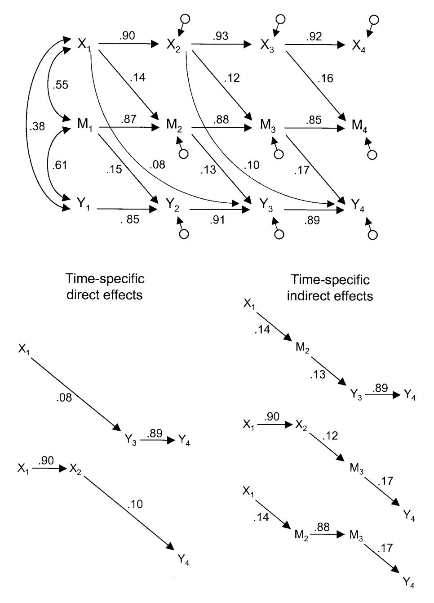

*Figure A1.* Path diagrams reflecting overall direct and indirect effects. Subscripts denote the time or wave at which a given measure was obtained.

direct effect. As such, it reflects the amount of change in Y4 due to X1 that is mediated by M.

According to this path diagram, there are five routes whereby changes in X at Time 1 may affect Y at Time 4. These routes are depicted in the lower section of Figure A1. The sum of the products of the relevant coefficients yields the overall total effect of X on Y:

$$(.08)(.89) + (.90)(.10) + (.14)(.13)(.89) + (.90)(.12)(.17)$$

$$+ (.14)(.88)(.17) = 0.22.$$

Thus a change of 1 SD in X at Time 1 is expected to result in a change of .22 SDs in Y at Time 4, according to the model. A portion of this overall total effect is due to the direct effect of X on Y, whereas the remainder is due to the indirect effect mediated by M. The overall direct effect can consist of the first two routes shown in the bottom left portion of Figure A1. In both of these routes, X has a direct effect on Y without going through M. The sum of the products of these coefficients is

$$(.08)(.89) + (.90)(.10) = 0.16.$$

Finally, the overall indirect effect can be found for the remaining three routes, all of which pass through M. The sum of the products of these coefficients is

$$(.14)(.13)(.89) + (.90)(.12)(.17) + (.14)(.88)(.17) = 0.06.$$

Thus, M partially mediates the overall effect of X on Y during this time period, although the majority of the overall effect is due to the direct effect of X on Y.

> Received December 20, 2001 Revision received March 1, 2003 Accepted March 12, 2003