# ORIGINAL PAPER

# Mindfulness at Work: Positive Affect, Hope, and Optimism Mediate the Relationship Between Dispositional Mindfulness, Work Engagement, and Well-Being

Peter Malinowski & Hui Jia Lim

Published online: 22 January 2015

# Springer Science+Business Media New York 2015

Abstract Mindfulness has been described as a state of awareness characterized by refined attentional skills and a nonevaluative attitude toward internal and external events. Recently, it has been suggested that higher levels of mindfulness may be beneficial in the workplace and first programs aiming to increase mindful awareness in occupational settings have been introduced. The current study underpins these developments with empirical evidence regarding the involved psychological processes, by investigating the relationship between dispositional mindfulness, work engagement, and wellbeing in 299 adults in full-time employment. As hypothesized, the results confirm that self-reported mindfulness predicts work engagement and general well-being. Furthermore, these relationships are mediated by positive job-related affect and psychological capital (hope, optimism, resiliency, and self-efficacy). Investigating mindfulness and psychological capital as multi-faceted concepts by means of structural equation modeling yielded a more precise picture. The ability to step back from automatic, habitual reactions to distress turned out to be the mindfulness facet most central for predicting work engagement and well-being. Furthermore, mindfulness exerts its positive effect on work engagement by increasing positive affect, hope, and optimism, which on their own and in combination enhance work engagement (full mediation). Well-being, on the other hand, is directly influenced by mindfulness, which exerts additional indirect influence via positive affect, hope, and optimism (partial mediation). Although exploratory in nature, the results identify non-reactivity and non-judging as important mindfulness skills in the workplace.

P. Malinowski (\*) : H. J. Lim Research Centre for Brain and Behaviour, Liverpool John Moores University, Liverpool L3 3AF, UK e-mail: p.malinowski@ljmu.ac.uk

Keywords Mindfulness . Psychological capital . Work engagement . Well-being . Structural equation modeling . Broaden-and-Build theory

## Introduction

Mindfulness-based interventions have attracted significant attention in clinical psychology and related fields, and increasing numbers of empirical studies confirm their effectiveness in a variety of clinical and sub-clinical settings. Encouraged by the reported positive outcomes, the interest in applying similar interventions and programs in other, non-clinical fields such as education (Meiklejohn et al. [2012](#page-11-0); Schonert-Reichl and Lawlor [2010\)](#page-12-0), coaching (Cavanagh and Spence [2012](#page-10-0)), or leadership training (Sauer and Kohls [2011;](#page-12-0) Reb et al. [2014](#page-11-0)) is growing rapidly. Concurrently, mindfulness programs are being introduced in the workplace (e.g., Levy et al. [2012;](#page-11-0) Klatt et al. [2009](#page-11-0); Hülsheger et al. [2013;](#page-11-0) Wolever et al. [2012](#page-12-0)) under the assumption that a whole range of positive effects on employee performance and well-being would result from increasing levels of mindfulness (Glomb et al. [2011](#page-10-0)). These include improvements in decision-making, in communication, in task performance and in creativity and decreases in antisocial behavior, experience of negative emotions, and frustration (Dane [2011;](#page-10-0) Glomb et al. [2011\)](#page-10-0). However, so far, the evidence for the assumed beneficial effects of mindfulness in workrelated settings is limited and there is a paucity of studies elucidating the mechanisms by which it might exert its assumed beneficial effects. Similarly, very little is known as to whether dispositional mindfulness—how mindful an individual tends to be in their daily life—predicts successful and healthy engagement in the workplace. To address this gap in the literature, the current study investigated the relationship between dispositional mindfulness and work engagement, which has emerged as an important determinant of organizational success (Bakker et al. [2011](#page-10-0)) for instance, in terms of financial returns (Xanthopoulou et al. [2009](#page-12-0)) and job performance (Halbesleben and Wheeler [2008\)](#page-11-0). As high work engagement in itself can have negative consequences, for example in terms of interference with family life (Halbesleben et al. [2009\)](#page-11-0), we considered it in conjunction with well-being, rather than in isolation (Robertson and Cooper [2010](#page-11-0)). Positive affect and psychological capital were included in the study as potential mediators because both have been implicated in promoting work engagement and well-being (Avey et al. [2011;](#page-10-0) Avey et al. [2008](#page-10-0); Quoidbach et al. [2010](#page-11-0); Sonnentag et al. [2008](#page-12-0)).

Within the psychological literature, mindfulness is typically described as "paying attention on purpose, in the present moment, and nonjudgmentally to the unfolding of experience moment by moment."(Kabat-Zinn [2003\)](#page-11-0). It is considered to consist of a combination of two core components: refined attentional skills and an open, non-evaluative attitude toward the different mental experiences that may arise (Bishop et al. [2004;](#page-10-0) Brown et al. [2007](#page-10-0); Malinowski [2008\)](#page-11-0). Dispositional mindfulness has been operationalized as a one-dimensional (e.g., Brown and Ryan [2003](#page-10-0)), two-dimensional (e.g., Cardaciotto et al. [2008](#page-10-0); Davis et al. [2009](#page-10-0)), or multidimensional construct with up to five mindfulness facets (Baer et al. [2006;](#page-10-0) Feldman et al. [2007\)](#page-10-0). Studies measuring dispositional mindfulness in workplace contexts (Allen and Kiburz [2012](#page-10-0); Dane and Brummel [2014](#page-10-0); Klatt et al. [2009](#page-11-0); Leroy et al. [2013](#page-11-0); Levy et al. [2012](#page-11-0); Roche et al. [2014](#page-11-0)) so far relied on the one-dimensional Mindful Attention Awareness Scale (MAAS; Brown and Ryan [2003](#page-10-0)), with the only exception of Wolever et al. ([2012\)](#page-12-0), who used the four-factor Cognitive and Affective Mindfulness Scale-Revised (CAMS-R; Feldman et al. [2007](#page-10-0)), but also treated it like a single-factor construct. Thus, although dispositional mindfulness is likely to be multi-faceted (Baer et al. [2006\)](#page-10-0), the role of different mindfulness facets has not yet been explored within workplace contexts, limiting the understanding in which way mindfulness may be beneficial. The aim of this study is to overcome this limitation by investigating the role of five different mindfulness facets in predicting work engagement and well-being of employees. Toward this end, we used the Five-Facet Mindfulness Questionnaire (FFMQ; Baer et al. [2006](#page-10-0); Baer et al. [2008\)](#page-10-0), which consists of the factors "non-reactivity to inner experience" (non-reacting), "observing sensations, perceptions, thoughts, feelings" (observing), "acting with awareness" (act aware), "describing or labeling with words" (describing), and "non-judging of experience" (non-judging).

The ability to nonjudgmentally observe and stay with arising thoughts and emotions, primarily captured by the nonreacting and non-judging subscales of the FFMQ, has been recognized as an important emotion regulation strategy (Papies et al. [2012](#page-11-0)). It differs from other forms of emotion regulation as it is based on changing the relationship to one's emotional states rather than the nature of the emotions themselves (Gross and Thompson [2007](#page-11-0); Teper et al. [2013](#page-12-0)). The presence of this skill is thought to be associated with sensitivity to more subtle changes in one's emotional states, allowing an individual to engage in regulation soon after the emotion arises with the effect that potentially detrimental automatic appraisal and response patterns will be less pronounced (Chambers et al. [2009;](#page-10-0) Teper et al. [2013](#page-12-0)). The larger flexibility in engaging with cognitions and emotions (Shapiro et al. [2006\)](#page-12-0) is furthermore assumed to be associated with more positive states of mind and a broader range of available thought-action repertoires (Fredrickson [2004\)](#page-10-0), and less automatic or habitual actions. In support of this view, neuroscientific evidence confirms that mindfulness is related to better attentional skills which interact with cognitive and emotion regulation skills (Chiesa et al. [2013;](#page-10-0) Malinowski [2013;](#page-11-0) Moore and Malinowski [2009;](#page-11-0) Slagter et al. [2011](#page-12-0); Teper and Inzlicht [2013](#page-12-0)).

Work engagement has been demonstrated to be an important indicator of occupational success. On an individual level, it is positively associated with work-related constructs such as safety, job satisfaction, employee loyalty, job performance, and organizational citizenship behavior (Harter et al. [2002;](#page-11-0) Markos and Sridevi [2010;](#page-11-0) Ram and Prabhakar [2011](#page-11-0); Saks [2006;](#page-12-0) Schaufeli and Bakker [2004](#page-12-0); Sonnentag [2003](#page-12-0)). On an organizational level, work engagement is positively related to productivity, customer satisfaction, employee commitment, financial return, profitability, and business success (Attridge [2009;](#page-10-0) Simpson [2009\)](#page-12-0). Furthermore, the psychological connection of employees to their work is of critical importance for organizational competitiveness (Bakker et al. [2011](#page-10-0)). Levels of employee work engagement, entailing vigor, dedication, and absorption (Schaufeli et al. [2002\)](#page-12-0) can thus be considered an important indicator of the health and preparedness of an organization. A positive association between mindfulness and work engagement would confirm the assumption that accepting, non-reactive emotion regulation strategies may be beneficial in the workplace and contribute to positive organizational outcomes. Mindfulness may support work engagement in a direct way, as a more accepting mental attitude that is less prone to distraction due to automatic response patterns may lead to more positive and fulfilling states of mind that are associated with higher engagement in the specific tasks at hand and with the overall evaluation of ones relationship to work. However, so far, evidence regarding such an association is limited. Recently, a specific intervention mapping protocol was employed to develop a mindfulness-based intervention aimed at improving work engagement. Initial evidence suggests that uptake of this intervention by the employees was relatively high (van Berkel et al. [2013;](#page-12-0) van Berkel et al. [2011\)](#page-12-0), but outcomes of this project regarding work engagement are not yet available. One study reported increased levels of vigor (a component of work engagement) after participation in a

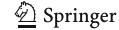

mindfulness program (Rosenzweig et al. [2003\)](#page-11-0). In addition, a recent paper using cross-sectional and longitudinal data provided first evidence that mindfulness is, indeed, positively related to work engagement (Leroy et al. [2013](#page-11-0)).

Besides work engagement, psychological well-being has been identified as an important contributor to positive organizational outcomes. Research demonstrates that levels of psychological well-being are positively related to job performance (Wright and Cropanzano [2000;](#page-12-0) Wright et al. [2004](#page-12-0); Cropanzano and Wright [1999\)](#page-10-0). As work engagement per se can have negative consequences for employees, for instance in terms of work-life conflicts such as work-family interference (Halbesleben et al. [2009\)](#page-11-0), and psychological well-being is positively related to work engagement (Fairlie [2011](#page-10-0); Shimazu and Schaufeli [2009](#page-12-0); Simpson [2009\)](#page-12-0), Robertson and Cooper ([2010](#page-11-0)) convincingly argue against narrowly focusing on commitment-based engagement. They suggest that aiming for "full engagement," which includes work engagement and employee well-being, constitutes a more profound management strategy for achieving sustainable benefits for individuals and organizations. In line with this view, and to capture a broader picture of the role of mindfulness in employees, we also included a broad measure of psychological well-being as outcome variable in the study. While a positive link between mindfulness and general psychological wellbeing is well established (Irving et al. [2009;](#page-11-0) Keng et al. [2011](#page-11-0)), little is known about whether mindfulness is linked to well-being in the workplace. So far, only one study demonstrated that in working parents, dispositional mindfulness was positively related to work-family balance, which is closely related to well-being (Allen and Kiburz [2012\)](#page-10-0).

To elucidate the hypothesized relationship between mindfulness, work engagement, and psychological well-being, it will be important to consider other variables that are likely to contribute to this relationship. Psychological Capital (PsyCap) has emerged as an important construct in human resource development. It is a higher order construct consisting of the four psychological resources of hope, self-efficacy, resiliency, and optimism (Luthans et al. [2007a\)](#page-11-0) and has been demonstrated to contribute to desirable employee attitudes and behaviors (job satisfaction, organizational commitment, psychological well-being, and citizenship) as well as various measures of job performance (Avey et al. [2011](#page-10-0)). As mindful individuals tend to experience and respond to emotionally challenging situations in a more flexible and less impulsive way, they are likely to be equipped with higher levels of PsyCap. In particular, their ability to be aware of distressing or difficult situations without immediately responding to them (captured by the FFMQ-facet non-reacting) is likely to be associated with greater self-efficacy, resiliency, hope, and optimism, the four corner stones of PsyCap. For instance, maintaining a cool head under duress and not responding automatically to experienced negative cognitions and emotions will be related to higher selfefficacy, as this ability to be in control will be related to more confidence in succeeding in challenging tasks. Closely related are hope and optimism, the perceived capability to persevere, motivate oneself, and (re-)direct one's pathways to achieve the desired goals (hope; Snyder [2002\)](#page-12-0) and having a positive outlook on one's own future success (optimism; Carver and Scheier [2005\)](#page-10-0), respectively. When mindfulness is high and an individual can step back or disengage from detrimental cognitive or emotional reactivity, a more hopeful and optimistic attitude will usually result. Finally, also resiliency, the ability to bounce back despite challenges and adversity should be more pronounced in mindful individuals, as they will, for instance, engage less in rumination and habitual worrying (Shapiro et al. [2007;](#page-12-0) Verplanken and Fisher [2014](#page-12-0)), but rather maintain a solutionfocused outlook. Although plausible, evidence for such a relationship between mindfulness and PsyCap is almost non-existent (but see Avey et al. [2008\)](#page-10-0). Based on these considerations and on the predictive strength of PsyCap regarding various organizational outcome measures, we hypothesize that PsyCap may be an important factor mediating the relationship between mindfulness, work engagement, and well-being.

Positive affect is associated with and precedes several outcomes that are indicative of work-related success, such as employment, quality of work, income, and organizational citizenship (Lyubomirsky et al. [2005](#page-11-0)). Furthermore, evidence indicates a positive relationship between PsyCap and positive affect (Avey et al. [2008;](#page-10-0) Salanova et al. [2011\)](#page-12-0) and between positive affect and work engagement (Sonnentag et al. [2008\)](#page-12-0). The Broaden-and-Build theory of positive emotions (Fredrickson [2004](#page-10-0)) predicts that the increase in positive emotions would lead to broadening of one's thought-action repertoire which, in turn, would result in increased personal resources such as those included in PsyCap. In line with Broaden-and-Build theory, we thus predict that mindfulness at least partially exerts its influence on work engagement and well-being in a serial fashion via positive affect and PsyCap.

Based on the discussed evidence and theoretical considerations, we hypothesize that dispositional mindfulness will be positively related to work engagement and to well-being. Furthermore, we predict that this relationship is mediated by positive affect and PsyCap. Reflecting the propositions of the Broaden-and-Build theory, model 1 (see Fig. [1\)](#page-3-0) assumes a strict serial relationship flowing from mindfulness→positive affect→PsyCap→work engagement. Higher mindfulness would be related to more positive affect, a broadened thought-action repertoire, and as a consequence more personal resources (PsyCap). As PsyCap predicts work engagement (Bakker et al. [2011;](#page-10-0) Luthans et al. [2007a](#page-11-0)), and PsyCap and positive affect are related to well-being, we expect a positive relation to these two outcome variables.

Given that mindfulness reflects psychological core processes such as emotional and cognitive flexibility (Malinowski [2012,](#page-11-0) [2013;](#page-11-0) Shapiro et al. [2006](#page-12-0)), we argued above that some mindfulness facets directly relate to PsyCap

Fig. 1 Path diagrams for the two hypothesized structural models. Model 1 predicts a strict serial multiple mediation. Model 2 predicts a partial serial mediation, including additional paths originating from FFMQ-nonreacting and from positive affect. Due to the results of the CFAs of the FFMQ and additional theoretical considerations, the facet observing is not included in the models. For reasons of clarity, only the latent variables and structural paths are depicted, whereas indicator variables, error terms, residuals, and covariances are not displayed

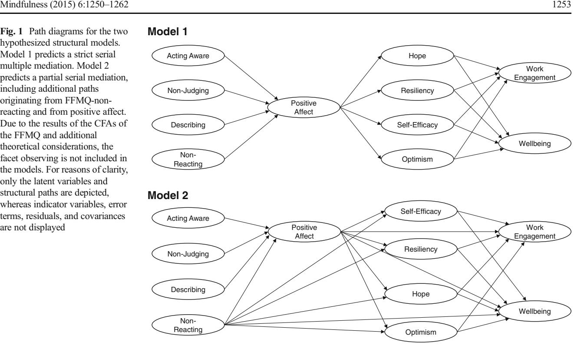

facets and to the outcome variables work engagement and well-being. Model 2 (see Fig. 1) depicts these additional structural paths. First and foremost, it reflects the theoretically central role of the FFMQ-facet non-reacting. As explained before, the ability to bear difficulties and distress without having to respond automatically will not only be related to higher positive affect, but also to the four facets of PsyCap and may also have a direct impact on well-being and work engagement. Thus, four additional structural paths will flow from nonreacting to the four PsyCap facets and two further paths to work engagement and well-being. Moreover, it is likely that positive affect is also directly related to well-being (rather than merely through PsyCap) and may also have a positive link to work engagement. Accordingly, these two paths are also included. Due to the strong theoretical grounding for these additional direct links, we expect that model 2, which outlines a partial mediation, will provide a better fit for the sample data than the serial, full mediation described by model 1.

### Method

### Participants

Two hundred ninety-nine full-time working adults (123 male, 176 female, mean age 40.1 years, SD 11.6, mean tenure 5.75 years) from various job sectors (public 34.8 %, private 53.5 %, non-profit 10.0 %, volunteer work 1.7 %) participated in the study by completing an online survey. They had a Western background or were based in one of 36 Western countries (following the classification by Hill et al. [2004](#page-11-0)) and rated their English language skills as "good" or "excellent." One hundred forty-six participants classed themselves as non-meditators and 153 as meditators, defined as an individual with a regular meditation practice of at least once or twice per week (Baer et al. [2008](#page-10-0)). The meditators had an average of 8.9 years (range 6 weeks to 39 years) of meditation experience and meditated on average six times a week (range one to 21 times per week). Levels of education and management experience are presented in Table [1.](#page-4-0)

# Procedure

Participants were recruited via posts on the university website and social networking websites such as Facebook, Linked In, and Yahoo Groups. Furthermore, potential participants were targeted through e-mail distributions, via personal contacts, specific mailing lists (e.g., from meditation centers, company contacts, etc.), and relevant newsletters. After giving informed consent, participants were directed to a secure website that was not publically accessible. Completion of the survey took no more than 20 min. All participants were given the opportunity to take part in a prize draw to win one out of five Amazon vouchers worth GBP 20 (or the equivalent in USD or Euro). The study was approved by the Research Ethics Committee of the host institution.

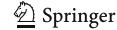

**Table 1** Distribution of the highest educational level and managerial responsibilities in the complete sample (N=291) and split into meditators (N=151) and non-meditators (N=140)

| All  | Meditators                                                        | Non-meditator                                                                                                |
|------|-------------------------------------------------------------------|--------------------------------------------------------------------------------------------------------------|
|      |                                                                   |                                                                                                              |
| 8.2  | 8.6                                                               | 7.9                                                                                                          |
| 34.0 | 29.8                                                              | 38.6                                                                                                         |
| 43.6 | 45.0                                                              | 42.1                                                                                                         |
| 9.3  | 11.9                                                              | 6.4                                                                                                          |
| 4.8  | 4.6                                                               | 5.0                                                                                                          |
|      |                                                                   |                                                                                                              |
| 11.0 | 13.2                                                              | 8.6                                                                                                          |
| 16.2 | 17.9                                                              | 14.3                                                                                                         |
| 21.0 | 20.5                                                              | 21.4                                                                                                         |
| 41.6 | 35.1                                                              | 48.6                                                                                                         |
| 10.3 | 13.2                                                              | 7.1                                                                                                          |
|      | 8.2 34.0 43.6 9.3 4.8 11.0 16.2 21.0 41.6 | 8.2 8.6 34.0 29.8 43.6 45.0 9.3 11.9 4.8 4.6 11.0 13.2 16.2 17.9 21.0 20.5 41.6 35.1 |

All values are percentage

#### Measures

Dispositional trait mindfulness was measured with the Five-Facet Mindfulness Questionnaire (FFMQ; Baer et al. 2006). The FFMQ is a 39-item scale assessing the following five components of mindfulness: observing, describing, acting with awareness, non-judging, and non-reacting. Participants rate items such as "I perceive my feelings and emotions without having to react to them" on a five-point Likert scale (1= never or very rarely true; 5=very often or always true).

Work engagement was assessed with the nine-item version of the Utrecht Work Engagement Scale (UWES-9; Schaufeli et al. 2006). Participants responded to items like "At my job, I feel strong and vigorous." on a seven-point frequency rating scale (0=never; 6=always).

Positive mental well-being was assessed with the Warwick-Edinburgh Mental Well-Being Scale (WEMWBS; Tennant et al. 2007) consisting of 14 items that cover a broad range of positive health indicators, including hedonic and eudemonic perspectives. Participants rated positively worded items such as "I've been feeling optimistic about the future" on a five-point Likert scale (1=none of the time; 5=all of the time).

Psychological capital was assessed with the Psychological Capital Questionnaire (PCQ; Luthans et al. 2007a; Luthans et al. 2007b). The PCQ consists of 24 items, which measure the four constructs hope, self-efficacy, resiliency, and optimism. Respondents indicate their agreement with statements such as "There are lots of ways around any problem" or "I usually take stressful things at work in stride" on a six-point Likert scale ranging from 1 (strongly disagree) to 6 (strongly agree).

Job-related positive affect was measured with a shortened version of the Job-related Affective Well-being Scale (JAWS; Van Katwyk et al. 2000) limited to the positive items

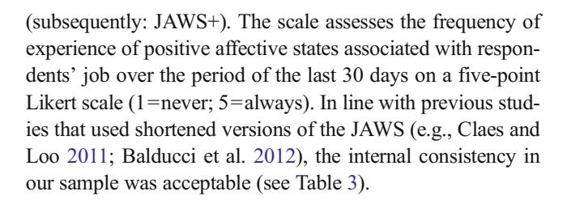

### Data Analyses

Data were analyzed with structural equation modeling techniques (SEM) using the AMOSTM (V.21) software package (Arbuckle 2012). To ensure that the measurements of all included latent variables are psychometrically sound, all questionnaires were subjected to confirmatory factor analyses (CFA). Results of these CFAs are presented at the beginning of the results section. The maximum likelihood method was used for SEM and CFA model fitting, and goodness of fit of each model was determined by considering a range of model indices (Schermelleh-Engel et al. 2003): the chi-square ( $\chi^2$ ) statistic with degrees of freedom,  $\chi^2$  index divided by the degrees of freedom ( $\chi^2/df$ ), comparative fit index (CFI), non-normed fit index (NNFI), root-mean-square error of approximation (RMSEA), standardized root-mean-square residual (SRMR), and Akaike information criterion (AIC). To evaluate each model, these indices are considered collectively, taking into account cutoffs for acceptable and good model fits as suggested in the literature (Byrne 2010; Schermelleh-Engel et al. 2003). To address the problem that the  $\chi^2$ -statistic is strongly influenced by sample size, we include the  $\chi^2/df$  index, where a value below five indicates acceptable fit and a value close to or less than 2 a good model fit. SRMR indices of less than 0.10 and less than 0.08 indicate acceptable and good model fit, respectively. RMSEA values below 0.10 and 0.06 are interpreted to reflect acceptable and good model fit. CFI and NNFI values larger than 0.90 and 0.95 indicate adequate or good model fit, respectively. Finally, the AIC index is a descriptive measure used to compare the parsimony of models (where appropriate), where a lower AIC is indicative of a better model

#### Results

Uni- and multi-dimensional outlier analyses based on the extremity of z-scores (>3.29) and Mahalanobis distances ( $\chi^2_{12}$ > 31.26) resulted in the exclusion of data from eight participants from all analysis. Skewness and kurtosis were acceptable for all study variables.

# Confirmatory Factor Analyses for Self-Report Measures

Fife-Facet Mindfulness Questionnaire The initial development of the FFMQ yielded a five-factor hierarchical structure with mindfulness as a latent variable that underlies the five facets (Baer et al. [2006\)](#page-10-0). However, already at the point of development, it was recognized that a four-factor hierarchical structure which did not include the factor observing provided a better fit for samples with no meditation experience (Baer et al. [2006;](#page-10-0) Baer et al. [2008\)](#page-10-0). Similar concerns regarding the observing subscale were also reported by other authors (e.g., Curtiss and Klemanski [2014;](#page-10-0) Williams et al. [2014](#page-12-0)). To account for this uncertainty in addition to five-factor models, we also considered four-factor models which excluded the items associated with the observing factor. In total, six FFMQ models were tested. Three models (FFMQ with observing) included all items of the FFMQ. The other three models included all items except of those mapped onto the observing subscale (FFMQ without observing). For both types, a single-factor model was tested, where all indicators loaded onto the latent variable mindfulness. In two further models, the items loaded onto five (or four) inter-correlated factors identified in previous studies. And finally, in two hierarchal solutions, the five (or four) factors loaded onto the overall mindfulness construct. To align our analysis approach with previous factor analyses of the FFMQ (Baer et al. [2006;](#page-10-0) Baer et al. [2008;](#page-10-0) Curtiss and Klemanski [2014](#page-10-0); Williams et al. [2014](#page-12-0)), item parcels were implemented for these CFAs, whereby items within each subscale were randomly assigned to parcels. Each subscale comprised three parcels, with two or three items each, to a total of 15 parcels. Although there has been some discussion regarding item parceling, various reasons justify this strategy (for details see Little et al. [2002](#page-11-0); Curtiss and Klemanski [2014](#page-10-0)).

As listed in Table [2](#page-6-0), neither of the single factor models yielded acceptable solutions. The five-factor correlated model and the five-factor hierarchical model yielded good model fits. In direct comparison, the significant χ2-difference test indicates a superior fit of the five-factor hierarchical model over the five-factor correlated model. Also, both four-factor models yielded equally good solutions, confirmed by a nonsignificant χ2-difference test. Overall the four-factor models provided better fit indices than the five-factor models. Although due to the difference in degrees of freedom, these differences should be interpreted with care, combined with the general concerns about the observing subscale, we decided to drop this factor and proceed with the four-factor model. As the hierarchical model was not superior to the correlated model, the latter was chosen as it provides more straightforward information regarding the role of the individual factors and does not include additional assumptions regarding second-order factors.

Psychological Capital PsyCap is a construct combining the four components self-efficacy, hope, optimism, and resiliency. A recent review of the psychometric properties of this questionnaire (Dawkins et al. [2013\)](#page-10-0) indicates issues with some of its items. According to CFAs from several studies, the exclusion of some items and in particular those that are reversecoded tends to increase factor loading and improves model fit (Chen and Lim [2012](#page-10-0); Gooty et al. [2009;](#page-10-0) Rego et al. [2010](#page-11-0)). To account for the possibility that individual items affect model fit, we scrutinized item properties and tested models that were reduced by eight items (items 1, 7, 9, 13, 15, 18, 20, 23), which included all reverse-coded items. We analyzed five PsyCap models; the first three models maintained all items of the questionnaire: a single-factor model, a model with four inter-correlated factors, and a hierarchical model with the four factors loading onto the overall PsyCap latent factor. In addition, the two four-factor models were also run after removal of the eight worst-performing items. As can be seen in Table [2](#page-6-0), the reduced model with four correlated factors provided the best fit. The significant χ2-difference test indicates a better model fit for the first-order model compared to the alternative second-order model. This model was thus included in the SEM.

Job-Related Positive Affect The positive affect subscale of the JAWS has been constructed as a single-factor scale (Balducci et al. [2012;](#page-10-0) Van Katwyk et al. [2000\)](#page-12-0). The CFA confirmed good model fit of the shortened scale used in this study (see Table [2](#page-6-0)).

Work Engagement—UWES-9 The three-factor and the single factor solution of the nine-item version of the UWES (Schaufeli et al. [2006\)](#page-12-0) yielded acceptable overall model fits (see Table [2\)](#page-6-0). As our hypotheses consider work engagement in broad terms rather than focusing on specific sub-components, we decided to include the single factor model of the UWES-9 in the analysis.

Mental Well-Being—WEMWBS The WEMWBS has been designed as a one-dimensional scale (Tennant et al. [2007\)](#page-12-0). The single-factor CFA yielded indices indicative of acceptable or good fit.

### Descriptives and Basic Relationships

Table [3](#page-7-0) lists the means, standard deviations, internal consistencies, and Pearson correlations for all study variables. All measures had acceptable internal consistency (between 0.72 and 0.92) and were positively inter-correlated (all p<0.01). Some of these correlations reflect the associations between sub-scales of the same questionnaires, whereas others support our hypothesis that dispositional mindfulness would be positively related to work engagement and psychological well-

Table 2 Results of the confirmatory factor analyses for all main study variables

| Model                             | χ2         | df  | Δχ2      | χ2 /df | SRMR   | RMSEA [90 % CI]     | CFI   | NNFI  | AIC      |
|-----------------------------------|------------|-----|----------|-----------|--------|---------------------|-------|-------|----------|
| FFMQ—with observing               |            |     |          |           |        |                     |       |       |          |
| Single factor                     | 1274.569** | 90  |          | 14.162    | 0.1242 | 0.213 [0.203–0.223] | 0.568 | 0.469 | 1334.569 |
| Five factors                      | 169.544**  | 80  |          | 2.119     | 0.0449 | 0.062 [0.049–0.075] | 0.967 | 0.957 | 249.544  |
| Five factors hierarchical         | 185.664**  | 85  | 16.12*   | 2.184     | 0.0534 | 0.064 [0.051–0.076] | 0.963 | 0.955 | 255.664  |
| FFMQ—without observing            |            |     |          |           |        |                     |       |       |          |
| Single factor                     | 1034.66**  | 54  |          | 19.16     | 0.1345 | 0.250 [0.237–0.264] | 0.577 | 0.483 | 1082.66  |
| Four factorsa                     | 108.977**  | 48  |          | 2.270     | 0.0425 | 0.066 [0.050–0.083] | 0.974 | 0.964 | 168.977  |
| Four factors hierarchical         | 110.580**  | 50  | 1.603 ns | 2.212     | 0.0443 | 0.065 [0.048–0.081] | 0.974 | 0.965 | 166.580  |
| PsyCap                            |            |     |          |           |        |                     |       |       |          |
| Single factor                     | 1064.708** | 252 |          | 4.225     | 0.0788 | 0.105 [0.099–0.112] | 0.735 | 0.709 | 1160.708 |
| Four factors                      | 614.604**  | 246 |          | 2.498     | 0.0636 | 0.072 [0.065–0.079] | 0.880 | 0.865 | 722.604  |
| Four factors hierarchical         | 625.969**  | 248 | 11.365*  | 2.524     | 0.0649 | 0.072 [0.065–0.080] | 0.877 | 0.863 | 729.969  |
| Four factors reduceda             | 151.259**  | 98  |          | 1.543     | 0.0410 | 0.043 [0.029–0.056] | 0.975 | 0.969 | 227.259  |
| Four factors reduced hierarchical | 164.817**  | 100 | 13.558*  | 1.648     | 0.0457 | 0.047 [0.034–0.060] | 0.969 | 0.963 | 236.817  |
| s-JAWS+                           |            |     |          |           |        |                     |       |       |          |
| Single factora                    | 5.234 ns   | 2   |          | 2.617     | 0.0185 | 0.075 [0.000–0.156] | 0.995 | 0.984 |          |
| UWES-9                            |            |     |          |           |        |                     |       |       |          |
| Single factora                    | 170.285**  | 27  |          | 6.307     | 0.0522 | 0.135 [0.116–0.155] | 0.907 | 0.876 | 206.285  |
| Three factors                     | 117.414**  | 24  |          | 4.892     | 0.0441 | 0.116 [0.095–0.137] | 0.939 | 0.909 | 159.414  |
| WEMWBS                            |            |     |          |           |        |                     |       |       |          |
| Single factora                    | 47.784**   | 5   |          | 9.56      | 0.0338 | 0.172 [0.129–0.218] | 0.957 | 0.915 |          |

Bold indices signify a good model fit, indices in italics an acceptable fit; comparison of nested models with χ2 -difference test: a significant Δχ2 denotes that the larger model (with fewer df) fits significantly better than the smaller model (with more dfs)

being and that psychological capital and positive affect may be part of this relationship.

A concern that is commonly raised when such a broad range of significant bivariate correlations are present is that these results may partially be due to common method variance (CMV), i.e., that the correlations are attributable to the method rather than the constructs that are being measured (Podsakoff et al. [2003](#page-11-0)). However, a Monte Carlo study by Evans ([1985\)](#page-10-0) and a statistical approach by Siemsen et al. ([2010\)](#page-12-0) demonstrated that bivariate linear relationships may either be inflated or deflated by CMV, whereas interaction terms in regression models are generally either not affected or are deflated. Similarly, a Monte Carlo simulation demonstrated that cross-level interactions in multi-level linear models would rather be deflated by CMV and that the inclusion of more potentially CMV-contaminated variables would reduce the probability of type 1 errors (Lai et al. [2013](#page-11-0)). Thus, although a common method bias cannot be ruled out completely, the use of SEM, which overcomes the problems of simple bivariate relationships, makes it unlikely that the presented results can be attributed to CMV artifacts.

## Testing the Models

Structural equation modeling (SEM) was used to analyze fit between the hypothesized models (Fig. [1](#page-3-0)) and the sample data and to compare the fit between the suggested models. The fit indices listed in Table [4](#page-7-0) show that the strictly sequential model, which assumes full serial mediation through positive affect and PsyCap facets (model 1: mindfulness facets→positive affect→PsyCap→work engagement/well-being) does not fit the data as well as model 2, which is more specific in its predictions and implies partial mediation. The superior fit of model 2 is furthermore confirmed by the highly significant χ2-difference test. Figure [2](#page-8-0) displays the models with standardized regression weights for all structural parameters. As can be seen, although the overall fit of model 2 is acceptable, only 13 of the regression weights are significant (plus one marginally significant), while the remaining nine were

ns non-significant

a Indicates the models included in the SEM

\*p<0.01

\*\*p<0.001

Table 3 Means, standard deviations, internal consistencies (Cronbach's α), and Pearson correlation coefficients for the variables included in the path analysis

|        | N=291         | M    | SD   | α    | 1     | 2     | 3     | 4     | 5     | 6     | 7     | 8     | 9     | 10    |
|--------|---------------|------|------|------|-------|-------|-------|-------|-------|-------|-------|-------|-------|-------|
| FFMQ   |               |      |      |      |       |       |       |       |       |       |       |       |       |       |
| 1      | Act aware     | 3.54 | 0.67 | 0.89 | –     |       |       |       |       |       |       |       |       |       |
| 2      | Describing    | 3.82 | 0.69 | 0.90 | 0.336 | –     |       |       |       |       |       |       |       |       |
| 3      | Non-judging   | 3.71 | 0.83 | 0.92 | 0.505 | 0.377 | –     |       |       |       |       |       |       |       |
| 4      | Non-reacting  | 3.47 | 0.64 | 0.85 | 0.537 | 0.430 | 0.528 | –     |       |       |       |       |       |       |
| 5      | JAWS+         | 3.47 | 0.76 | 0.86 | 0.261 | 0.188 | 0.285 | 0.325 | –     |       |       |       |       |       |
| PsyCap |               |      |      |      |       |       |       |       |       |       |       |       |       |       |
| 6      | Self-efficacy | 4.95 | 0.84 | 0.88 | 0.321 | 0.346 | 0.302 | 0.350 | 0.404 | –     |       |       |       |       |
| 7      | Hope          | 4.61 | 0.82 | 0.84 | 0.375 | 0.253 | 0.321 | 0.330 | 0.626 | 0.567 | –     |       |       |       |
| 8      | Resiliency    | 4.73 | 0.77 | 0.72 | 0.327 | 0.155 | 0.270 | 0.464 | 0.304 | 0.442 | 0.419 | –     |       |       |
| 9      | Optimism      | 4.35 | 0.82 | 0.79 | 0.383 | 0.240 | 0.298 | 0.457 | 0.577 | 0.452 | 0.632 | 0.473 | –     |       |
| 10     | UWES-9        | 4.01 | 0.91 | 0.91 | 0.272 | 0.218 | 0.272 | 0.321 | 0.772 | 0.489 | 0.705 | 0.316 | 0.588 | –     |
| 11     | WEMWBS        | 3.78 | 0.57 | 0.92 | 0.455 | 0.368 | 0.426 | 0.524 | 0.568 | 0.479 | 0.647 | 0.418 | 0.626 | 0.589 |
|        |               |      |      |      |       |       |       |       |       |       |       |       |       |       |

FFMQ Five-Facet Mindfulness Questionnaire, JAWS+ Job-related Affective Well-Being Scale, PsyCap Psychological Capital Questionnaire, UWES-9 Utrecht Work Engagement Scale, WEMWBS Warwick-Edinburgh Mental Well-Being Scale

All correlations significant at p<0.01

statistically non-significant. Thus, several of the initially hypothesized paths may be irrelevant.

Post Hoc Model Modification A strictly confirmatory approach to the data would stop at this point and accept that only some of the hypothesized paths were found to be relevant. However, as we are dealing with an area of research still in its infancy, with little empirical evidence to build on, an exploratory post hoc model fit appeared useful for guiding future research (Byrne [2010](#page-10-0); Hoyle [2011\)](#page-11-0). Following established guidelines (Byrne [2010\)](#page-10-0), we first reviewed modification indices of possible structural paths, which indicated that the additional path from describing to self-efficacy should be included. Although hope, self-efficacy, and resiliency were considered to be facets of PsyCap and accordingly not related to each other in a structural way, the modification indices suggested otherwise. We thus relaxed this condition and subsequently included two regression paths flowing from hope to self-efficacy and to resiliency, respectively. The next model modification step considered model parsimony. As already discussed, some regression paths were insignificant and these were now removed from the model. These two modification steps had several effects. First, the mindfulness facet acting with awareness no longer influenced other factors and was thus eliminated from the model. Furthermore, the two PsyCap facets self-efficacy and resiliency bear no influence on the two outcome variables work engagement and well-being. They should thus not be maintained in the position of mediating variables. Because they are influenced by other factors in the model, it seems reasonable to conceptualize them as further outcome variables, in parallel with work engagement and well-being.

The fit indices of this final post hoc model version show a good fit (Table 4). Figure [3](#page-8-0) displays all regression paths of the model. As can be seen, only the two mindfulness facets nonjudging and non-reacting directly or indirectly influence work engagement and well-being, whereas describing only influences self-efficacy. Overall, non-reacting clearly stands out as the mindfulness facet with the most prominent influence. Either directly or via mediating factors (positive affect, hope, optimism), it influences all outcome variables.

Table 4 Results of the SEM for the different models

| Model                    | χ2        | df  | Δχ2      | χ2 /df | SRMR   | RMSEA [90 % CI]     | CFI   | NNFI  | AIC      |
|--------------------------|-----------|-----|----------|-----------|--------|---------------------|-------|-------|----------|
| Hypothesized models      |           |     |          |           |        |                     |       |       |          |
| Model 1                  | 2043.722* | 967 |          | 2.113     | 0.0839 | 0.062 [0.058–0.066] | 0.879 | 0.871 | 2271.722 |
| Model 2                  | 1848.117* | 960 | 195.605* | 1.925     | 0.0641 | 0.056 [0.053–0.060] | 0.900 | 0.893 | 2090.117 |
| Post hoc model (model 3) | 1574.633* | 842 |          | 1.870     | 0.0598 | 0.055 [0.051–0.059] | 0.912 | 0.906 | 1782.633 |

Bold indices signify a good model fit, indices in italics an acceptable fit; comparison of nested models with χ2 -difference test: a significant Δχ2 denotes that the larger model (with fewer df) fits significantly better than the smaller model (with more dfs)

\*p<0.001

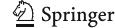

Fig. 2 Path diagrams with standardized regression weights. *Arrows* and coefficients in *bold* indicate statistically significant relationships. For reasons of clarity, only the latent variables and structural paths are depicted, whereas indicator variables, error terms, residuals, and covariances are not displayed

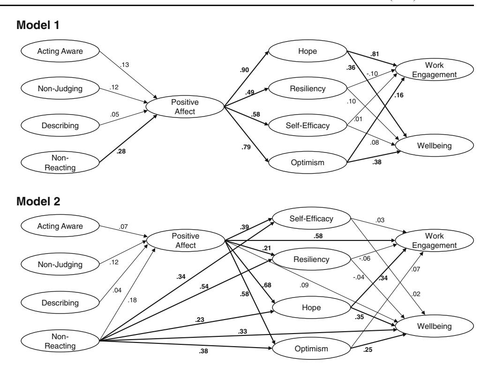

#### Discussion

To our knowledge, this is the first study investigating dispositional mindfulness as a multi-faceted construct in relation to intra-personal factors in organizational settings. To a certain extent, the study confirmed the hypothesized positive relationship between dispositional mindfulness and the two outcome variables work engagement and well-being. The more mindful a participant was, the higher their work engagement and well-being tended to be. Furthermore, it confirmed that positive work-related affect and some aspects of PsyCap exert a mediating influence on these relationships. Here, the comparison of a strictly serial full mediation model (model 1) was inferior to a partial mediation model (model 2) which also included links between mindfulness facets and PsyCap facets (bypassing positive affect), between mindfulness and work engagement/

well-being (bypassing all mediators) and between positive affect and work engagement/well-being (bypassing PsyCap facets). The post hoc model (Fig. 3) developed in an exploratory fashion demonstrates the main findings from this study and suggests possible pathways as to how mindfulness might influence work engagement and well-being.

More precisely, by considering the individual facets of mindfulness and of PsyCap, rather than their higher order constructs, a more differentiated picture emerged. First of all, it turned out that resiliency and self-efficacy neither influenced work engagement nor well-being. This is surprising, given the existing evidence of the positive association between self-efficacy and work engagement (Bakker et al. 2011; Xanthopoulou et al. 2007). It may, however, be that the mindfulness facet non-reacting, which has not been included in previous studies in this field, shares some variance

Fig. 3 Path diagrams with standardized regression weights for the final, post hoc model. For reasons of clarity, only the latent variables and structural paths are depicted, whereas indicator variables, error terms, residuals, and covariances are not displayed

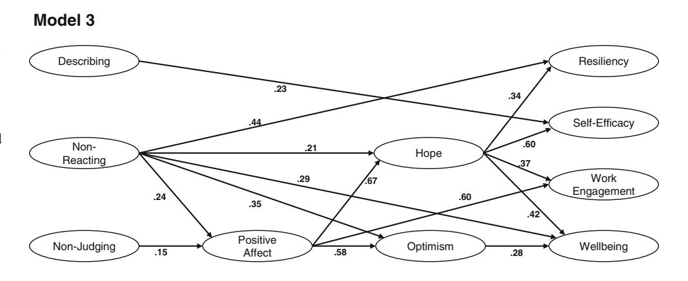

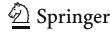

with resiliency, explaining the diminished role of the latter. Similarly, in a study where self-efficacy emerged as an important predictor for work engagement, hope was not included (Xanthopoulou et al. [2007\)](#page-12-0). The large regression weight of the path between hope and self-efficacy indicates a potential partial overlap of these two constructs.

Concerning our main question as to how mindfulness fits into the picture, the observation that non-reacting emerged as the most important factor of the four included mindfulness facets, is particularly interesting. While the other facets (describing, non-judging) play only a minor role or no role at all (acting with awareness), non-reacting exerted direct influence on the majority of variables. The influence of mindfulness (non-judging and non-reacting) on work engagement is exclusively indirect, flowing via positive affect and directly from non-reacting to hope and from both factors on to work engagement. The lack of a direct effect between these mindfulness facets and work engagement is in line with a recent study showing that the positive relationship between mindfulness and work engagement is fully mediated by authentic functioning (Leroy et al. [2013](#page-11-0)), a concept that attracts increasing attention in discussions of leadership qualities (Gardner et al. [2011\)](#page-10-0). In light of this evidence, reports that authentic leadership and PsyCap are interrelated (Jensen and Luthans [2006\)](#page-11-0) and that positive affect has been shown to be an important contributor to authentic leadership (Gardner et al. [2011\)](#page-10-0) are of interest, indicating a possible overlap of positive affect, PsyCap, and authentic functioning. Future studies will therefore need to clarify their mediating roles and interactions.

Well-being was influenced by non-reacting via direct and indirect routes and by non-judging only in indirect ways (the latter including positive affect and/or optimism and/or hope), confirming previous evidence (Keng et al. [2011\)](#page-11-0) that mindfulness is related to well-being. While the link between optimism and well-being is well established and supported by many studies (Forgeard and Seligman [2012\)](#page-10-0), evidence for a positive link between mindfulness and optimism is still scarce (Kiken and Shook [2011;](#page-11-0) Weinstein et al. [2009](#page-12-0)). Although mindfulness is thought to be present centered rather than engaged with outlook into the future, it seems plausible that the ability to refrain from reacting will lead to a more positive and at the same time more realistic outlook on life (Kiken and Shook [2011](#page-11-0)). Of further interest is the relatively prominent role of hope. As hopeful individuals are thought to have a sense of goal-directed determination (Snyder et al. [1991\)](#page-12-0), it appears plausible that non-reacting, the ability to step back or disengage from automatic response patterns, would be positively related to it. It will be easier for a person to maintain set goals or generate plans to achieve them if they are able to keep a cool head without automatically reacting to distress. In line with this, first studies provide limited evidence that mindfulness practice may increase hope (Sears and Kraus [2009;](#page-12-0) Shapiro et al. [2011\)](#page-12-0).

The fact that positive affect significantly contributed to the observed relationships lends some support to the Broadenand-Build theory (Fredrickson [2004\)](#page-10-0) indicating that by increasing positive affect, psychological resources such as hope and optimism will increase, resulting in higher work engagement and well-being, as well as resiliency and self-efficacy. However, the fact that model 2 provided a better fit than model 1 speaks against a strict serial process and that broaden-andbuild processes only partially explain the relationship between mindfulness and the outcome variables.

Some limitations of this study should be noted. As the data come from a cross-sectional survey, any causal interpretation has to be treated with care. We used SEM to get a first impression what processes may be involved in the salutary effects of mindfulness on well-being and work engagement. Future studies that take an experimental or longitudinal approach and investigate how the different contributing variables develop and interact over time will be able to provide more definite answers regarding the possible causal pathways our study suggests. Evidence that individual mindfulness facets may play quite distinct roles highlights the importance of operationalizing mindfulness as a multi-facet construct. While we relied on the most widely used multi-factor scale, the FFMQ, after completion of data collection, the four-factor Comprehensive Inventory of Mindfulness Experiences beta (CHIME-β) was proposed (Bergomi et al. [2013](#page-10-0)), which is said to integrate nine aspects of mindfulness that emerged from reviewing the eight most commonly used mindfulness questionnaires. For moving the field forward, it will be important to remain cautious about the operationalization of mindfulness and the different sub-components that are included in a study.

In conclusion, this study yields useful insights for further exploring the role of dispositional mindfulness and mindfulness programs in work environments. By highlighting the important role of the mindfulness facet nonreacting, it specifies that the ability to inwardly step back from distressing experiences without being taken over by them may be a particularly important contributor to the salutary effects of mindfulness. In addition, the prominent contributions of positive affect, hope, and optimism outline pathways by which mindfulness might increase work engagement and well-being and thus develop "fully engaged" employees. Based on these findings, we may hypothesize that increasing dispositional mindfulness will (1) directly promote well-being; (2) raise positive affect, hope, and optimism resulting in improved work engagement and well-being; and (3) engage broaden-and-build processes leading to higher work engagement and well-being. Given the important role of non-reacting, programs that emphasize the development of this mindfulness skill hold particular promise.

# References

- Allen, T. D., & Kiburz, K. M. (2012). Trait mindfulness and work–family balance among working parents: the mediating effects of vitality and sleep quality. Journal of Vocational Behavior, 80(2), 372–379. doi: [10.1016/j.jvb.2011.09.002.](http://dx.doi.org/10.1016/j.jvb.2011.09.002)
- Arbuckle, J. L. (2012). IBM SPSS Amos 21 user's guide. Crawfordville: Amos Development Corporation.
- Attridge, M. (2009). Measuring and managing employee work engagement: a review of the research and business literature. Journal of Workplace Behavioral Health, 24(4), 383–398. doi:[10.1080/](http://dx.doi.org/10.1080/15555240903188398) [15555240903188398](http://dx.doi.org/10.1080/15555240903188398).
- Avey, J. B., Wernsing, T. S., & Luthans, F. (2008). Can positive employees help positive organizational change? Impact of psychological capital and emotions on relevant attitudes and behaviors. The Journal of Applied Behavioral Science, 44(1), 48–70. doi[:10.1177/](http://dx.doi.org/10.1177/0021886307311470) [0021886307311470.](http://dx.doi.org/10.1177/0021886307311470)
- Avey, J. B., Reichard, R. J., Luthans, F., & Mhatre, K. H. (2011). Metaanalysis of the impact of positive psychological capital on employee attitudes, behaviors, and performance. Human Resource Development Quarterly, 22(2), 127–152. doi[:10.1002/hrdq.20070](http://dx.doi.org/10.1002/hrdq.20070).
- Baer, R. A., Smith, G. T., Hopkins, J., Krietemeyer, J., & Toney, L. (2006). Using self-report assessment methods to explore facets of mindfulness. Assessment, 13(1), 27–45. doi: [10.1177/1073191105283504](http://dx.doi.org/10.1177/1073191105283504).
- Baer, R. A., Smith, G. T., Lykins, E., Button, D., Krietemeyer, J., Sauer, S., et al. (2008). Construct validity of the five facet mindfulness questionnaire in meditating and nonmeditating samples. Assessment, 15(3), 329–342. doi[:10.1177/1073191107313003](http://dx.doi.org/10.1177/1073191107313003).
- Bakker, A. B., Albrecht, S. L., & Leiter, M. P. (2011). Key questions regarding work engagement. European Journal of Work and Organizational Psychology, 20(1), 4–28. doi[:10.1080/1359432x.2010.485352.](http://dx.doi.org/10.1080/1359432x.2010.485352)
- Balducci, C., Cecchin, M., Fraccaroli, F., & Schaufeli, W. B. (2012). Exploring the relationship between workaholism and workplace aggressive behaviour: the role of job-related emotion. Personality and Individual Differences, 53(5), 629–634. doi[:10.1016/j.paid.2012.05.](http://dx.doi.org/10.1016/j.paid.2012.05.004) [004](http://dx.doi.org/10.1016/j.paid.2012.05.004).
- Bergomi, C., Tschacher, W., & Kupper, Z. (2013). Measuring mindfulness: first steps towards the development of a comprehensive mindfulness scale. Mindfulness, 4(1), 18–32. doi[:10.1007/s12671-012-](http://dx.doi.org/10.1007/s12671-012-0102-9) [0102-9](http://dx.doi.org/10.1007/s12671-012-0102-9).
- Bishop, S. R., Lau, M. A., Shapiro, S. L., Carlson, L. E., Anderson, N. D., Carmody, J., et al. (2004). Mindfulness: a proposed operational definition. Clinical Psychology: Science and Practice, 11(3), 230–242.
- Brown, K. W., & Ryan, R. M. (2003). The benefits of being present: mindfulness and its role in psychological well-being. Journal of Personality and Social Psychology, 84(4), 822–848.
- Brown, K. W., Ryan, R. M., & Creswell, J. D. (2007). Mindfulness: theoretical foundations and evidence for its salutary effects. Psychological Inquiry, 18(4), 211–237. doi:[10.1080/](http://dx.doi.org/10.1080/10478400701598298) [10478400701598298](http://dx.doi.org/10.1080/10478400701598298).
- Byrne, B. M. (2010). Structural equation modeling with AMOS: basic concepts, applications, and programming (2nd ed.). New York: Routledge.
- Cardaciotto, L., Herbert, J. D., Forman, E. M., Moitra, E., & Farrow, V. (2008). The assessment of present-moment awareness and acceptance: the Philadelphia Mindfulness Scale. Assessment, 15(2), 204– 223. doi[:10.1177/1073191107311467.](http://dx.doi.org/10.1177/1073191107311467)
- Carver, C. S., & Scheier, M. S. (2005). Optimism. In C. R. Snyder & S. J. Lopez (Eds.), Handbook of positive psychology (pp. 231–243). Oxford: Oxford University Press.
- Cavanagh, M. J., & Spence, G. B. (2012). Mindfulness in coaching: philosophy, psychology or just a useful skill? In J. Passmore, D. B. Peterson, & T. Freire (Eds.), The Wiley-Blackwell handbook of the psychology of coaching and mentoring (pp. 112–134). Oxford: John Wiley & Sons.

- Chambers, R., Gullone, E., & Allen, N. B. (2009). Mindful emotion regulation: an integrative review. Clinical Psychology Review, 29(6), 560–572. doi[:10.1016/j.cpr.2009.06.005](http://dx.doi.org/10.1016/j.cpr.2009.06.005).
- Chen, D. J. Q., & Lim, V. K. G. (2012). Strength in adversity: the influence of psychological capital on job search. Journal of Organizational Behavior, 33(6), 811–839. doi[:10.1002/job.1814](http://dx.doi.org/10.1002/job.1814).
- Chiesa, A., Serretti, A., & Jakobsen, J. C. (2013). Mindfulness: top-down or bottom-up emotion regulation strategy? Clinical Psychology Review, 33(1), 82–96. doi[:10.1016/j.cpr.2012.10.006](http://dx.doi.org/10.1016/j.cpr.2012.10.006).
- Claes, R., & Loo, K. (2011). Relationships of proactive behaviour with job-related affective well-being and anticipated retirement age: an exploration among older employees in Belgium. European Journal of Ageing, 8(4), 233–241. doi[:10.1007/s10433-011-0203-7.](http://dx.doi.org/10.1007/s10433-011-0203-7)
- Cropanzano, R., & Wright, T. A. (1999). A 5-year study of change in the relationship between well-being and job performance. Consulting Psychology Journal: Practice and Research, 51(4), 252–265. doi: [10.1037/1061-4087.51.4.252.](http://dx.doi.org/10.1037/1061-4087.51.4.252)
- Curtiss, J., & Klemanski, D. H. (2014). Factor analysis of the five facet mindfulness questionnaire in a heterogeneous clinical sample. Journal of Psychopathology and Behavioral Assessment, Advance online publication. doi[:10.1007/s10862-014-9429-y.](http://dx.doi.org/10.1007/s10862-014-9429-y)
- Dane, E. (2011). Paying attention to mindfulness and its effects on task performance in the workplace. Journal of Management, 37(4), 997– 1018. doi:[10.1177/0149206310367948.](http://dx.doi.org/10.1177/0149206310367948)
- Dane, E., & Brummel, B. J. (2014). Examining workplace mindfulness and its relations to job performance and turnover intention. Human Relations, 67(1), 105–128. doi[:10.1177/0018726713487753](http://dx.doi.org/10.1177/0018726713487753).
- Davis, K. M., Lau, M. A., & Cairns, D. R. (2009). Development and preliminary validation of a trait version of the Toronto Mindfulness Scale. Journal of Cognitive Psychotherapy, 23(3), 185–197. doi[:10.1891/0889-8391.23.3.185.](http://dx.doi.org/10.1891/0889-8391.23.3.185)
- Dawkins, S., Martin, A., Scott, J., & Sanderson, K. (2013). Building on the positives: a psychometric review and critical analysis of the construct of Psychological Capital. Journal of Occupational and Organizational Psychology, 86(3), 348–370. doi[:10.1111/joop.12007.](http://dx.doi.org/10.1111/joop.12007)
- Evans, M. G. (1985). A Monte Carlo study of the effects of correlated method variance in moderated multiple regression analysis. Organizational Behavior and Human Decision Processes, 36(3), 305–323.
- Fairlie, P. (2011). Meaningful work, employee engagement, and other key employee outcomes: implications for human resource development. Advances in Developing Human Resources, 13(4), 508–525. doi[:10.](http://dx.doi.org/10.1177/1523422311431679) [1177/1523422311431679](http://dx.doi.org/10.1177/1523422311431679).
- Feldman, G., Hayes, A., Kumar, S., Greeson, J., & Laurenceau, J.-P. (2007). Mindfulness and emotion regulation: the development and initial validation of the Cognitive and Affective Mindfulness Scale-Revised (CAMS-R). Journal of Psychopathology and Behavioral Assessment, 29(3), 177–190. doi:[10.1007/s10862-006-9035-8](http://dx.doi.org/10.1007/s10862-006-9035-8).
- Forgeard, M. J. C., & Seligman, M. E. P. (2012). Seeing the glass half full: a review of the causes and consequences of optimism. Pratiques Psychologiques, 18(2), 107–120. doi:[10.1016/j.prps.2012.02.002](http://dx.doi.org/10.1016/j.prps.2012.02.002).
- Fredrickson, B. L. (2004). The broaden-and-build theory of positive emotions. Philosophical Transactions of the Royal Society of London. Series B, 359, 1367–1378. doi[:10.1098/rstb.2004.1512.](http://dx.doi.org/10.1098/rstb.2004.1512)
- Gardner, W. L., Cogliser, C. C., Davis, K. M., & Dickens, M. P. (2011). Authentic leadership: a review of the literature and research agenda. The Leadership Quarterly, 22(6), 1120–1145. doi:[10.1016/j.leaqua.](http://dx.doi.org/10.1016/j.leaqua.2011.09.007) [2011.09.007](http://dx.doi.org/10.1016/j.leaqua.2011.09.007).
- Glomb, T. M., Duffy, M. K., Bono, J. Y., & Yang, T. (2011). Mindfulness at work. In: A. Joshi, H. Liao, & J. J. Martocchio (Eds.), Research in Personnel and Human Resources Management (pp. 115–157, Research in Personnel and Human Resources Management, Vol. 30): Emerald Group Publishing.
- Gooty, J., Gavin, M., Johnson, P. D., Frazier, M. L., & Snow, D. B. (2009). In the eyes of the beholder: transformational leadership, positive psychological capital, and performance. Journal of

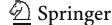

- Leadership & Organizational Studies, 15(4), 353–367. doi[:10.1177/](http://dx.doi.org/10.1177/1548051809332021) [1548051809332021](http://dx.doi.org/10.1177/1548051809332021).
- Gross, J. J., & Thompson, R. A. (2007). Emotion regulation: conceptual foundations. In J. J. Gross (Ed.), Handbook of emotion regulation (pp. 3–24). New York (NY): Guilford Press.
- Halbesleben, J. R. B., & Wheeler, A. R. (2008). The relative roles of engagement and embeddedness in predicting job performance and intention to leave. Work & Stress, 22(3), 242–256. doi[:10.1080/](http://dx.doi.org/10.1080/02678370802383962) [02678370802383962](http://dx.doi.org/10.1080/02678370802383962).
- Halbesleben, J. R. B., Harvey, J., & Bolino, M. C. (2009). Too engaged? A conservation of resources view of the relationship between work engagement and work interference with family. The Journal of Applied Psychology, 94(6), 1452–1465. doi[:10.1037/a0017595](http://dx.doi.org/10.1037/a0017595).
- Harter, J. K., Schmidt, F. L., & Hayes, T. L. (2002). Business-unit-level relationship between employee satisfaction, employee engagement, and business outcomes: a meta-analysis. Journal of Applied Psychology, 87(2), 268–279. doi[:10.1037//0021-9010.87.2.268](http://dx.doi.org/10.1037//0021-9010.87.2.268).
- Hill, E. J., Yang, C., Hawkins, A. J., & Ferris, M. (2004). A cross-cultural test of the work-family interface in 48 countries. Journal of Marriage and Family, 66(5), 1300–1316. doi:[10.1111/j.0022-](http://dx.doi.org/10.1111/j.0022-2445.2004.00094.x) [2445.2004.00094.x.](http://dx.doi.org/10.1111/j.0022-2445.2004.00094.x)
- Hoyle, R. H. (2011). Structural equation modeling for social and personality psychology. London: Sage.
- Hülsheger, U. R., Alberts, H. J., Feinholdt, A., & Lang, J. W. (2013). Benefits of mindfulness at work: the role of mindfulness in emotion regulation, emotional exhaustion, and job satisfaction. The Journal of Applied Psychology, 98(2), 310–325. doi:[10.1037/a0031313](http://dx.doi.org/10.1037/a0031313).
- Irving, J. A., Dobkin, P. L., & Park, J. (2009). Cultivating mindfulness in health care professionals: a review of empirical studies of mindfulness-based stress reduction (MBSR). Complementary Therapies in Clinical Practice, 15(2), 61–66. doi[:10.1016/j.ctcp.](http://dx.doi.org/10.1016/j.ctcp.2009.01.002) [2009.01.002](http://dx.doi.org/10.1016/j.ctcp.2009.01.002).
- Jensen, S. M., & Luthans, F. (2006). Relationship between entrepreneurs' psychological capital and their authentic leadership. Journal of Managerial Issues, XVIII(2), 254–273.
- Kabat-Zinn, J. (2003). Mindfulness-based interventions in context: past, present, and future. Clinical Psychology: Science and Practice, 10(2), 144–156.
- Keng, S. L., Smoski, M. J., & Robins, C. J. (2011). Effects of mindfulness on psychological health: a review of empirical studies. Clinical Psychology Review, 31(6), 1041–1056. doi[:10.1016/j.cpr.2011.04.006](http://dx.doi.org/10.1016/j.cpr.2011.04.006).
- Kiken, L. G., & Shook, N. J. (2011). Looking up: mindfulness increases positive judgments and reduces negativity bias. Social Psychological and Personality Science, 2(4), 425–431. doi[:10.](http://dx.doi.org/10.1177/1948550610396585) [1177/1948550610396585.](http://dx.doi.org/10.1177/1948550610396585)
- Klatt, M. D., Buckworth, J., & Malarkey, W. B. (2009). Effects of lowdose mindfulness-based stress reduction (MBSR-ld) on working adults. Health Education & Behavior, 36(3), 601–614. doi[:10.](http://dx.doi.org/10.1177/1090198108317627) [1177/1090198108317627.](http://dx.doi.org/10.1177/1090198108317627)
- Lai, X., Li, F., & Leung, K. (2013). A Monte Carlo study of the effects of common method variance on significance testing and parameter bias in hierarchical linear modeling. Organizational Research Methods, 16(2), 243–269. doi[:10.1177/1094428112469667.](http://dx.doi.org/10.1177/1094428112469667)
- Leroy, H., Anseel, F., Dimitrova, N. G., & Sels, L. (2013). Mindfulness, authentic functioning, and work engagement: a growth modeling approach. Journal of Vocational Behavior, 82(3), 238–247. doi:[10.](http://dx.doi.org/10.1016/j.jvb.2013.01.012) [1016/j.jvb.2013.01.012.](http://dx.doi.org/10.1016/j.jvb.2013.01.012)
- Levy, D. M., Wobbrock, J. O., Kaszniak, A. W., & Ostergren, M. (2012). The effects of mindfulness meditation training on multitasking in a high-stress information environment. In: Graphics Interface Conference, Toronto, 28–30 May 2012 2012 (pp. 45–52, Proceedings of Graphics Interface). To ronto: Canadian Information Processing Society.
- Little, T. D., Cunningham, W. A., Shahar, G., & Widaman, K. F. (2002). To parcel or not to parcel: exploring the question, weighing the

- merits. Structural Equation Modeling, 9(2), 151–173. doi[:10.1207/](http://dx.doi.org/10.1207/S15328007SEM0902_1) [S15328007SEM0902\\_1.](http://dx.doi.org/10.1207/S15328007SEM0902_1)
- Luthans, F., Avolio, B. J., Avey, J. B., & Norman, S. M. (2007a). Positive psychological capital: measurement and relationship with performance and satisfaction. Personnel Psychology, 60(3), 541–572. doi:[10.1111/j.1744-6570.2007.00083.x](http://dx.doi.org/10.1111/j.1744-6570.2007.00083.x).
- Luthans, F., Youssef, C. M., & Avolio, B. J. (2007b). Psychological capital: developing the human competitive edge. New York: Oxford University Press.
- Lyubomirsky, S., King, L., & Diener, E. (2005). The benefits of frequent positive affect: does happiness lead to success? Psychological Bulletin, 131(6), 803–855. doi[:10.1037/0033-2909.131.6.803.](http://dx.doi.org/10.1037/0033-2909.131.6.803)
- Malinowski, P. (2008). Mindfulness as psychological dimension: concepts and applications. Irish Journal of Psychology, 29(1), 155–166.
- Malinowski, P. (2012). Flourishing through meditation and mindfulness. In S. David, I. Boniwell, & A. Conley Ayers (Eds.), Oxford Handbook of Happiness (pp. 384–396). Oxford: Oxford University Press.
- Malinowski, P. (2013). Neural mechanisms of attentional control in mindfulness meditation. Frontiers in Neuroscience, 7, 8. doi:[10.3389/](http://dx.doi.org/10.3389/fnins.2013.00008) [fnins.2013.00008.](http://dx.doi.org/10.3389/fnins.2013.00008)
- Markos, S., & Sridevi, M. S. (2010). Employee engagement: the key to improving performance. International Journal of Business and Management, 5(12), 89–96.
- Meiklejohn, J., Phillips, C., Freedman, M. L., Griffin, M. L., Biegel, G., Roach, A., et al. (2012). Integrating mindfulness training into K-12 education: fostering the resilience of teachers and students. Mindfulness, 3(4), 291–307. doi[:10.1007/s12671-012-0094-5.](http://dx.doi.org/10.1007/s12671-012-0094-5)
- Moore, A., & Malinowski, P. (2009). Meditation, mindfulness and cognitive flexibility. Consciousness and Cognition, 18(1), 176–186.
- Papies, E. K., Barsalou, L. W., & Custers, R. (2012). Mindful attention prevents mindless impulses. Social Psychological and Personality Science, 3(3), 291–299. doi[:10.1177/1948550611419031.](http://dx.doi.org/10.1177/1948550611419031)
- Podsakoff, P. M., MacKenzie, S. B., Lee, J. Y., & Podsakoff, N. P. (2003). Common method biases in behavioral research: a critical review of the literature and recommended remedies. Journal of Applied Psychology, 88(5), 879–903. doi:[10.1037/0021-9010.88.5.879](http://dx.doi.org/10.1037/0021-9010.88.5.879).
- Quoidbach, J., Berry, E. V., Hansenne, M., & Mikolajczak, M. (2010). Positive emotion regulation and well-being: comparing the impact of eight savoring and dampening strategies. Personality and Individual Differences, 49(5), 368–373. doi:[10.1016/j.paid.2010.](http://dx.doi.org/10.1016/j.paid.2010.03.048) [03.048.](http://dx.doi.org/10.1016/j.paid.2010.03.048)
- Ram, P., & Prabhakar, G. V. (2011). The role of employee engagement in work-related outcomes. Interdisciplinary Journal of Research in Business, 1(3), 47–61.
- Reb, J., Narayanan, J., & Chaturvedi, S. (2014). Leading mindfully: two studies on the influence of supervisor trait mindfulness on employee well-being and performance. Mindfulness, 5, 36-45. doi: [10.1007/](http://dx.doi.org/10.1007/s12671-012-0144-z) [s12671-012-0144-z](http://dx.doi.org/10.1007/s12671-012-0144-z).
- Rego, A., Marques, C., Leal, S., Sousa, F., & Pina e Cunha, M. (2010). Psychological capital and performance of Portuguese civil servants: exploring neutralizers in the context of an appraisal system. The International Journal of Human Resource Management, 21(9), 1531–1552. doi[:10.1080/09585192.2010.488459.](http://dx.doi.org/10.1080/09585192.2010.488459)
- Robertson, I. T., & Cooper, C. L. (2010). Full engagement: the integration of employee engagement and psychological well-being. Leadership & Organization Development Journal, 31(4), 324–336. doi:[10.](http://dx.doi.org/10.1108/01437731011043348) [1108/01437731011043348.](http://dx.doi.org/10.1108/01437731011043348)
- Roche, M., Haar, J. M., & Luthans, F. (2014). The role of mindfulness and psychological capital on the well-being of leaders. Journal of Occupational Health Psychology, Advance online publication. doi: [10.1037/a0037183.](http://dx.doi.org/10.1037/a0037183)
- Rosenzweig, S., Reibel, D. K., Greeson, J. M., Brainard, G. C., & Hojat, M. (2003). Mindfulness-based stress reduction lowers psychological distress in medical students. Teaching and Learning in Medicine, 15(2), 88–92.

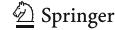

- Saks, A. M. (2006). Antecedents and consequences of employee engagement. Journal of Managerial Psychology, 21(7), 600–619. doi:[10.](http://dx.doi.org/10.1108/02683940610690169) [1108/02683940610690169.](http://dx.doi.org/10.1108/02683940610690169)
- Salanova, M., Llorens, S., & Schaufeli, W. B. (2011). "Yes, I can, I feel good, and I just do it!" On gain cycles and spirals of efficacy beliefs, affect, and engagement. Applied Psychology, 60(2), 255–285. doi: [10.1111/j.1464-0597.2010.00435.x.](http://dx.doi.org/10.1111/j.1464-0597.2010.00435.x)
- Sauer, S., & Kohls, N. (2011). Mindfulness in leadership: does being mindful enhance leaders' business success? In S. Han & E. Pöppel (Eds.), Culture and neural frames of cognition and communication (pp. 287–307). Berlin: Springer.
- Schaufeli, W. B., & Bakker, A. B. (2004). Job demands, job resources, and their relationship with burnout and engagement: a multi-sample study. Journal of Organizational Behavior, 25, 293–315.
- Schaufeli, W. B., Salanova, M., Gonzalez-Roma, V., & Bakker, A. B. (2002). The measurement of engagement and burnout: a two sample confirmatory factor analytic approach. Journal of Happiness Studies, 3(1), 71–92.
- Schaufeli, W. B., Bakker, A. B., & Salanova, M. (2006). The measurement of work engagement with a short questionnaire: a crossnational study. Educational and Psychological Measurement, 66(4), 701-716. doi[:10.1177/0013164405282471](http://dx.doi.org/10.1177/0013164405282471).
- Schermelleh-Engel, K., Moosbrugger, H., & Müller, H. (2003). Evaluating the fit of structural equation models. Tests of significance and descriptive goodness-of-fit measures Methods of Psychological Research, 8(2), 23–74.
- Schonert-Reichl, K. A., & Lawlor, M. S. (2010). The effects of a mindfulness-based education program on pre- and early adolescents' well-being and social and emotional competence. Mindfulness, 1(3), 137–151. doi[:10.1007/s12671-010-0011-8.](http://dx.doi.org/10.1007/s12671-010-0011-8)
- Sears, S., & Kraus, S. (2009). I think therefore I am: cognitive distortions and coping style as mediators for the effects of mindfulness meditation on anxiety, positive and negative affect, and hope. Journal of Clinical Psychology, 65(6), 561–573. doi[:10.1002/jclp.20543.](http://dx.doi.org/10.1002/jclp.20543)
- Shapiro, S. L., Carlson, L. E., Astin, J. A., & Freedman, B. (2006). Mechanisms of mindfulness. Journal of Clinical Psychology, 62(3), 373–386. doi[:10.1002/jclp.20237.](http://dx.doi.org/10.1002/jclp.20237)
- Shapiro, S. L., Brown, K. W., & Biegel, G. M. (2007). Teaching self-care to caregivers: effects of mindfulness-based stress reduction on the mental health of therapists in training. Training and Education in Professional Psychology, 1(2), 105–115. doi[:10.1037/1931-3918.1.2.105](http://dx.doi.org/10.1037/1931-3918.1.2.105).
- Shapiro, S. L., Brown, K. W., Thoresen, C., & Plante, T. G. (2011). The moderation of mindfulness-based stress reduction effects by trait mindfulness: results from a randomized controlled trial. Journal of Clinical Psychology, 67(3), 267–277. doi[:10.1002/jclp.20761.](http://dx.doi.org/10.1002/jclp.20761)
- Shimazu, A., & Schaufeli, W. B. (2009). Is workaholism good or bad for employee well-being? The distinctiveness of workaholism and work engagement among Japanese employees. Industrial Health, 47, 495–502.
- Siemsen, E., Roth, A., & Oliveira, P. (2010). Common method bias in regression models with linear, quadratic, and interaction effects. Organizational Research Methods, 13(3), 456–476. doi[:10.1177/](http://dx.doi.org/10.1177/1094428109351241) [1094428109351241](http://dx.doi.org/10.1177/1094428109351241).
- Simpson, M. R. (2009). Engagement at work: a review of the literature. International Journal of Nursing Studies, 46(7), 1012–1024. doi:[10.](http://dx.doi.org/10.1016/j.ijnurstu.2008.05.003) [1016/j.ijnurstu.2008.05.003.](http://dx.doi.org/10.1016/j.ijnurstu.2008.05.003)
- Slagter, H. A., Davidson, R. J., & Lutz, A. (2011). Mental training as a tool in the neuroscientific study of brain and cognitive plasticity. Frontiers in Human Neuroscience, 5, 17. doi[:10.3389/fnhum.2011.00017](http://dx.doi.org/10.3389/fnhum.2011.00017).
- Snyder, C. R. (2002). TARGET ARTICLE: Hope theory: rainbows in the mind. Psychological Inquiry, 13(4), 249–275. doi:[10.1207/](http://dx.doi.org/10.1207/s15327965pli1304_01) [s15327965pli1304\\_01.](http://dx.doi.org/10.1207/s15327965pli1304_01)
- Snyder, C. R., Harris, C., Anderson, J. R., Holleran, S. A., Irving, L. M., Sigmon, S. T., et al. (1991). The will and the ways: development and validation of an individual-differences measure of hope. Journal of Personality and Social Psychology, 60(4), 570–585.

- Sonnentag, S. (2003). Recovery, work engagement, and proactive behavior: a new look at the interface between nonwork and work. Journal of Applied Psychology, 88, 518–528.
- Sonnentag, S., Mojza, E. J., Binnewies, C., & Scholl, A. (2008). Being engaged at work and detached at home: a week-level study on work engagement, psychological detachment, and affect. Work & Stress, 22(3), 257–276. doi[:10.1080/02678370802379440](http://dx.doi.org/10.1080/02678370802379440).
- Tennant, R., Hiller, L., Fishwick, R., Platt, S., Joseph, S., Weich, S., et al. (2007). The Warwick-Edinburgh Mental Well-being Scale (WEMWBS): development and UK validation. Health and Quality of Life Outcomes, 5, 63. doi[:10.1186/1477-7525-5-63](http://dx.doi.org/10.1186/1477-7525-5-63).
- Teper, R., & Inzlicht, M. (2013). Meditation, mindfulness and executive control: the importance of emotional acceptance and brain-based performance monitoring. Social Cognitive and Affective Neuroscience, 8(1), 85–92. doi[:10.1093/scan/nss045.](http://dx.doi.org/10.1093/scan/nss045)
- Teper, R., Segal, Z. V., & Inzlicht, M. (2013). Inside the mindful mind: how mindfulness enhances emotion regulation through improvements in executive control. Current Directions in Psychological Science, 22(6), 449–454. doi[:10.1177/0963721413495869](http://dx.doi.org/10.1177/0963721413495869).
- van Berkel, J., Proper, K. I., Boot, C. R. L., Bongers, P. M., & van der Beek, A. J. (2011). Mindful "Vitality in Practice": an intervention to improve the work engagement and energy balance among workers; the development and design of the randomised controlled trial. BMC Public Health, 11(1), 736–748.
- van Berkel, J., Boot, C. R. L., Proper, K. I., Bongers, P. M., & van der Beek, A. J. (2013). Process evaluation of a workplace health promotion intervention aimed at improving work engagement and energy balance. Journal of Occupational and Environmental Medicine, 55(1), 19–26.
- Van Katwyk, P. T., Fox, S., Spector, P. E., & Kelloway, E. K. (2000). Using the Job-Related Affective Well-Being Scale (JAWS) to investigate affective responses to work stressors. Journal of Occupational Health Psychology, 5(2), 219–230. doi:[10.1037/1076-8998.5.2.219](http://dx.doi.org/10.1037/1076-8998.5.2.219).
- Verplanken, B., & Fisher, N. (2014). Habitual worrying and benefits of mindfulness. Mindfulness, 5(5), 566–573. doi[:10.1007/s12671-013-0211-0.](http://dx.doi.org/10.1007/s12671-013-0211-0)
- Weinstein, N., Brown, K. W., & Ryan, R. M. (2009). A multi-method examination of the effects of mindfulness on stress attribution, coping, and emotional well-being. Journal of Research in Personality, 43(3), 374–385. doi[:10.1016/j.jrp.2008.12.008](http://dx.doi.org/10.1016/j.jrp.2008.12.008).
- Williams, M. J., Dalgleish, T., Karl, A., & Kuyken, W. (2014). Examining the factor structures of the Five Facet Mindfulness Questionnaire and the Self-Compassion Scale. Psychological Assessment, 26(2), 407–418. doi[:10.1037/a0035566.](http://dx.doi.org/10.1037/a0035566)
- Wolever, R. Q., Bobinet, K. J., McCabe, K., Mackenzie, E. R., Fekete, E., Kusnick, C. A., et al. (2012). Effective and viable mind-body stress reduction in the workplace: a randomized controlled trial. Journal of Occupational Health Psychology, 17(2), 246–258. doi[:10.1037/](http://dx.doi.org/10.1037/a0027278) [a0027278](http://dx.doi.org/10.1037/a0027278).
- Wright, T. A., & Cropanzano, R. (2000). Psychological well-being and job satisfaction as predictors of job performance. Journal of Occupational Health Psychology, 5(1), 84–94. doi[:10.1037/1076-](http://dx.doi.org/10.1037/1076-8998.5.1.84) [8998.5.1.84](http://dx.doi.org/10.1037/1076-8998.5.1.84).
- Wright, T. A., Cropanzano, R., & Meyer, D. G. (2004). State and trait correlates of job performance: a tale of two perspectives. Journal of Business and Psychology, 18(3), 365–383. doi:[10.1023/b:jobu.](http://dx.doi.org/10.1023/b:jobu.0000016708.22925.72) [0000016708.22925.72](http://dx.doi.org/10.1023/b:jobu.0000016708.22925.72).
- Xanthopoulou, D., Bakker, A. B., Demerouti, E., & Schaufeli, W. B. (2007). The role of personal resources in the job demandsresources model. International Journal of Stress Management, 14(2), 121–141. doi[:10.1037/1072-5245.14.2.121.](http://dx.doi.org/10.1037/1072-5245.14.2.121)
- Xanthopoulou, D., Bakker, A. B., Demerouti, E., & Schaufeli, W. B. (2009). Work engagement and financial returns: a diary study on the role of job and personal resources. Journal of Occupational and Organizational Psychology, 82(1), 183–200. doi:[10.1348/](http://dx.doi.org/10.1348/096317908x285633) [096317908x285633](http://dx.doi.org/10.1348/096317908x285633).

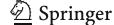