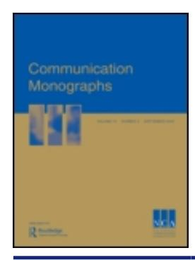
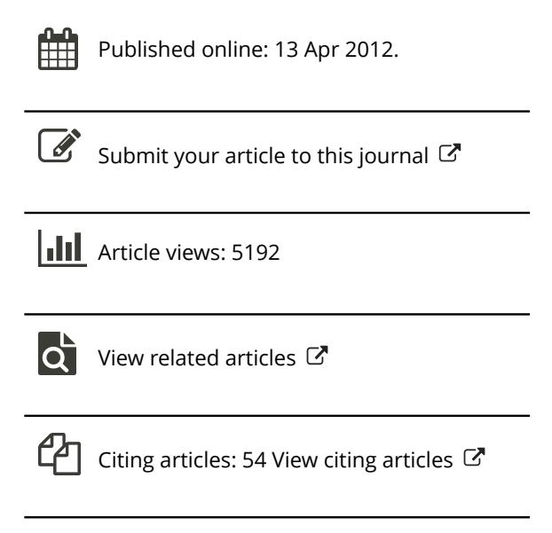
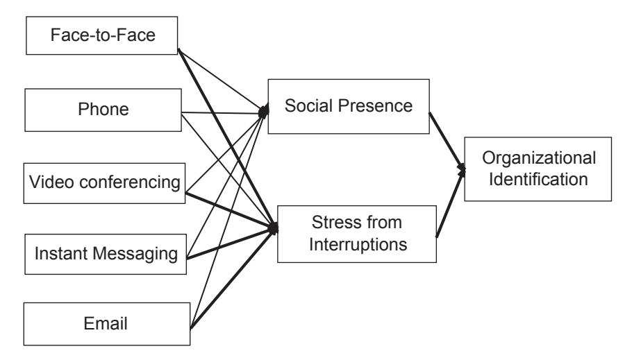
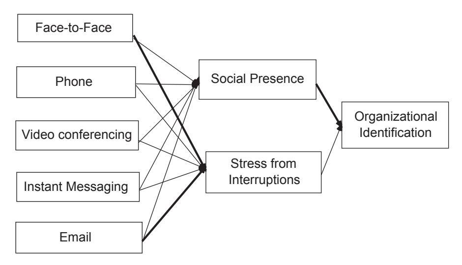

### **Communication Monographs**

**ISSN: 0363-7751 (Print) 1479-5787 (Online) Journal homepage: [www.tandfonline.com/journals/rcmm20](https://www.tandfonline.com/journals/rcmm20?src=pdf)**

## **Testing the Connectivity Paradox: Linking Teleworkers' Communication Media Use to Social Presence, Stress from Interruptions, and Organizational Identification**

**Kathryn L. Fonner & Michael E. Roloff**

**To cite this article:** Kathryn L. Fonner & Michael E. Roloff (2012) Testing the Connectivity Paradox: Linking Teleworkers' Communication Media Use to Social Presence, Stress from Interruptions, and Organizational Identification, Communication Monographs, 79:2, 205-231, DOI: [10.1080/03637751.2012.673000](https://www.tandfonline.com/action/showCitFormats?doi=10.1080/03637751.2012.673000)

**To link to this article:** <https://doi.org/10.1080/03637751.2012.673000>

# Testing the Connectivity Paradox: Linking Teleworkers' Communication Media Use to Social Presence, Stress from Interruptions, and Organizational Identification

Kathryn L. Fonner & Michael E. Roloff

Scholars emphasize the importance of rich communication media for the development of teleworkers' organizational identification, but tests of these relationships have produced inconsistent results. The connectivity paradox helps explain these findings. The paradox suggests that teleworkers' connectivity to others through communication media facilitates remote work by affording greater social presence, while also negating the benefits of telework by enabling stressful interruptions. These outcomes of connectivity may benefit and detract from identification. We propose a model linking the core features of the connectivity paradox to organizational identification. Teleworkers and office workers were surveyed, and a multigroup path analysis was utilized. Results indicate that connectivity increases stress from interruptions and indirectly diminishes teleworkers' identification.

Keywords: Telework; Organizational Identification; Interruptions; Connectivity; Social Presence

Telework is an arrangement in which employees perform part or all of their work outside the organization's physical boundaries, primarily communicating via

Kathryn L. Fonner (PhD, Northwestern University) is an Assistant Professor in the Department of Communication at the University of Wisconsin-Milwaukee. Michael E. Roloff (PhD, Michigan State University) is a Professor in the Department of Communication Studies at Northwestern University. Data were collected as part of the first author's dissertation. A version of this manuscript was presented at the 2011 International Communication Association Conference, Boston, MA. We would like to thank Katherine Miller and the anonymous Communication Monographs reviewers for their thoughtful feedback. We also thank Erik Timmerman for his helpful suggestions. Correspondence to: Kathryn L. Fonner, PO Box 413, Milwaukee, WI 53201, USA. E-mail: fonner@uwm.edu

technology (Baruch, 2001). Despite its growing prevalence in US organizations (WorldatWork, 2009), telework adoption has been slower than originally predicted. In part, this may stem from the assumption that remote work isolates employees from their colleagues and the organization (Cooper & Kurland, 2002) and thus diminishes their sense of identity as an organizational member (Thatcher & Zhu, 2006).

However, teleworkers may not be as isolated as is often assumed, because the availability and ease of use of communication technologies enable a high degree of connectivity. Essentially, teleworkers may experience a connectivity paradox, whereby the use of synchronous and data-intensive communication technologies diminishes their experience of distance and isolation while simultaneously generating a sense of being overly connected to others in the organization (Leonardi, Treem, & Jackson, 2010, p. 99). The paradox appears to occur as the connectivity afforded by communicating using various media enables remote work by increasing a sense of presence and connectedness but also negates the benefits of remote work by generating interruptions that may threaten teleworkers' flexibility, focus, and autonomy. Hence, connectivity may simultaneously afford distinct positive and negative outcomes. These outcomes may help explain the inconsistent results identified in research linking the use of specific media to organizational identification.

We propose a model to test the connectivity paradox and its relationship to teleworkers' organizational identification. We hypothesize that (a) communication media use affects teleworkers' perceptions of social presence and the extent to which they experience stress from interruptions, and that (b) teleworkers' experiences of social presence and stress from interruptions connect communication media use to organizational identification through significant indirect paths. Because collocated work settings are associated with both high levels of social presence and stressful interruptions, the model is also examined in relation to office-based employees. Below, we discuss the importance of organizational identification in remote work contexts and outline the hypothesized relationships.

#### Telework and Organizational Identification

Organizational identification occurs when employees feel a sense of attachment toward the organization (Cheney, 1983), incorporate the organization into their selfconcept, and feel a sense of belonging within the organization (Mael & Ashforth, 1992). The construct of organizational identification is closely tied to social identity theory, which focuses on individuals' cognitive membership in a group and the emotional value of that membership (Tajfel, 1978, p. 66). Although identificationfocused research has predominantly been conducted in collocated contexts, scholars have recently emphasized the need to evaluate identification in remote work contexts (e.g., Fiol & O'Connor, 2005; Scott, 2007). Indeed, some have suggested that identification may be the ''critical glue'' that links teleworkers to their organizations, as it facilitates interactions, aids work group functioning, and encourages extra-role efforts (Wiesenfeld, Raghuram, & Garud, 1999, p. 777).

The process of identification has been characterized as a dynamic interchange between the individual and the organization, which occurs as ''individuals begin to incorporate elements of the collective into their sense of self by enacting identities and then interpreting responses to these enactments'' (Ashforth, Harrison, & Corley, 2008, p. 340). According to the structurational model of identification, organizations operate across various locations, but it is employees' daily routines and activities ''in a given locale that provide the context for identifications'' (Scott, Corman, & Cheney, 1998, p. 322). Daily workplace experiences such as communication with managers and exposure to informal norms and formal policies guide employees' ongoing enactment of organizational identities (Shamir, 1992). Consequently, employees' activities and social interactions\*''usually with those who are copresent''\*facilitate the development of their organizational identities and identification (Scott et al., 1998, p. 322).

However, teleworkers experience less exposure to the interactions, structures, and guidelines that help solidify the collective and individual organizational identities that affect identification (Wiesenfeld, Raghuram, & Garud, 2001). Employees who work remotely most of the time may face the greatest challenge in establishing organizational identification, as those who telework at low or moderate levels may still operate within the shared temporal and physical boundaries that facilitate identification (Thatcher & Zhu, 2006). Teleworkers may begin to feel that they are no longer ''full-fledged members'' of the organization as they are solely ''connected and identified by communication technology rather than their physical person'' (Ballard & Gossett, 2007, p. 300). Although teleworkers may proactively manage their identities by establishing a ''virtual presence,'' relying on mediated communication may lead to the feeling that their organizational relationships and identities have changed (p. 300). Thus, the organizational identification of less extensive teleworkers may differ from that of more extensive teleworkers (Scott & Timmerman, 1999), and the relationship between communication media use and organizational identification is influenced by the extent of time spent teleworking (Wiesenfeld et al., 1999).

Hence, we examine the communication and organizational identification of highintensity teleworkers (Gajendran & Harrison, 2007, p. 1529), who we identify as employees working remotely at least three days a week, compared to office-based employees working at least three days a week in a collocated environment. Teleworking intensity represents ''the extent or amount of scheduled time that employees spend doing tasks away from a central work location'' (p. 1529). When teleworkers spend the majority of their time working remotely, they cross a psychological threshold. Initial evidence indicates that high-intensity teleworkers' work experiences differ from those of their office-based colleagues. Employees who telework 2.5 or more days per week experience lower worklife conflict and lower quality coworker relationships (Gajendran & Harrison, 2007). Similarly, employees teleworking more than 50% of their workweek have reported experiencing different stressors and motivations compared to office-centered and nonteleworking employees working at least 50% of their workdays in a central location (Konradt, Hertel, & Schmook, 2003, p. 66). Finally, employees teleworking three or more days a week have been found to differ in their use of communication media (Wiesenfeld et al., 1999) and to experience greater job satisfaction and less frequent information exchange, worklife conflict, stress from meetings and interruptions, and exposure to general office politics relative to employees working the majority of their time in a collocated environment (Fonner & Roloff, 2010). Thus, it is important to examine how the connectivity paradox applies to high-intensity teleworkers, who may be the furthest removed from the collocated workplace and the interactions that facilitate a sense of presence, interruptions, and organizational identification. We now outline a model linking high-intensity teleworkers' communication media use to their perceptions of social presence and feelings of stress due to interruptions, and explain how these relationships are related to organizational identification.

#### The Connectivity Paradox

Scholars have acknowledged the need to explore the existence of organizational paradoxes, or the ''simultaneous presence of contradictory, even mutually exclusive elements'' in organizational conditions (Cameron & Quinn, 1988, p. 2). Organizational paradoxes are evident in workplace democracy, employee participation (Stohl & Cheney, 2001), and gender issues (Martin, 2004). In contrast to logical paradoxes, ''social paradoxes are about a real world, subject to its temporal and spatial constraints'' (Poole & Van de Ven, 1989, p. 565). In part, organizational paradoxes may exist or emerge based on these temporal and spatial constraints. For example, work arrangements such as telework may generate inconsistencies in employees' work interactions that create a need to identify new ways of conducting work. Telework may be associated with paradoxes such as flexibility\*structure, individuality\* teamwork, and responsibility\*control (Pearlson & Saunders, 2001).

Recently, studies have explored organizational paradoxes in remote work contexts, by examining the extent to which consequences of remote work are incompatible with each other, such that certain benefits of telework come at the expense of certain drawbacks of telework. Gajendran and Harrison (2007) proposed and tested a telecommuting paradox, in which telework was expected to afford greater autonomy and lower worklife conflict while simultaneously damaging employees' connections to their colleagues and supervisors. This paradox was also tested in a study examining the extent to which telework was associated with additional proximal outcomes that benefit, and others that detract from, job satisfaction (Fonner & Roloff, 2010). Neither study supported the proposed telecommuting paradox. Rather, findings highlighted the benefits of telework and challenged the notion that teleworkers' relational and informational ties are affected in ways that negatively influence individual outcomes. Teleworkers appear to experience unique advantages based on their ability to maintain a sense of distance from the collocated workplace. However, when teleworkers establish a high degree of connectivity to others in the organization, this may mitigate some of the benefits of remote work.

The current study focuses on this issue by testing the connectivity paradox proposed by Leonardi et al. (2010). These scholars suggest that connectivity should be viewed as a paradox, as the technologies ''that provide the connectivity for teleworkers to successfully conduct work also create the opportunity for perpetual connectivity that raises perceived obstacles to work'' (p. 99). In other words, the technologies that help teleworkers overcome their sense of distance and isolation may also enable levels of connectivity that detract from the potential advantages of working remotely. In a qualitative study testing this paradox, Leonardi and his colleagues found that teleworkers' connectivity diminished their sense of distance from colleagues while simultaneously negating some of the valued benefits of their work arrangement, such as flexibility and the ability to work with limited interruptions. Technologies enabled teleworkers' sense of connection with others but also provided a means for office-based colleagues to communicate with teleworkers at increasing levels, thus spurring the types of interruptions teleworkers reported trying to avoid by working remotely. Although connectivity diminished teleworkers' sense of distance, the ''constant connection with the office placed informants in the center of discussions that they thought they would avoid by becoming teleworkers'' and the ''enhanced levels of communication were impeding them from focusing on their work'' (Leonardi et al., 2010, p. 95). Ultimately, the paradox was evident as the connectivity via various communication technologies enabled a greater sense of connection with colleagues, but simultaneously counteracted many of the potential benefits of remote work, such as the ability to limit interruptions and focus. We propose a quantitative model that tests this connectivity paradox and examines its relationship to organizational identification.

To test the connectivity paradox, we evaluate outcomes associated with the frequency of teleworkers' communication with their colleagues and supervisor using various media. Although the availability of various media may also generate expectations for teleworkers' connectivity, these expectations will primarily be captured in the communication that occurs. In other words, when teleworkers feel they are expected to remain connected, they will be responsive and communicative. In the preliminary arguments leading to the development of the connectivity paradox, Leonardi, Jackson, and Marsh (2004) state that, ''despite their physical separation from the office, workers are expected to remain connected to the organization,'' and ''the most obvious manifestation of this connection is through communication'' (p. 161). Teleworkers' communication using various media should be significantly related to their experiences of social presence and to stress associated with interruptions.

The first part of the connectivity paradox suggests that through the use of various communication media, teleworkers decrease the perception of distance and feel more connected to others. To test this, we examine the relationship between communication media use and teleworkers' perceptions of social presence in their workplace interactions. Social presence represents the degree to which communication media enable users to evoke a sense of physical presence during an interaction (Short, Williams, & Christie, 1976), as well as a sense of mutual understanding, involvement, intimacy, and immediacy (Biocca, Harms, & Burgoon, 2003).

Communication media afford varying degrees of social presence. Those with the most available verbal and nonverbal cues are expected to produce the greatest perceptions of social presence, with face-to-face communication enabling the highest social presence (Short et al., 1976). However, social presence can be perceived in lean, mediated environments (Gunawardena, 1995) and lean media such as email should also contribute to users' sense of social presence. Thus, we propose that teleworkers' use of communication media will be positively related to their perceptions of social presence.

The second part of the connectivity paradox suggests that connectivity may come at a cost, as the use of various communication media also enables unwanted and distracting interactions. We test this by examining the relationship between communication media use and teleworkers' feelings of stress arising from interruptions. In general, telework enables employees to withdraw from unwanted workplace communication and to secure uninterrupted time to work (Nardi & Whittaker, 2002). High-intensity teleworkers in particular have been found to derive job satisfaction from their ability to avoid information overload, meetings and interruptions, office politics, and worklife conflict (Fonner & Roloff, 2010). In order to protect their uninterrupted time, teleworkers may strategically manage their sense of distance from their colleagues (Leonardi et al., 2010). However, rich and data-intensive communication technologies make it more challenging for teleworkers to sustain this sense of distance. Increased connectivity exposes teleworkers to workplace interactions that can be perceived as interruptions, such as scheduled meetings (Luong & Rogelberg, 2005), informal conversations, (Jett & George, 2003), and colleagues' requests for help (Perlow & Weeks, 2002). These interruptions may generate feelings of stress and time pressure as employees strive to accomplish tasks (Jett & George, 2003). Unless teleworkers strategically disconnect or otherwise make themselves unavailable (Leonardi et al., 2010), they will be exposed to interruptions and in turn may lose some of the advantages of remote work.

H1: Among high-intensity teleworkers, the frequency of communication media use will be positively related to perceptions of social presence and stress arising from interruptions.

#### Linking the Connectivity Paradox to Organizational Identification

The aforementioned hypothesis tests the connectivity paradox and extends the current literature by examining relationships between teleworkers' use of specific communication media and outcomes related to connectivity\*namely, social presence and stress from interruptions. We propose these outcomes will be related to teleworkers' organizational identification and build on previous research emphasizing the relationship between communication media use and organizational identification. For teleworkers, technology use may enhance identification by ''enabling the frequency, depth, and interactivity of communication processes'' (Wilson, O'Leary, Metiu, & Jett, 2008). Teleworkers' use of rich media may help establish a sense of proximity and similarity and promote feelings of identification (Pratt, Fuller, & Northcraft, 2000). Indeed, qualitative findings suggest that virtual workers use technologies to establish relationships and maintain communication crucial to their identification process (Leonardi et al., 2004).

However, quantitative studies examining the direct relationships between teleworkers' use of specific communication media and their identification have produced relatively weak support for these relationships. In one study, use of advanced phone technologies was significantly related to teleworkers' organizational identification, but use of electronic messaging technologies, basic desktop technologies, and delivery service technologies was not (Scott & Timmerman, 1999). In another study, significant relationships between teleworkers' communication media use and organizational identification emerged only when the amount of time spent teleworking was included as a moderating variable (Wiesenfeld et al., 1999). Employees working in the office less than two days a week experienced a significant positive relationship between email use and identification, and those working in the office two or more days a week experienced a significant positive relationship between phone use and identification. Finally, Timmerman and Scott (2006) found that communication media use was only related to virtual workers' identification with their team when attributes of their communication were evaluated as moderating variables. Specifically, communication attributes influenced the relationship between email use and team identification. Clearly, there is some evidence that communication media use has a positive relationship with identification, but overall these findings have been relatively weak and inconsistent.

The connectivity paradox may help explain these findings. The paradox suggests that increased connectivity via use of communication media may produce advantages (e.g., social presence) and disadvantages (e.g., stressful interruptions) for teleworkers. This builds on adaptive structuration theory (DeSanctis & Poole, 1994), which notes that despite the inherent structural potential or restrictiveness of communication technologies, they can be appropriated in ways that both constrain and enable interaction. Put simply, employees' choices regarding technology use may affect qualities of their social interaction, which in turn affect key outcomes. Similarly, the connectivity paradox suggests that teleworkers' use of communication media may influence their work interactions in positive and negative ways, which should help explain outcomes such as organizational identification. Specifically, the weak or nonsignificant relationships found between communication media use and organizational identification may be explained by the contradicting benefits and challenges associated with the use of these media. The relationship between communication media use and organizational identification may be best explained by examining the perceptions of social presence and feelings of stress that are derived from communicating through these media.

First, we propose a significant indirect relationship between communication media use and organizational identification, through social presence. Increased use of communication media should be positively related to teleworkers' perceptions of social presence, which in turn should augment the feelings of understanding and common ground that facilitate organizational identification. Social presence has been equated with greater personalized communication and awareness of communication partners (Ramirez & Zhang, 2007), and higher social presence conditions lead to greater information accuracy, communication richness, appropriate communication, and discussion quality (Lowry, Roberts, Romano, Cheney, & Hightower, 2006). Experiencing enhanced communication and the ability to better observe organizational norms will aid teleworkers' development of organizational identification. Just as proximal environments help employees achieve common ground (Olson & Olson, 2000) and encourage positive social judgments of others (Burgoon et al., 2002), work environments enabling a higher degree of social presence should produce similarly positive experiences. When employees feel a sense of connection in their interpersonal interactions, they will be more likely to perceive and adopt organizational norms, enact organizational identities, and feel a sense of belonging. Experiencing social presence should positively affect employees' organizational identification, and social presence should help explain the relationship between communication media use and identification.

Second, we propose a significant indirect relationship linking communication media use to organizational identification, through stress from interruptions. This may seem counterintuitive, as communication with others is an essential part of enacting one's organizational identity. However, organizational identification not only includes the cognitive component through which employees perceive the extent to which they belong and are a typical organizational member, it also incorporates an affective component, through which employees experience the rewards of being an organizational member (Tajfel, 1978). Feelings of stress from interruptions may detract from the extent to which organizational membership is perceived as rewarding, as employees generally react negatively when meetings and interruptions increase their sense of time pressure and impede task accomplishments (Jett & George, 2003). When employees perceive that meetings and interruptions inhibit their focus, slow task completion, and generate stress, they may associate fewer benefits with organizational membership.

Avoiding unwanted interruptions may be especially important for teleworkers, who may expect their organizational role to afford the benefits of relative flexibility and control over the work-home boundary. Telework and other nonstandard work arrangements generate new forms of the psychological contract (Sparrow, 2000), in which employees expect a certain degree of temporal flexibility and separation from the organization (Ballard & Gossett, 2007). Constant connectivity and frequent contact with organizational members may be perceived as a direct obstacle to achieving the valued and expected benefits of the telework arrangement (Leonardi et al., 2004). Hence, teleworkers may perceive ongoing interruptions as a violation of their psychological contract, which has been linked to organizational identification in conceptual research (Rousseau, 1998). Teleworkers who feel the organization is not protecting the expected benefits of their work arrangement may be less likely to perceive the rewards of organizational membership or may experience greater challenges enacting their desired organizational role, and therefore may experience lower organizational identification. Increased stress from interruptions should be negatively related to teleworkers' organizational identification, and this relationship will help explain the connection between media use and identification.

- H2: (a) Social presence will be positively related to organizational identification, and (b) stress from interruptions will be negatively related to organizational identification.
- H3: Communication media use will be indirectly related to organizational identification through (a) social presence and (b) stress from interruptions.

### Testing the Model for Office-Based Employees

Based on the prevalence of geographically distributed teams and the pervasive use of communication technologies to complete work, the connectivity paradox may also apply to office-based employees. These employees may also struggle to balance maintaining a sense of connection with others and avoiding stressful interruptions. Collocated work arrangements invite work-related interruptions (Hunton, 2005), and constant connectivity (Perlow & Porter, 2009) and interruptions (Perlow & Weeks, 2002) can create stressful and dissatisfying outcomes among collocated employees. Although office-based employees may not have the same expectations for flexibility and autonomy as do teleworkers, they may feel less rewarded by their organizational membership if their sense of boundary control is threatened. Office-based employees may experience high levels of social presence due to their access to face-to-face and other forms of communication media, but this highly interactive environment may also enable frequent interruptions that generate anxiety and time pressure (Jett & George, 2003). Thus, office-based employees' organizational identification may be affected by their perceived social presence and sense of stress from interruptions.

RQ: To what extent do the aforementioned relationships apply to office-based employees?

### Method

#### Sample and Procedure

The sample included 89 high-intensity teleworkers and 104 office-based employees.1 Snowball sampling was used to recruit participants to complete an online survey by sending emails to personal contacts and to the alumni of a terminal Master's in Communication program at a midsized University. A study description and a link to the online survey were also posted on two telework websites: The Telework Coalition, [http://www.telcoa.org, and Gil Gordon Associates,](http://www.telcoa.org, and Gil Gordon Associates)<http://www.gilgordon.com>.2 To qualify, participants self-selected into one of two categories (office-based employee or telecommuter), based on their current work arrangement. Participants were not given survey access if they indicated they did not fit into either category. After data collection, 11 participants were removed because they did not meet study criteria.

#### 214 K. L. Fonner & M. E. Roloff

Demographics. Several demographic items were included based on their potential link to study variables (see Table 1). Age may be associated with career demands, and organizational position (ranging from administrative to executive) and organization type (e.g., publicly or privately owned) may be associated with communicationrelated expectations, job stress (Raghuram & Wiesenfeld, 2004), and organizational identification. Organizational tenure and job tenure may affect how employees respond to certain work arrangements (Bailey & Kurland, 2002) and their organizational identification. Gender may be relevant, as women may exert more effort to adjust to remote work (Hill, Miller, Weiner, & Colihan, 1998). Marital status and children may increase employees' desire to avoid interruptions in order to prevent worklife conflict. Teleworking participants were significantly older, t(191)4.56, p B.001, r.30, had longer job tenure, t(191)3.29, pB.01, r.22, and organizational tenure, t(191)4.40, pB.001, r.30, and were more

Table 1 Demographic Information and Descriptive Statistics

|                                   | Teleworking employees (N89) |       | Office-based employees (N104) |       |
|-----------------------------------|--------------------------------|-------|----------------------------------|-------|
|                                   | M                              | SD    | M                                | SD    |
| Age (years)                       | 42.55                          | 10.21 | 35.80                            | 9.93  |
| Organizational tenure (years)     | 10.36                          | 8.95  | 5.40                             | 6.67  |
| Job tenure (years)                | 5.83                           | 6.59  | 3.30                             | 3.96  |
|                                   | Frequency                      | %     | Frequency                        | %     |
| Gender                            |                                |       |                                  |       |
| Male                              | 36                             | 40.40 | 50                               | 48.00 |
| Female                            | 52                             | 58.40 | 53                               | 51.00 |
| Missing                           | 1                              | 1.10  | 1                                | 1.00  |
| Marital status                    |                                |       |                                  |       |
| Single                            | 9                              | 10.10 | 37                               | 35.60 |
| Married                           | 75                             | 84.30 | 59                               | 56.70 |
| Divorced                          | 5                              | 5.60  | 8                                | 7.70  |
| Has children                      |                                |       |                                  |       |
| Yes                               | 64                             | 71.90 | 45                               | 43.30 |
| No                                | 25                             | 28.10 | 59                               | 56.70 |
| Organizational position           |                                |       |                                  |       |
| Administrative                    | 5                              | 5.60  | 9                                | 8.70  |
| Entry level                       | 4                              | 4.50  | 7                                | 6.70  |
| Between entry level/midmanagement | 23                             | 25.80 | 28                               | 26.90 |
| Middle management                 | 37                             | 41.60 | 39                               | 37.50 |
| Upper management                  | 5                              | 5.60  | 10                               | 9.60  |
| Executive                         | 5                              | 5.60  | 3                                | 2.90  |
| Other                             | 10                             | 11.20 | 7                                | 6.70  |
| Missing                           | 0                              | 0     | 1                                | 1.00  |
| Type of organization              |                                |       |                                  |       |
| Privately owned                   | 35                             | 39.30 | 40                               | 38.50 |
| Publicly owned                    | 44                             | 49.40 | 40                               | 38.50 |
| Nonprofit                         | 3                              | 3.40  | 8                                | 7.70  |
| Public sector/government          | 4                              | 4.50  | 5                                | 4.80  |
| Public education                  | 1                              | 1.10  | 6                                | 5.80  |
| Other                             | 2                              | 2.30  | 5                                | 4.80  |

likely to be married, x2 (2, N193)18.59, p B.001, F.31, and have children, x2 (1, N193)16.01, p B.001, F.29. There were no significant differences in gender, organizational position, or organizational type.

#### Measures

Table 2 includes bivariate correlations and alpha coefficients. Table 3 lists scale items and descriptive statistics. Unless otherwise noted, scale items were rated using a 7 point Likert-type scale, with 7 representing the highest rating for a particular item.

Work arrangement. Participants self-selected into one of two work arrangement categories. Telecommuters were those who have an ongoing arrangement to work at least three days a week from a remote location in which they are physically isolated from members of their organization (Konradt et al., 2003). We label these highintensity teleworkers (Gajendran & Harrison, 2007). Office-based employees were those working in a collocated environment with members of their organization at least three days a week. This category included consultants as well as employees working in nonoffice work settings such as hospitals and schools. No independent contractors were included in the sample.

Communication media use. Participants rated how frequently they communicate with two separate targets (supervisor, colleagues) using face-to-face, videoconferencing, phone, instant messaging, and email, on a 7-point scale from ''not at all'' to ''very often.'' Responses regarding communication with each of the two targets were summed and averaged to create a measure representing the overall use of each medium (e.g., Wiesenfeld et al., 1999). Prior to doing so, a principal components factor analysis was used to identify factors with items classified on a given factor using the 60/40 rule as a benchmark (McCroskey & Young, 1979). An exploratory analysis was used, as previous studies examining teleworkers' media use with specific communication partners have either not conducted a factor analysis (e.g., Wiesenfeld et al., 1999) or have not factor analyzed items by medium and communication partner (e.g., Scott & Timmerman, 1999). Factor analysis results conducted among each of the samples indicated support for five two-item factors, representing use of face-to-face communication, phone, videoconferencing, instant messaging, and email with one's supervisor and colleagues.

Social presence. There is no widely accepted measure of social presence, but the original measure developed by Short and colleagues (1976) is the most commonly used (Biocca et al., 2003). This includes the semantic differential items: unsociable\* sociable, insensitive\*sensitive, cold\*warm, and impersonal\*personal. Building upon these, Gunawardena (1995) developed 17 items to measure social presence in a computer-mediated conference environment. Of these, Gunawardena and Zittle

Table 2 Bivariate Correlations and Alpha Coefficients for Study Variables

| Variable                      | 2    | 3     | 4   | 5     | 6     | 7   | 8     | 9     | 10    | 11    | 12    | 13    | ∞.         |
|-------------------------------|------|-------|-----|-------|-------|-----|-------|-------|-------|-------|-------|-------|------------|
| 1. Work Arrangement           | 69** | .32** | .02 | .20** | .20** | 03  | 28**  | .06   | .32** | .23** | .30** | .29** | NA .88  |
| 2. Face-to-Face               |      | 24**  | .03 | 24**  | 21**  | .08 | .30** | 03    | .19** | 10    | 18*   | 23**  | .88        |
| 3. Phone                      |      |       | .09 | .04   | .39** | .14 | .04   | .10   | .23** | .19** | .23** | .08   | .76        |
| 4. Video Conferencing         |      |       |     | .19** | .12   | .03 | .18*  | .05   | .17*  | .02   | .19** | 12    | .82        |
| 5. Instant Messaging          |      |       |     |       | .11   | .01 | .12   | 05    | 29**  | 19**  | 17*   | 07    | .82 .92 |
| 6. Email                      |      |       |     |       |       | .04 | .12   | .11   | 05    | 10    | 05    | .04   | .83        |
| 7. Social Presence            |      |       |     |       |       |     | 15*   | .25** | 04    | .03   | 11    | .09   | .80        |
| 8. Stress from Interruptions  |      |       |     |       |       |     |       | 15*   | 19**  | 19**  | 10    | 17*   | .89        |
| 9. Identification             |      |       |     |       |       |     |       |       | .15*  | .11   | .18*  | 12    | .88        |
| 10. Age                       |      |       |     |       |       |     |       |       |       | .51** | .62** | .50** | NA         |
| 11. Job Tenure                |      |       |     |       |       |     |       |       |       |       | .55** | .26** | NA         |
| 12. Organizational Tenure     |      |       |     |       |       |     |       |       |       |       |       | .35** | NA         |
| 13. Children $(N = 0, Y = 1)$ |      |       |     |       |       |     |       |       |       |       |       |       | NA         |

\*p < .05, \*\*p < .01.

Table 3 Scale Items and Descriptive Statistics for Study Variables

|                                                                                                                                                                                     | Teleworking employees | Office-based employees |
|-------------------------------------------------------------------------------------------------------------------------------------------------------------------------------------|--------------------------|---------------------------|
| Measures                                                                                                                                                                            | M (SD)                   | M (SD)                    |
| Communication medium use with supervisor and colleagues:                                                                                                                            |                          |                           |
| Face-to-face                                                                                                                                                                     | 2.59 (1.30)              | 5.28 (1.52)               |
| Phone                                                                                                                                                                            | 5.47 (1.61)              | 4.34 (1.77)               |
| Videoconferencing                                                                                                                                                                | 1.47 (1.15)              | 1.43 (0.92)               |
| Instant messaging                                                                                                                                                                | 3.75 (2.62)              | 2.75 (2.32)               |
| Email                                                                                                                                                                            | 6.39 (0.93)              | 5.85 (1.59)               |
| Stress from interruptions:                                                                                                                                                          |                          |                           |
| How often do you feel your work is interrupted due to  scheduled meetings? To what extent are you frustrated due to the number of  meetings you must participate in? | 3.20 (1.36)              | 3.92 (1.91)               |
| How often do you feel pressure because meetings take  you away from your work?                                                                                                |                          |                           |
| To what extent do you feel interrupted when colleagues  talk with you?                                                                                                        |                          |                           |
| How often do your colleagues' conversations with you                                                                                                                             |                          |                           |
| take you away from your work? To what extent do your colleagues' conversations with                                                                                           |                          |                           |
| you generate anxiety, given the work that you need to                                                                                                                               |                          |                           |
| get done?                                                                                                                                                                           |                          |                           |
| Social presence:                                                                                                                                                                    |                          |                           |
| Not at all interactivevery interactive                                                                                                                                           | 4.99 (1.07)              | 5.06 (0.91)               |
| Not at all immediatevery immediate                                                                                                                                               |                          |                           |
| Very impersonalvery personal                                                                                                                                                     |                          |                           |
| Very unsociablevery sociable                                                                                                                                                     |                          |                           |
| Very insensitivevery sensitive                                                                                                                                                   |                          |                           |
| Very coldvery warm                                                                                                                                                               |                          |                           |
| Organizational identification:                                                                                                                                                      |                          |                           |
| When someone criticizes my organization, it feels like a  personal insult                                                                                                     | 5.17 (1.39)              | 5.00 (1.29)               |
| I am very interested in what others think about my  organization                                                                                                              |                          |                           |
| When I talk about this organization, I usually say ''we''                                                                                                                           |                          |                           |
|  rather than ''they''                                                                                                                                                            |                          |                           |
| This organization's successes are my successes                                                                                                                                      |                          |                           |
|  When someone praises this organization, it feels like a                                                                                                                      |                          |                           |
| personal compliment If a story in the media criticized this organization, I  would feel embarrassed                                                                        |                          |                           |

(1997) identified the six that best represent the social connection and intimacy afforded to communication partners. These six items were used in the current study, including the original items above, and two additional items: not immediate\*immediate, and not interactive\*interactive. A confirmatory factor analysis verified the one-factor model, x2 (4, N193)4.36, p.36, CFI1.00, RMSEA.03.

Stress from meetings and interruptions. Building upon research outlining the negative consequences of meetings (Luong & Rogelberg, 2005) and interruptions (Jett & George, 2003), an original six-item scale was used to represent employees' anxiety, frustration, and stress due to meetings and interruptions. A confirmatory factor analysis verified the one-factor model, x2 (4, N193)1.58, p.18, CFI1.00, RMSEA.06.

Organizational identification. Mael and Ashforth's (1992) six-item scale was used. A confirmatory factor analysis verified the one-factor model, x2 (6, N193)8.85, p.18, CFI1.00, RMSEA.05.

#### Results

Prior to testing the proposed model, the correlation matrix was used to identify between-group differences and other relationships of interest (see Table 2). Teleworkers were significantly more likely to communicate using the phone, instant messaging, and email, but less likely to use face-to-face communication relative to office-based employees. The two groups did not differ significantly in their use of videoconferencing. None of the communication media were significantly related to organizational identification, which aligns with previous studies that found nonsignificant relationships between various communication media and teleworkers' organizational identification (e.g., Scott & Timmerman, 1999). Teleworkers experienced significantly less stress from interruptions compared to office-based employees, but the two groups did not differ in their perceptions of social presence or feelings of organizational identification.

Two analyses were used to test the model. The preliminary analysis involved a multiple-group path analysis using AMOS 7.0 (Arbuckle, 2006) with Maximum Likelihood Estimation.3 This was used to determine whether the model could be applied to both samples, and to identify which parameters should be constrained as equal or allowed to vary across the two groups. Conventional standards were used, CFI.95; and RMSEAB.06 (Byrne, 2001). The unconstrained and partly constrained models were compared for fit differences.

The primary analysis was conducted using Mplus (Muthen & Muthen, 2007), as the current version of AMOS does not test the individual indirect paths from a predictor to the outcome variable. A multiple-group path analysis with Maximum Likelihood Estimation was used to produce standardized parameter estimates and 95% bias-corrected confidence intervals for direct and indirect relationships specified in the model. A bootstrapping method was used to evaluate each direct and indirect path; 5,000 possible samples were created.

Preliminary analysis. The model included paths linking each of the five communication media to social presence and to stress from interruptions, as well as paths linking social presence and stress from interruptions to organizational identification. Demographic covariates were also included (age, job tenure, organizational tenure, marital status, children). The model achieved a good level of fit, x2 (42, N 193)53.88, p.10, CFI.97, and RMSEA.04, 90% CI (.000, .066). Critical ratio tests indicated that two unstandardized parameter estimates differed significantly between samples: instant messaging0stress due to interruptions, z2.84, p B.05; teleworkers, r.20, SE.05, pB.0001; officebased, r.02, SE.06, p.77; and stress due to interruptions0organizational identification, z4.26, p B.05; teleworkers, r.39, SE.10, pB.001; officebased, r.18, SE.09, p.06. The overall model fit both samples with only two deviations. Next, all parameter estimates were constrained as equal across teleworking and office-based groups, with the exception of these links: instant messaging0interruptions and stress from interruptions0identification. The partly constrained model was a good fit, x2 (52, N 193)61.54, p.17, CFI.98, and RMSEA.031, 90% CI (.000, .058). A chi-square difference test was conducted to determine whether the chi-square statistics of the unconstrained and the partly constrained models differed significantly, x2 (10, N 193)7.66, pB.66. Constraining some parameters as equal did not significantly affect the model fit; a partly constrained model was used for hypothesis testing.

Primary analysis. Using Mplus, a multiple-group path analysis was conducted for the partly constrained model (see Figure 1). The model achieved a good level of fit, x2 (52, N 193)62.18, p.16, CFI.97, and RMSEA.05, 90% CI (.000, .083). Table 4 includes standardized direct effects for teleworkers.

H1 proposed positive direct effects between teleworkers' communication media use and social presence and their stress from interruptions. Although all

Figure 1 Partly Constrained Model for Teleworkers. Darker Lines Indicate Statistically Significant Relationships, pB.05.

| Tab! | le 4 | Partly | y Cons | strained | Model | for | Teleworkers |
|------|------|--------|--------|----------|-------|-----|-------------|
|------|------|--------|--------|----------|-------|-----|-------------|

| Standardized direct effects                  | $\rho$  | SE   |
|----------------------------------------------|---------|------|
| Face-to-face →social presence                | .084    | .065 |
| Phone → social presence                      | .127    | .076 |
| Videoconferencing → social presence          | .003    | .081 |
| Instant messaging →social presence           | .024    | .073 |
| Email →social presence                       | 005     | .054 |
| Face-to-face → stress from interruptions     | .156**  | .057 |
| Phone →stress from interruptions             | .077    | .065 |
| Videoconferencing →stress from interruptions | .149*   | .073 |
| Instant messaging →stress from interruptions | .369*** | .086 |
| Email →stress from interruptions             | .135**  | .046 |
| Social presence →identification              | .254*** | .065 |
| Stress from interruptions →identification    | 393***  | .093 |

\*p < .05; \*\*p < .01; \*\*\*p < .001

communication media except email were positively related to teleworkers' perceptions of social presence—with phone communication showing the strongest link to social presence,  $\rho=.13$ , z=1.68, p=.09, 95% CI (-.021, .276)—none of these were significant relationships. Conversely, teleworkers' face-to-face, videoconferencing, instant messaging, and email communication were significantly related to increased stress from interruptions: face-to-face communication,  $\rho=.16$ , z=2.75, p<.006, 95% CI (.044, .269); videoconferencing,  $\rho=.15$ , z=2.04, p<.042, 95% CI (.006, .296); instant messaging,  $\rho=.37$ , z=4.29, p<.001, 95% CI (.201, .534); and email,  $\rho=.14$ , z=2.95, p<.003, 95% CI (.045, .225). H1 was partially supported.

A post-hoc analysis was conducted to determine whether certain communication media had a stronger influence on social presence and stress from interruptions than others. Within-group pairwise parameter comparisons from the partly constrained model were evaluated for teleworkers. No significant differences were identified.

H2 proposed (a) a positive direct relationship between social presence and organizational identification, and (b) a negative direct relationship between stress from interruptions and organizational identification. As predicted, teleworkers' perceptions of social presence were positively related,  $\rho = .25$ , z = 3.91, p < .001, 95% CI (.127, .382), and stress from interruptions was negatively related,  $\rho = -.39$ , z = -4.22, p < .001, 95% CI (-.576, -.211), to organizational identification. Pairwise comparisons from the partly constrained model indicated that the stress from interruptions  $\rightarrow$  organizational identification relationship was significantly greater in magnitude relative to the social presence  $\rightarrow$  organizational identification relationship, z = -5.483, p < .05. H2a and H2b were supported.

H3 proposed indirect relationships linking communication media use to organizational identification, through (a) social presence and (b) stress from interruptions. None of the indirect relationships linking communication media use to organizational identification through social presence were significant. However, the indirect relationships linking teleworkers' media use to identification through stress from interruptions were significant for the following media: face-to-face,

r.06, z2.18, pB.03, 95% CI (.117, .006); instant messaging, r.15, z3.16, p B.002, 95% CI (.235, .055); and email, r.05, z2.47, p B.013, 95% CI (.095, .011). H3a was not supported; H3b was partially supported.

Testing the model among office-based employees. Next, the multiple-group path analysis was tested for office-based employees (see Figure 2). Some of the direct effects found in the teleworking model were supported for office-based employees (see Table 5 for standardized direct effects). Similar to teleworkers, all communication media except email were positively related to office-based employees' perceptions of social presence, but these relationships were not significant. Office-based employees' phone communication also had the strongest association with social presence, r.16, z1.72, p.09, 95% CI (.023, .345). Congruent with teleworkers, office-based employees' use of face-to-face communication and email was positively related to their stress from interruptions; face-to-face, r.19, z2.83, p B.005, 95% CI (.059, .325); and email, r.25, z3.21, p B.001, 95% CI (.095, .394). The relationship between videoconferencing and stress approached statistical significance, r.13, z1.85, p B.06, 95% CI (.007, .259). However, their use of instant messenger was not significantly related to stress. Pairwise parameter comparisons revealed no significant differences in magnitude in the relationships between each of the communication media and social presence and between each of the communication media and stress from interruptions. For office-based employees, perceived social presence was significantly related, r.23, z3.75, p B.001, 95% CI (.111, .336), but stress from interruptions was not significantly related, r.18,

Figure 2 Partly Constrained Model for Office-Based Employees. Darker Lines Indicate Statistically Significant Relationships, pB.05.

Table 5 Partly Constrained Model for Office-Based Employees

| Standardized direct effects                  | $\rho$  | SE   |
|----------------------------------------------|---------|------|
| Face-to-face →social presence                | .112    | .091 |
| Phone → social presence                      | .161    | .086 |
| Videoconferencing → social presence          | .003    | .073 |
| Instant messaging → social presence          | .024    | .075 |
| Email →social presence                       | 010     | .107 |
| Face-to-face → stress from interruptions     | .192**  | .068 |
| Phone →stress from interruptions             | .090    | .076 |
| Videoconferencing →stress from interruptions | .126    | .068 |
| Instant messaging →stress from interruptions | 008     | .100 |
| Email →stress from interruptions             | .245*** | .076 |
| Social presence →identification              | .233*** | .062 |
| Stress from interruptions →identification    | .175    | .098 |

\*p <.05; \*\*p <.01; \*\*p <.001

z = 1.79, p = .07, 95% CI (-.016, .366), to organizational identification. None of the indirect relationships specified in the model were significant.

#### Discussion

We tested the proposed connectivity paradox among teleworking employees and investigated its relationship to organizational identification. Study results extend current knowledge regarding the disadvantages of connectivity and build upon the limited extant empirical data evaluating teleworkers' experience of interruptions and associated outcomes (Hunton, 2005). Tests of the model among office-based employees also provide unique insight.

Overall, teleworking and office-based employees' use of communication media was significantly related to experiencing stress due to interruptions, but was not significantly related to feeling a personal connection in workplace interactions. Face-to-face communication and email use were related to increased stress among teleworking and office-based employees, and teleworkers' instant messaging and videoconferencing were also associated with stress. Clearly, teleworkers were the most negatively affected by stress from interruptions. Teleworkers' perceptions of social presence and their stress from interruptions were significantly related to organizational identification, but the latter relationship was greater in magnitude. Significant indirect relationships connected teleworkers' use of face-to-face communication, instant messaging, and email to their organizational identification, through stress from interruptions. The negative relationship between teleworkers' stress from interruptions and their organizational identification is crucial to understanding the link between media use and organizational identification. These findings highlight several conclusions about connectivity that align with Leonardi and colleagues' (2010) qualitative study and extend the literature on identification in the remote work context. To follow, we highlight five primary conclusions and potential interpretations of study findings and address considerations for the model moving forward.

First, although the connectivity paradox was not supported, some of its basic tenets were upheld. The connectivity paradox presumes that connectivity is both advantageous and detrimental to teleworkers, by enabling personal connections and collaborative work while also inviting unwanted interruptions that potentially threaten some of the valued attributes of remote work. Study findings indicate that frequent use of most communication media may ''enable distributed work'' by positively affecting social presence, but that connectivity is more likely to ''undermine the benefits of working away from team members'' (Leonardi et al., 2010, p. 88) by generating stressful interruptions. Although the use of face-to-face, videoconferencing, instant messaging, and phone communication were positively related to teleworkers' perceptions of social presence, these relationships were not significant. The benefits of increased communication on perceptions of social presence appear to be minimal. However, teleworkers' use of all types of communication media except the telephone increased their stress from interruptions. The increased communication afforded by various media is not necessarily positive, and there may be distinct disadvantages associated with connectivity.

Thus, two basic assumptions of the connectivity paradox were supported. First, teleworkers' sense of connection with others does not appear to be hindered by their limited access to face-to-face communication and reliance on mediated communication. Teleworkers and office-based employees reported similar perceptions of social presence, indicating that working remotely does not necessarily diminish the sense of personal connection in workplace interactions. Teleworkers feel overly connected to, and have good reason to protect their sense of distance from, the collocated workplace, as suggested by Leonardi and his colleagues (2010). The use of various communication media may aid employee collaboration, but higher connectivity also invites interactions and disruptions that place unwanted demands on teleworkers' time. As teleworkers incorporate various media into their work routine, their colleagues may perceive them as more available for meetings, task and social exchanges, and ''live'' conversations. In turn, these interruptions generate stress and may threaten some of the known advantages of remote work, such as autonomy, productivity, and worklife balance (Shia & Monroe, 2006).

Second, results provide new insight into the relationship between connectivity and teleworkers' organizational identification. Previously, scholars have suggested that ''by changing the social, physical, and psychological context of work,'' telework may increase the need for organizational identification while also making identification more difficult to develop and sustain (Thatcher & Zhu, 2006, p. 1079). The rationale behind this argument is that telework may lead to isolation and uncertainty regarding the relationship with the organization (Baruch, 2000) and that a reliance on mediated communication presents an obstacle to teleworkers' enactment of organizational identities (Thatcher, Doucet, & Tuncel, 2003). Our study questions some of these assumptions and provides an alternate view on the challenges associated with teleworkers' connectivity and organizational identification. Contrary to the notion that distance from the collocated workplace hinders teleworkers' organizational identification, findings indicate that teleworkers feel less identified with the organization when constant connectivity threatens the expected benefits of their work arrangement. Compared to employees in other alternative work arrangements (e.g., temporary work) whose organizational identification is hindered when they are kept at ''arm's length'' from the organization and its members (Gossett, 2002, p. 385), teleworkers' organizational identification appears to be hindered by stressful interruptions brought on by frequent communication with colleagues and supervisors.

Third, teleworkers may expect or desire certain levels of connectivity, and when that threshold is crossed, they may begin to perceive fewer rewards associated with organizational membership. High-intensity teleworkers in particular may hold distinct expectations for communication norms, levels of information exchange, and other issues related to workplace interactions. Conversely, employees working primarily in a collocated environment may anticipate and be inoculated against the effects of ongoing communication. Our study supports this notion. Office-based employees reported significantly greater levels of stress due to interruptions compared to teleworkers, but their organizational identification was not related to this stress. Previous research has also shown that office employees need and exchange more information than field employees, and that their job satisfaction is more closely linked with receiving a variety of information (Rosenfeld, Richman, & May, 2004). Office-based employees may feel that a high degree of connectivity with others is expected and therefore not problematic to their organizational identification, whereas teleworkers may feel that constant connectivity counters their organizational role expectations. Teleworking arrangements may enable or require a nontraditional psychological contract with the organization (Sparrow, 2000), in which employees provide hard work and extra-role effort in return for flexibility, autonomy, and the ability to manage their worklife boundary.

Fourth, teleworkers may react negatively to work-related interruptions because they have a lower need for organizational identification or they have a greater desire to balance organizational, occupational, and home-based identities (Thatcher & Zhu, 2006). When work-related interruptions generate time pressure and make it more difficult for teleworkers to manage their workload, teleworkers may experience difficulty maintaining their other-related identities. Although it is possible that different identities are ''loosely coupled'' (Mael & Ashforth, 1992), in that changes in one may not affect the other, it is likely that one's personal, group, organizational, and occupational identities are both compatible and competitive (Scott et al., 1998). When employees perceive competition between their identities\*especially those related to personal and work-related roles\*this may generate role conflict and lead to negative outcomes (Kossek & Ozeki, 1998), including lower organizational identification.

Fifth, tests of the connectivity paradox among office-based employees suggest that collocated workplaces enable communication, but that more communication is not always better. Office-based employees' use of face-to-face and email communication was related to feelings of stress due to interruptions. Although office-based employees' feelings of stress from interruptions were not related to their organizational identification, this stress may be linked to other negative individual and organizational outcomes. Previous research suggests that collocated employees may become frustrated when they cannot avoid unwanted interruptions (Perlow & Weeks, 2002) and experience positive outcomes when the organization provides ways to disconnect from workplace communication (Perlow & Porter, 2009). Our study extends this line of research by providing initial evidence that office-based employees may also need to proactively manage their connectivity to avoid unwanted and stressful interruptions. This will be an important area of continuing research, as geographically distributed teams, knowledge-work, and new technologies become more prevalent in organizations and decrease the gap between teleworking and officebased employees' communication and experiences.

Although this study provides useful findings, we acknowledge that some relationships were not supported in the proposed model. Specifically, it was surprising that none of the communication media were significantly related to social presence. Perhaps additional contextual variables should be evaluated in order to fully understand the relationship between communication media use and feelings of presence in remote work environments. Some scholars have suggested that ''social presence should be conceptualized as a transient phenomenological state that varies with medium, knowledge of the other, content of the communication, environment, and social context'' (Biocca et al., 2003, p. 469). This reinforces some aspects of Carlson and Zmud's (1999) channel expansion theory, which notes that users' perceptions of communication medium richness will be influenced by their experience with the medium, communication partner, topic, and organizational context. Future considerations of the social presence afforded within teleworkers' interactions might also evaluate contextual issues in addition to the frequency of medium use and the availability of verbal and nonverbal cues.

Burgoon and colleagues' (2002) interactivity principle may also inform adaptations of the model. Future studies examining the connectivity paradox might explore how structural aspects of communication media (e.g., contingency, participation, proximity, and synchronicity) enable stress from interruptions as well as ''processual'' aspects of interactivity, including degree of involvement, interaction ease and coordination, and mutuality (p. 660).

Finally, additional tests of the model may benefit from examining colleagues' expectations\*both perceived by teleworkers and reported by office-based colleagues\*for teleworkers' connectivity, in addition to examining teleworkers' strategic choices for utilizing communication media to deal with those expectations. Perhaps the paradox is more clearly evident when expectations for connectivity and strategies for appropriating media are considered. Our model tested the paradox by examining teleworkers' self reported connectivity. This may reflect strategic behavior aimed at increasing connectivity but could also reflect responses to contacts from others. It is possible that the paradox is more evident when employees are asked about expectations for connectivity and their strategic use of media (cf. Leonardi et al., 2010).

#### Practical Applications

Communicating via technology will be necessary for most teleworking employees to remain active and productive members of their organizations, and may lead to constructive outcomes such as establishing collaborative partnerships and accomplishing tasks. However, study results indicate some disadvantages of frequent interaction with others via various communication media. Therefore, teleworkers should strategically manage their connectivity in order to balance the benefits and drawbacks of communicating with others.

Telworkers may benefit from establishing clear expectations with their supervisors and colleagues regarding technology use and connectivity. Often, teleworkers' frustration stems from office-based colleagues' tendency to go ''overboard'' in making sure they are not left out of the office communication loop (Leonardi et al., 2010, p. 95). By proactively communicating with colleagues about connectivity expectations, teleworkers may construct boundaries that alleviate some of the stress associated with supervisory and collegial communication. Although communicating about connectivity expectations may appear to diminish teleworkers' autonomy and flexibility, it may enhance their ability to schedule time to disconnect and focus on work. These strategies may also be useful for office-based employees, who benefit from scheduled blocks of ''quiet time'' to work uninterrupted (Perlow & Weeks, 2002), and from prescheduled time away from workplace communication (Perlow & Porter, 2009). Transparency regarding teleworkers' availability may also benefit officebased employees, who have been found to experience dissatisfaction when telework is prevalent in the organization (Golden, 2007).

Study findings emphasize a need to address the stress and time pressure associated with the constant barrage of workplace communication. For both teleworkers and office-based employees, face-to-face and several forms of mediated communication were associated with stress from interruptions. More communication is not always better, and organizations should develop cultural norms focused on streamlined communication. This may include limiting mass emails, diminishing the number of weekly meetings, creating information stores and other locations where employees can proactively access information, and fostering an environment where employees can schedule uninterrupted time to work. In addition, results indicate that phone communication generally does not induce the degree of stress relative to other forms of communication media. Organizations may wish to promote phone communication and simultaneously encourage employees to be cognizant of overcommunication using other forms of communication media.

#### Limitations and Future Directions

We acknowledge limitations to our study. Participants were not selected randomly; the study evaluated high-intensity teleworkers and findings may not transfer to other types of telework arrangements. Self-report data may not reflect accurate assessments, and because the study was conducted using a cross-sectional design, inferences cannot be clearly drawn about causality. Future research should examine employee communication patterns and identification development over time. Initially, teleworkers' use of specific media may enhance their perceptions of social presence\*and ultimately their organizational identification\*but over time these benefits may decline and the hindrances of increased communication may become more salient. Future studies should also examine employees working within the same team or organizational norms. In addition, we did not account for teleworking employees' previous work in the collocated office, or the degree of geographic distribution among employee work teams, both of which may have affected study variables. The model outlines the proposed directionality of relationships, but alternative directions may also need to be considered. Although we did not measure whether teleworking was voluntary or required, it is possible that employees chose telework to avoid stressful interruptions. The stressful interruptions employees experience may prompt work arrangement and technology use choices. Similarly, although our model suggests that teleworkers who experience higher stress from interruptions will experience lower organizational identification, it is possible that teleworking employees with a stronger sense of organizational identification may experience lower levels of stress associated with interruptions because they perceive greater relevance of that communicative activity for the organization and their role within it.

Numerous potential directions emerge from this study. One next step includes exploring whether telework affects employees' felt need for connectivity and the desire to enact organizational and other-related identities. Teleworkers may assume their work arrangement will be isolating (Connaughton & Daly, 2004), which may shape expectations regarding availability, connectivity, and the types of interactions they will engage in with others. Alternatively, teleworkers may primarily identify with their work team. Relationships between media use, feelings of presence, and stress may relate to team communication attributes that have been linked to team identification in previous research (Timmerman & Scott, 2006). Scholars should explore relationships between teleworkers' communication-related expectations and experiences and their development of organizational and team-based identification.

Studies should also identify issues related to boundary management and identification. Teleworkers who are able to structure boundaries and alleviate the stress associated with workplace interactions may feel greater identification and belonging. Scholars should build upon Leonardi and colleagues' (2010) findings to explore how teleworkers manipulate their use of technologies in order to regain control over their work environment and sustain a sense of distance from the workplace. This would identify the spatial, temporal, communicative, and behavioral boundaries that teleworkers develop to prevent spillover between work and home. Scholars might also consider coworkers' expectations for teleworkers' connectivity and how those factor into teleworkers' management of their connectivity and workhome boundary.

Finally, individual differences and contextual factors may moderate relationships in our model. Extraversion and previous time working in the collocated office might influence the extent to which teleworkers' increased communication with others generates stress. The need for organizational identification, the importance of otherrelated identities, and the desire for rigid or fluid work-home boundaries may affect the extent to which interruptions negatively influence teleworkers' organizational identification. Job autonomy, task interdependence, and whether teleworking is voluntary may also influence model outcomes.

In sum, our results indicate that teleworkers sustain a high level of connectivity to the workplace despite limited face-to-face communication. However, frequent connectivity is positively related to stress due to interruptions, which is negatively related to their organizational identification.

#### Notes

- [1] Twenty two participants had limited missing data; nearly all of these missed just one survey question. Missing data did not form a pattern and appeared to be due to oversight rather than a deliberate attempt to skip certain questions. Each scale item was missing between 0 and 3 responses. To determine how missing data were distributed among the two groups, a new variable was created to code for subjects with at least one value missing on a study variable. A chi-square test revealed no significant difference in missing data among teleworking and office-based groups, x2 (1, N193).95, p.33, F.07. Because empty cells were few and were distributed across scale items and the two groups, these 22 cases were included in the sample. No data were missing from demographic controls used in the study.
- [2] Twenty telecommuters and fourteen office-based employees accessed the survey through one of the telework-related websites.
- [3] Telework and office-based work were labeled as grouping variables, which produced separate unstandardized parameter estimates for each group and one set of fit statistics for the model. Critical difference ratios, or z-scores, were used to compare differences between the parameter estimates derived for each sample.

#### References

- Arbuckle, J. L. (2006). AMOS 7.0 user's guide. Chicago: SPSS.
- Ashforth, B. E., Harrison, S. H., & Corley, K. G. (2008). Identification in organizations: An examination of four fundamental questions. Journal of Management, 34, 325374.
- Bailey, D. E., & Kurland, N. B. (2002). A review of telework research: Findings, new directions, and lessons for the study of modern work. Journal of Organizational Behavior, 23, 383400.
- Ballard, D. I., & Gossett, L. M. (2007). Alternative times: Temporal perceptions, processes, and practices defining the nonstandard work relationship. In C. S. Beck (Ed.), Communication yearbook 31 (pp. 275320). New York: Routledge.
- Baruch, Y. (2000). Tele-working: Benefits and pitfalls as perceived by professionals and managers. New Technology, Work, and Employment, 15, 3449.
- Baruch, Y. (2001). The status of research on teleworking and an agenda for future research. International Journal of Management Review, 3, 113129.
- Biocca, F., Harms, C., & Burgoon, J. K. (2003). Toward a more robust theory and measure of social presence: Review and suggested criteria. Presence, 12, 456480.

- Burgoon, J. K., Bonito, J. A., Ramirez, A., Dunbar, N. E., Kam, K., & Fischer, J. (2002). Testing the interactivity principle: Effects of mediation, propinquity, and verbal and nonverbal modalities in interpersonal interaction. Journal of Communication, 52, 657677.
- Byrne, B. M. (2001). Structural equation modeling with AMOS: Basic concepts, applications, and programming. Mahwah, NJ: Erlbaum.
- Cameron, K. S., & Quinn, R. E. (1988). Organizational paradox and transformation. In R. E. Quinn & K. S. Cameron (Eds.), Paradox and transformation: Toward a theory of change in organization and management (pp. 118). Cambridge, MA: Ballinger.
- Carlson, J. R., & Zmud, R. W. (1999). Medium expansion theory and the experiential nature of media richness. Academic Management Journal, 42, 171195.
- Cheney, G. (1983). On the various and changing meanings of organizational membership: A field study of organizational identification. Communication Monographs, 50, 342362.
- Connaughton, S. L., & Daly, J. A. (2004). Identification with leader: A comparison of perceptions of identification among geographically dispersed and co-located teams. Corporate Communications: An International Journal, 9, 89103.
- Cooper, C. D., & Kurland, N. B. (2002). Telecommuting, professional isolation, and employee development in public and private organizations. Journal of Organizational Behavior, 23, 511532.
- DeSanctis, G., & Poole, M. S. (1994). Capturing the complexity in advanced technology use: Adaptive structuration theory. Organization Science, 5, 121147.
- Fiol, C. M., & O'Connor, E. J. (2005). Identification in face-to-face, hybrid, and pure virtual teams: Untangling the contradictions. Organization Science, 16, 1932.
- Fonner, K. L., & Roloff, M. E. (2010). Why teleworkers are more satisfied with their jobs than are office-based workers: When less contact is beneficial. Journal of Applied Communication Research, 38, 336361.
- Gajendran, R. S., & Harrison, D. A. (2007). The good, the bad, and the unknown about telecommuting: Meta-analysis of psychological mediators and individual consequences. Journal of Applied Psychology, 92, 15241521.
- Golden, T. D. (2007). Co-workers who telework and the impact on those in the office: Understanding the implications of virtual work for co-worker satisfaction and turnover intentions. Human Relations, 60, 16411667.
- Gossett, L. M. (2002). Kept at arm's length: Questioning the organizational desirability of member identification. Communication Monographs, 69, 389404.
- Gunawardena, C. N. (1995). Social presence theory and implications for interaction and collaborative learning in computer conferences. International Journal of Educational Telecommunications, 1, 147166.
- Gunawardena, C. N., & Zittle, F. J. (1997). Social presence as a predictor of satisfaction within a computer-mediated conference environment. American Journal of Distance Education, 11(3), 826.
- Hill, E. J., Miller, B. C., Weiner, S. P., & Colihan, J. (1998). Influences of the virtual office on aspects of work and work/life balance. Personnel Psychology, 51, 667683.
- Hunton, J. E. (2005). Behavioral self-regulation of telework locations: Interrupting interruptions!. Journal of Information Systems, 19, 111140.
- Jett, Q. R., & George, J. M. (2003). Work interrupted: A closer look at the role of interruptions in organizational life. Academy of Management Review, 28, 494507.
- Konradt, U., Hertel, G., & Schmook, R. (2003). Quality of management by objectives, task-related stressors, and non-task related stressors as predictors of stress and job satisfaction among teleworkers. European Journal of Work and Organizational Psychology, 12, 6179.
- Kossek, E. E., & Ozeki, C. (1998). Workfamily conflict, policies, and the job-life satisfaction relationship: A review and directions for organizational behavior/human resources research. Journal of Applied Psychology, 83, 139149.

- Leonardi, P. M., Jackson, M. H., & Marsh, N. (2004). The strategic use of ''distance'' among virtual team members: A multi-dimensional communication model. In S. H. Godar & S. P. Ferris (Eds.), Virtual and collaborative teams: process, technologies, and practice (pp. 156173). Hershey, PA: Idea Group.
- Leonardi, P. M., Treem, J. W., & Jackson, M. H. (2010). The connectivity paradox: Using technology to both decrease and increase perceptions of distance in distributed work arrangements. Journal of Applied Communication Research, 38, 85105.
- Lowry, P. B., Roberts, T. L., Romano, N. C., Cheney, P. D., & Hightower, R. T. (2006). The impact of group size and social presence on small-group communication: Does computer mediated communication make a difference? Small Group Research, 37, 631661.
- Luong, A., & Rogelberg, S. G. (2005). Meetings and more meetings: The relationship between meeting load and the daily well-being of employees. Group Dynamics: Theory, Research, and Practice, 9, 5867.
- Mael, F. A., & Ashforth, B. E. (1992). Alumni and their alma mater: A partial test of the reformulated model of organizational identification. Journal of Organizational Behavior, 13, 103123.
- Martin, D. M. (2004). Humor in middle management. Women negotiating the paradoxes of organizational life. Journal of Applied Communication Research, 32, 147170.
- McCroskey, J. C., & Young, T. J. (1979). The use and abuse of factor analysis in communication research. Human Communication Research, 5, 375382.
- Muthen, L. K., & Muthen, B. O. (2007). Mplus user's guide (5th ed). Los Angeles, CA: Muthen & Muthen.
- Nardi, B. A., & Whittaker, S. (2002). The place of face-to-face communication in distributed work. In P. Hinds & S. Kiesler (Eds.), Distributed work (pp. 83110). Cambridge, MA: MIT Press.
- Olson, G. M., & Olson, J. S. (2000). Distance matters. HumanComputer Interaction, 15, 139179.
- Pearlson, K. E., & Saunders, C. E. (2001). There's no place like home: Managing telecommuting paradoxes. Academy of Management Executive, 15, 117128.
- Perlow, L. A., & Porter, J. L. (2009). Making time off predictable and required. Harvard Business Review, 87(10), 103109.
- Perlow, L. A., & Weeks, J. (2002). Who's helping whom? Layers of culture and workplace behavior. Journal of Organizational Behavior, 23, 345361.
- Poole, M. S., & Van de Ven, A. H. (1989). Using paradox to build management and organization theories. The Academy of Management Review, 14, 562578.
- Pratt, M. G., Fuller, M. A., & Northcraft, G. B. (2000). Media selection and identification in distributed groups: The potential costs of ''rich'' media. In T. L. Griffith (Ed.), Technology (pp. 231255). Stamford, CT: JAI Press.
- Raghuram, S., & Wiesenfeld, B. (2004). Work-nonwork conflict and job stress among virtual workers. Human Resource Management, 43, 259277.
- Ramirez, A., & Zhang, S. (2007). When online meets offline: The effect of modality switching on relational communication. Communication Monographs, 74, 287310.
- Rosenfeld, L. B., Richman, J. M., & May, S. K. (2004). Information adequacy, job satisfaction, and organizational culture in a dispersed-network organization. Journal of Applied Communication Research, 32, 2854.
- Rousseau, D. M. (1998). Why workers still identify with organizations. Journal of Organizational Behavior, 19, 217233.
- Scott, C. R. (2007). Communication and social identity theory: Existing and potential connections in organizational identification research. Communication Studies, 58, 123138.
- Scott, C. R., Corman, S. R., & Cheney, G. (1998). Development of a structurational model of identification in the organization. Communication Theory, 8, 298336.
- Scott, C. R., & Timmerman, C. E. (1999). Communication technology use and multiple workplace identifications among organizational teleworkers with varied degrees of virtuality. IEEE Transactions on Professional Communication, 42, 240260.

- Shamir, B. (1992). Home: The perfect workplace? In S. Zedeck (Ed.), Work, families and organization (pp. 272311). San Francisco: Jossey-Bass.
- Shia, S. M., & Monroe, R. W. (2006). Telecommuting's past and future: A literature review and research agenda. Business Process Management Journal, 12, 455482.
- Short, J. A., Williams, E., & Christie, B. (1976). The social psychology of telecommunications. London: John Wiley & Sons.
- Sparrow, P. (2000). Teleworking and the psychological contract: A new division of labor? In K. Daniels, D. A. Lamond, & Peter Standen (Eds.), Managing telework: Perspectives from human resource management and work psychology (pp. 93102). London: Thomson.
- Stohl, C., & Cheney, G. (2001). Participatory processes/Paradoxical practices: Communication and the dilemmas of organizational democracy. Management Communication Quarterly, 14, 349407.
- Tajfel, H. (1978). Social categorization, social identity, and social comparison. In H. Tajfel (Ed.), Differentiation between social groups: Studies in the social psychology of intergroup relations (pp. 6176). London: Academic Press.
- Thatcher, S. M. B., Doucet, L., & Tuncel, E. (2003). Subjective identity and identity communication processes in information technology teams. Research on Managing Groups and Teams, 5, 5390.
- Thatcher, S. M. B., & Zhu, X. (2006). Changing identities in a changing workplace: Identification, identity, enactment, self-verification, and telecommuting. Academy of Management Review, 31, 10761088.
- Timmerman, C. E., & Scott, C. R. (2006). Virtually working: Communicative and structural predictors of media use and key outcomes in virtual work teams. Communication Monographs, 73, 108136.
- Wiesenfeld, B. M., Raghuram, S., & Garud, R. (1999). Communication patterns as determinants of organizational identification in a virtual organization. Organization Science, 10, 777790.
- Wiesenfeld, B. M., Raghuram, S., & Garud, R. (2001). Organizational identification among virtual workers: The role of need for affiliation and perceived work support. Journal of Management, 27, 213230.
- Wilson, J. M., O'Leary, M. B., Metiu, A., & Jett, Q. R. (2008). Perceived proximity in virtual work: Explaining the paradox of far-but-close. Organizational Studies, 29, 9791002.
- WorldatWork (2009). Telework trendlines 2009. Retrieved from [http://http://www.workingfromany](http://http://www.workingfromanywhere.org/news/Trendlines_2009.pdf)[where.org/news/Trendlines\\_2009.pdf.](http://http://www.workingfromanywhere.org/news/Trendlines_2009.pdf)