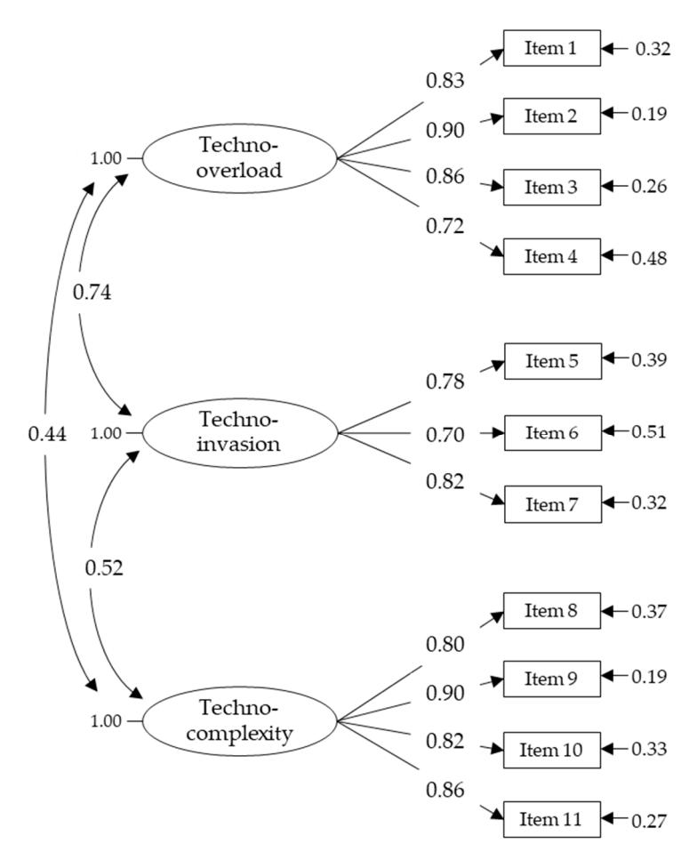
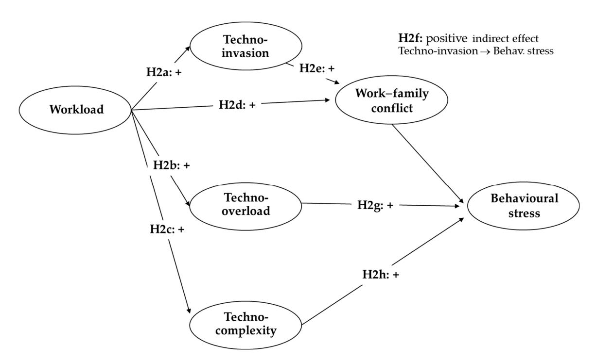
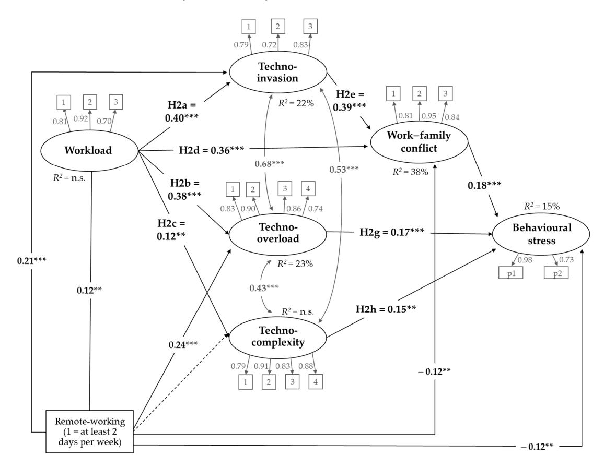

Article

# Wellbeing Costs of Technology Use during Covid-19 Remote Working: An Investigation Using the Italian Translation of the Technostress Creators Scale

Monica Molino 1, Emanuela Ingusci 2,\*, Fulvio Signore 2, Amelia Manuti 3, Maria Luisa Giancaspro 3, Vincenzo Russo 4, Margherita Zito 4 and Claudio G. Cortese 1

- Psychology Department, University of Turin, Via Verdi 10, 10124 Turin, Italy; monica.molino@unito.it (M.M.); claudio.cortese@unito.it (C.G.C.)
- History, Society and Human Studies Department, University of Salento, Via di Valesio 24, 73100 Lecce, Italy; fulvio.signore@unisalento.it
- Department of Education, Psychology, Communication, University of Bari, Palazzo Chiaia Napolitano Via Crisanzio 42, 70121 Bari, Italy; amelia.manuti@uniba.it (A.M.); marialuisa.giancaspro@uniba.it (M.L.G.)
- Department of Business, Law, Economics and Consumer Behaviour "Carlo A. Ricciardi", Università IULM, Via Carlo Bo 1, 20143 Milan, Italy; vincenzo.russo@iulm.it (V.R.); margherita.zito@iulm.it (M.Z.)
- \* Correspondence: emanuela.ingusci@unisalento.it; Tel.: +39-0832-294842

Received: 22 June 2020; Accepted: 18 July 2020; Published: 23 July 2020

**Abstract:** During the first months of 2020, the Covid-19 pandemic has affected several countries all over the world, including Italy. To prevent the spread of the virus, governments instructed employers and self-employed workers to close their offices and work from home. Thus, the use of remote working increased during the pandemic and is expected to maintain high levels of application even after the emergency. Despite its benefits for both organizations and workers, remote working entails negative consequences, such as technostress. The present study had a double aim: to test the psychometric characteristics of the Italian translation of the brief version of the technostress creators scale and to apply the scale to investigate technostress during the Covid-19 emergency. The research involved 878 participants for the first study and 749 participants for the second one; they completed a self-report online questionnaire. Results confirmed the three-factor structure of the Italian technostress creators scale and highlighted positive relationships between workload, techno-stressors, work–family conflict and behavioural stress. The role of remote working conditions has been analysed as well. The study provided a useful tool for the investigation of technostress in the Italian context. Moreover, it provided indications for practice in the field of remote working and workers' wellbeing.

**Keywords:** Covid-19; technostress; stress; technostress creators; work–family conflict; remote working; smart working; technology use; scale validation

#### 1. Introduction

Since early 2020, the world has been confronted with the consequences of the Covid-19 pandemic. Italy has been one of the most heavily affected countries, and the first Western country to adopt sectoral lockdown measures to prevent the spreading of the new virus. In a context of extreme change, several emergency measures have been established by the government, including the simplification of the procedures to access remote working from home for both private and public organizations. Remote working, also known as telecommuting or telework, is an arrangement between employee and employer where the employee's work is performed remotely outside the employer's premises thanks to the aid of information and communication technologies (ICTs) [1].

*Sustainability* **2020**, *12*, 5911 2 of 20

The Covid-19 emergency resulted in a radical and sudden reconsideration of the organization of work in the name of the protection of human health within companies and public administrations. The government's aim was to reduce the presence of people in offices, limiting the movement of workers throughout the national territory without compromising services. Remote working has become a necessary and widespread solution, although, before the Covid-19 lockdown, it was not widely adopted in Italy. A joint report by the International Labour Organization and Eurofound [\[1\]](#page-16-0) showed that, in 2017, Italy had the lowest percentage of employees remote working compared with other European countries. In 2019, the Observatory of Politecnico of Milan estimated 570,000 remote workers. According to the Italian Ministry of Labour and Social Policies, at the end of April 2020, the number of remote workers was 1,827,792, which amounted to about 8% of total employment. During the Covid-19 pandemic, the number of workers who worked remotely increased by 69% in Italy. Globally, it has been estimated that about 81% of the worldwide workforce has been affected by full or partial workplace closures [\[2\]](#page-16-1). Many workers experienced working from home for the first time every day for several weeks, often without receiving any kind of remote work preparation before [\[3\]](#page-16-2).

Many companies intend to maintain remote working also after the emergency. Benefits for both organizations and workers have been demonstrated: improvements in performance, cuts to the costs of "home-work-home" travelling, saving time and organizational resources, and higher employee satisfaction [\[3](#page-16-2)[,4\]](#page-16-3). Nevertheless, some negative consequences are also possible, particularly for workers' wellbeing [\[5–](#page-16-4)[9\]](#page-16-5). Accordingly, it is necessary to investigate this phenomenon during its highest peak of adoption, in order to find out potential solutions and improvements for its future spread. One the one side, we need a deep comprehension about how individuals experience their work and remote working in such a particular situation, considering that work from home, supported by technologies, has been almost ubiquitously used during the quarantine. Understanding evidence-based best practices for remote working has never been more relevant [\[10\]](#page-16-6) and findings from this study could address practices and solutions to better deal with mandatory remote working during potential future lockdown situations. On the other hand, results may allow generalizability beyond the Covid-19 pandemic given that "extreme events", like this one, frequently offer windows into understanding dynamics that are less observable during regular conditions [\[11\]](#page-16-7).

Particularly, the present work examined the role of ICT use and the occurrence of technostress, which is "stress experienced by end users in organizations as a result of their use of ICTs" [\[12\]](#page-16-8) (pp. 417–418), during the Covid-19 emergency, in order to better understand the dynamics that link technology use and workers' stress and how they change under conditions of remote working. Before, we provided psychometric information about the Italian translation of a brief version of the technostress creators scale [\[12](#page-16-8)[,13\]](#page-16-9), useful to detect techno-stressors in the Italian context in traditional or exceptional situations.

There is still a gap in the literature about stress due to technology [\[14\]](#page-16-10) despite the numerous calls for research to study the stressful impacts of both ICTs use and new form of work aided by ICTs [\[15](#page-16-11)[,16\]](#page-16-12). Among the research questions proposed by Tams [\[17\]](#page-16-13) in his agenda, emerged the importance to understand "what factors are most important in explaining how and why technology creates stress in users" (p. 6). Given the practical implications of such an assumption, it is crucial to understand technology-induced stress and its relationship with remote working. This is particularly true in times of radical changes as the current ones, where the crisis has had psychological consequences for individuals and impacted on several work-related processes. Working conditions deteriorated and family and job demands increased for many workers (high-pressure, emotionally demanding interactions, overlapping of multiple roles) [\[10](#page-16-6)[,18\]](#page-16-14).

## *1.1. Technostress*

During the last decades, ICTs advanced at a fast pace and impacted on work in all sectors. Among its advantages, the literature described the speed of processing data, as well as portability and reliability of data. Nevertheless, a negative side of this phenomenon exists with a connection between ICTs

*Sustainability* **2020**, *12*, 5911 3 of 20

and higher level of stress among workers [\[19\]](#page-16-15). According to the World Health Organization (WHO), the increased use of ICTs has modified work patterns today [\[20\]](#page-16-16); it has engendered an everlasting urgency and fostered expectations about individuals being constantly available and working faster and better [\[21\]](#page-16-17).

A common feeling among ICTs users is not having enough time to complete tasks, notwithstanding the constant effort to be efficient. The amount of available information has increased, and workers are expected to deal with it as before, or even faster [\[22\]](#page-16-18). ICTs and Internet connection operate all hours of the days and night, which creates an expectation that workers are constantly connected, available and operative as well [\[21\]](#page-16-17). In this context, negative consequences such as stress or workaholism can increase [\[23\]](#page-16-19), while performance on complex tasks decreases [\[22\]](#page-16-18).

The term technostress was originally coined by Craig Brod in 1984 [\[24\]](#page-17-0), who described it as a disease caused by one's inability to cope or deal with ICTs in a healthy manner. Later, Weil and Rosen defined technostress as "any negative impact on attitudes, thoughts, behaviours, or body physiology that is caused either directly or indirectly by technology" [\[25\]](#page-17-1) (p. 5). More recently, technostress has been defined as "the stress that users experience as a result of application multitasking, constant connectivity, information overload, frequent system upgrades and consequent uncertainty, continual relearning and consequent job-related insecurities, and technical problems associated with the organizational use of ICT" [\[22\]](#page-16-18) (pp. 304–305). Another definition widely accepted today in the literature states that technostress is "the phenomenon of stress experienced by end users in organizations as a result of their use of ICTs" [\[12\]](#page-16-8) (pp. 417–418).

Evidences from the literature showed several symptoms related to technostress, such as anxiety, physical diseases, behavioural strain, technophobia, mental fatigue, memory disturbances, poor concentration, irritability, feelings of exhaustion, and insomnia [\[26,](#page-17-2)[27\]](#page-17-3). Among the main frequent consequences of technostress, recent studies found reduced worker productivity, job performance, job satisfaction and organizational commitment, lowered ICTs use intention and increased turnover intentions [\[12](#page-16-8)[,13,](#page-16-9)[21,](#page-16-17)[22,](#page-16-18)[28](#page-17-4)[–30\]](#page-17-5). A further outcome is work–family and work–life conflict, increased by work-overload and flexibility due to technology use [\[31,](#page-17-6)[32\]](#page-17-7). Ayyagari and colleagues [\[21\]](#page-16-17) found that technology generates stress via work–home conflict and role ambiguity as mediators.

# *1.2. Technostress Creators*

Technology-related job demands that can provoke technostress are generally named techno-stressors or technostress creators. Two significant stressors have been acknowledged as originating from the use of ICTs for work purposes [\[29\]](#page-17-8). The first one is related to information overload: the multiple technological sources can produce a great amount of information and stimuli that lead to fatigue and loss of control over information flow for the users [\[33\]](#page-17-9). The second stressor refers to constant availability: thanks to the aid of ICTs (Internet connection, smartphones, tablets, laptops) workers can be connected at any time and everywhere; this fact supports expectations of constant reachability, availability and instant responses [\[31\]](#page-17-6). Among other identified stressors the following have been described [\[29\]](#page-17-8): the intensity of teleworking [\[34\]](#page-17-10); the frequent interruptions during work [\[35\]](#page-17-11); high e-mail quantity, and poor e-mail quality [\[36\]](#page-17-12).

Tarafdar and colleagues [\[13\]](#page-16-9) proposed a classification, widely accepted in the literature, of five technostress creators: (1) techno-overload, related to ICTs' potential to compel users to work faster and longer or change work habit; (2) techno-invasion, referring to ICTs' ability to invade users' personal life and make the boundaries between work and private contexts more blurred; (3) techno-complexity, describing situations where ICTs' features and complexity make users feel inadequate with respect to their skills; (4) techno-insecurity, related to potential users' feeling of being threatened about losing their jobs, due to a replacement by automation or others who have a better ICT knowledge; and (5) techno-uncertainty, associated with continuous upgrades and changes in ICTs that disturb users and force them to constantly learn new aspects of ICTs.

*Sustainability* **2020**, *12*, 5911 4 of 20

Based on the transaction-based model [\[37\]](#page-17-13) and the person–environment fit model [\[16](#page-16-12)[,38\]](#page-17-14) of stress, previous research (e.g., [\[12](#page-16-8)[,13](#page-16-9)[,21](#page-16-17)[,39\]](#page-17-15)) showed that technostress creators are associated with behavioural and psychological strain outcomes. According to these models, stress occurs through a phenomenological process where environmental demands exceed individuals' resources. In this process, strain refers to the psychological and behavioural responses to stressors present in the environment.

Grounded on the aforementioned literature, the present work had a double aim: to test the psychometric characteristics of the brief Italian translation of the technostress creators scale [\[12](#page-16-8)[,13\]](#page-16-9) (Study 1) and to apply the scale to the investigation of technostress during the Covid-19 emergency (Study 2).

#### **2. Study 1: Italian Translation of the Technostress Creators Scale**

In Italy, the "always on" approach is particularly common and supported within organizations [\[19\]](#page-16-15). In addition, digital devices ownership and usage are high in this country, with the 61% of smartphone penetration in 2019, which is projected to reach 65% percent of the total population in 2021 [\[40,](#page-17-16)[41\]](#page-17-17). This would be an increase of 19% compared with 2014. Among Italian professionals, 100% of directors, managers and academic professors, 99.5% of entrepreneurs and self-employed workers, and 98.8% of office workers and teachers use internet through different devices [\[42\]](#page-17-18). Further data showed that 35% of Italian users check their phone within five minutes of waking up in the morning, 34% access their phone during the night after having gone to sleep and before waking up, and 13% check their phone at least 50 times in a day [\[43\]](#page-17-19). Data on internet and digital devices use during Covid-19 lockdown are not available yet, but we expect an exponential increment. A preliminary survey conducted by the Samsung Trend Radar in April 2020 showed that the 79% of Italians used technologies during the quarantine for several different reasons and 68% accessed to Internet through their PC for working purposes.

High levels of technologies use may increase workload and working pace, multitasking and interruptions, leading to stress in the long run [\[44\]](#page-17-20). In light of the increased use of remote working, monitoring technostress among workers has become even more urgent. As far as we know, an instrument to detect techno-stressors is not available in Italian language; thus, the present study's aim is to propose a brief version of the technostress creators scale [\[12,](#page-16-8)[13\]](#page-16-9), relevant in the Italian context for research and professional purposes.

Specifically, we intended to propose a brief version extracted from the original instrument, which included 25 items to measure five factors. In our shorter version, which is more suitable for the general practice and more economic for research, we selected a total of 11 items and three technostress creators, namely techno-overload, techno-invasion, and techno-complexity. Attention was drawn specifically on these three dimensions of technostress because they are considered specifically relevant in the current scenario, where an increase of the use of technologies for work purposes is expected, also because of an intensification of remote working. In this situation, the perception of overload due to technologies, the risk of intrusion of work and technology into the personal life and the experience of complexity in dealing with technologies may represent important stressors. Yet, previous research found that techno-overload was the main influencing factor for exhaustion in teleworkers [\[15\]](#page-16-11) and techno-invasion was identified as one of the major causes of technostress among knowledge workers [\[45\]](#page-17-21).

The aim of the study was to investigate the psychometric properties (reliability, convergent validity and discriminant validity) of the three-factor Italian translation of the technostress creators scale and to test measurement invariance between remote working and traditional working groups. Thus, we formulated the following hypotheses.

**Hypothesis 1a (H1a).** *The three-factor brief Italian version of the technostress creators scale shows an e*ff*ective factor structure.*

**Hypothesis 1b (H1b).** *The three-factor brief Italian version of the technostress creators scale shows good reliability.*

*Sustainability* **2020**, *12*, 5911 5 of 20

**Hypothesis 1c (H1c).** *The three-factor brief Italian version of the technostress creators scale shows good convergent validity.*

**Hypothesis 1d (H1d).** *The three-factor brief Italian version of the technostress creators scale shows good discriminant validity.*

**Hypothesis 1e (H1e).** *The three-factor brief Italian version of the technostress creators scale shows good factorial validity among both remote workers and traditional workers and invariance of the measurement structure across the two groups.*

#### *2.1. Materials and Methods*

#### 2.1.1. Procedure and Participants

A convenience sample of Italian workers was involved; researchers contacted participants asking them to fill in an online self-report questionnaire. The questionnaire's cover sheet explained the anonymity (of both participants and their organizations), confidentiality and voluntariness of participation in the research. All participants provided their informed consent. The research observed the Helsinki Declaration [\[46\]](#page-17-22) and the General Data Protection Regulation.

The sample was made up of 878 workers (57.7% female; 42.0% male; 0.2% missing). The mean age was 39.45 years (*SD* = 11.57). Regarding education, 41.5% had a Bachelor's or Master's degree; 39.3% had a high school diploma; 12.5% had a qualification higher than Master's degree; 6.2% had a middle or elementary school diploma. Most of participants were married or cohabited (53.4%); 55.5% did not have children. The job contract was permanent for 56.7% and fixed-term for 20.0%; 17.4% were self-employed workers; 5.9% had other type of contracts. Participants were from different occupational sectors: 26.8% tertiary sector; 19.8% professional services; 15.1% education; 9.9% secondary sector; 7.6% health; 6.4% primary sector; 14.4% other sectors. Over half, 53.4%, were doing remote working when they completed the questionnaire.

## 2.1.2. Measures

*Technostress creators* were assessed through 11 items taken from the technostress creators scale [\[12](#page-16-8)[,13\]](#page-16-9): four items for techno-overload, three items for techno-invasion and four items for techno-complexity. Table [A1](#page-15-0) in Appendix [A](#page-15-1) shows the original version of the 11 items and their Italian translation. Items were translated from English to Italian by an Italian native speaker researcher. Successively, an English mother tongue made a back-translation from Italian into English. Participants used a Likert scale from 1 = strongly disagree to 5 = strongly agree.

#### 2.1.3. Data Analysis

Descriptive data analysis (mean and standard deviation), Pearson correlations and Cronbach's alpha coefficients were tested through the support of statistics software SPSS 26 (IBM, Armonk, NY, USA). Confirmative factor analysis (CFA) was performed with the aid of Mplus 7 (Muthén and Muthén, Los Angeles, CA, USA).

In order to assess construct validity of the Italian translation of the technostress creators scale's reliability, convergent validity and discriminant validity were considered. Reliability and convergent validity were assessed by factor loadings (calculated through CFA), Cronbach's alpha, the average variance extracted (AVE) and the composite reliability (CR) [\[47\]](#page-18-0). Acceptable values are above 0.70 for factor loadings, 0.50 for AVE and 0.70 for both Cronbach's alpha and CR; moreover, CR should be greater than AVE [\[48\]](#page-18-1). For discriminant validity, validation conditions are satisfied when the square root of AVE value is higher than the maximum interrelated correlation (Max r) and AVE is higher than both maximum shared variance (MSV) and average shared variance (ASV) [\[47](#page-18-0)[,49\]](#page-18-2).

Sustainability **2020**, 12, 5911 6 of 20

Subsequently, we tested for measurement invariance comparing the subsample of remote workers with the subsample of traditional workers. First, we conducted a CFA among the two groups separately. Then, we investigated measurement invariance according to the four levels described in the literature [50]. The first level, configural invariance, tested a model with no invariance constraints. The second level, weak invariance, tested the invariance of factor loadings. When this level is satisfied, it means that factor loadings of items are equivalent across groups. The third level, strong invariance, constrained item intercepts, and, if met, allows for a comparison of the means across groups. Finally, the fourth level, strict invariance, was tested for error variance invariance.

For CFA, the method of estimation was maximum likelihood (ML). According to the literature [51], several goodness-of-fit criteria were considered: the  $X^2$  goodness-of-fit statistic; the root mean square error of approximation (RMSEA); the comparative fit index (CFI); the Tucker–Lewis index (TLI); the standardized root mean square residual (SRMR). Nonsignificant values of  $X^2$  indicate that the hypothesized model fits the data. Values of RMSEA smaller than 0.05 indicate a good fit and values smaller than 0.08 indicate an acceptable fit. CFI and TLI values greater than 0.90 indicate an acceptable fit, and values greater than 0.95 indicate a good fit. The SRMR has a range from 0 to 1, with a cutoff criterion of 0.08 and values lower than 0.05 indicating an excellent fit.

#### 2.2. Results

Table 1 shows CFA results for different factor models tested to better understand the measurement structure of the scale. Comparison between models and the chi-squared difference test showed that the three-factor model, depicted in Figure 1, was the best fitting one, confirming the structure of the scale (H1a). Factor loadings ranged from 0.83 to 0.90 for techno-overload, from 0.70 to 0.82 for techno-invasion, and from 0.80 to 0.90 for techno-complexity. Table 2 shows reliability and validity coefficients. Alpha and CR coefficients were greater than 0.70, while AVE values were higher than 0.50. In addition, all CR values were higher than AVE values; thus, reliability and convergent validity were achieved (H1b and H1c). Moreover, in all cases the square root of AVE value was higher than interrelated correlations, and AVE was greater than MSV and ASV coefficients; therefore, discriminant validity was also confirmed (H1d).

|                  |                |    |         |      |      | ,                 | , ,, |           | `                              | ,               |         |
|------------------|----------------|----|---------|------|------|-------------------|------|-----------|--------------------------------|-----------------|---------|
|                  | χ 2 | df | р       | CFI  | TLI  | RMSEA (90% CI) | SRMR | AIC       | Comparison                     | $\Delta \chi^2$ | р       |
| M 1 . | 168.12         | 41 | < 0.001 | 0.98 | 0.97 | 0.06 (0.05, 0.07) | 0.04 | 23,823.23 |                                |                 |         |
| M 2 . | 2232.20        | 44 | < 0.001 | 0.65 | 0.56 | 0.24 (0.23, 0.25) | 0.13 | 25,885.32 | M 2 -M 1 | 2064.08         | < 0.001 |
| M 3 . | 516.26         | 43 | < 0.001 | 0.92 | 0.90 | 0.11 (0.10, 0.12) | 0.06 | 24,167.37 | M 3 -M 1 | 348.14          | < 0.001 |
| M 4 . | 852.53         | 44 | < 0.001 | 0.87 | 0.84 | 0.15 (0.14, 0.15) | 0.28 | 24.501.64 | M 4 -M 1 | 684.41          | < 0.001 |

**Table 1.** Results of confirmative factor analysis (CFA), alternative models (N = 878).

Note:  $M_1$ .—three-factor model.  $M_2$ .—one-factor model.  $M_3$ .—two-factor model (one factor for overload and invasion, which have the strongest correlation, and one factor for complexity).  $M_4$ .—three-factor model, no covariations.

Table 2. Test of reliability, convergent validity and discriminant validity.

| Variables | Mean | SD   | Cronbach's Alpha | AVE  | CR   | MSV  | ASV  | Max r | T-OVER | T-INV | T-COMP |
|-----------|------|------|------------------|------|------|------|------|-------|--------|-------|--------|
| T-OVER    | 2.35 | 0.99 | 0.89             | 0.69 | 0.90 | 0.55 | 0.37 | 0.74  | 0.83   |       |        |
| T-INV     | 2.15 | 1.05 | 0.81             | 0.59 | 0.81 | 0.55 | 0.41 | 0.74  | 0.74   | 0.77  |        |
| T-COMP    | 1.83 | 0.92 | 0.91             | 0.71 | 0.91 | 0.27 | 0.23 | 0.52  | 0.44   | 0.52  | 0.84   |

*Note*: AVE > 0.50; CR > 0.7; AVE > MSV;  $\sqrt{\text{AVE}}$  > Max r;  $\sqrt{\text{AVE}}$  is bold-face diagonal. Techno-overload (T-OVER). Techno-invasion (T-INV). Techno-complexity (T-COMP).

Sustainability **2020**, *12*, 5911 7 of 20

**Figure 1.** CFA (maximum likelihood (ML) estimation) standardized solution for the Italian translation of the brief technostress creators scale (N = 878). p < 0.001 for all parameters.

#### Measurement Invariance

Table 3 shows results of CFA in the two samples, remote working and traditional working, and results of the multigroup test of invariance. CFA showed acceptable fit to the data in both samples. As for the invariance test, the configural model provided a good fit to the data. Thus, the model was able to fit data from the remote working and traditional working samples when no additional invariance constraints were imposed. The weak measurement invariance was also supported since difference in fit between the two nested models (weak vs. configural) was not statistically significant. Based on chi-squared difference, the strong model fitted the data worse than the weak model. However, between the more and less complex models, the change in RMSEA was considerably less than the 0.015 value recommended to support interpretation of invariance as well as the change in CFI that was less than 0.01 [52]. Thus, the improvement in parsimony was greater than the loss in fit, supporting the strong measurement invariance and the comparison of means between the two samples. Finally, the strict model fitted the data worse than the strong model, according to chi-squared difference. Nevertheless, also in this case the change in RMSEA was considerably less than 0.015 and the change in CFI was less than 0.01 [52]. Therefore, all levels of comparability were supported and hypothesis 1e was fully confirmed.

Sustainability **2020**, *12*, 5911 8 of 20

| Models              | x 2             | df  | p       | CFI   | TLI   | RMSEA (90% CI)    | SRMR | AIC      | Comparison                     | $\Delta \chi^2$ | p       |
|---------------------|----------------------------|-----|---------|-------|-------|-------------------|------|----------|--------------------------------|-----------------|---------|
| Single Group Models |                            |     |         |       |       |                   |      |          |                                |                 |         |
| CFA RW   | 101.85                     | 41  | < 0.001 | 0.98  | 0.98  | 0.06 (0.04, 0.07) | 0.03 | 12668.86 |                                |                 |         |
| CFA TW   | 143.86                     | 44  | < 0.001 | 0.96  | 0.95  | 0.07 (0.05, 0.08) | 0.05 | 11048.46 |                                |                 |         |
|                     | Multiple Groups Invariance |     |         |       |       |                   |      |          |                                |                 |         |
| M 1 .    | 295.81                     | 90  | < 0.001 | 0.966 | 0.959 | 0.07 (0.05, 0.08) | 0.05 | 23751.92 |                                |                 |         |
| M 2 .    | 302.17                     | 98  | < 0.001 | 0.967 | 0.963 | 0.07 (0.05, 0.08) | 0.05 | 23742.28 | M 2 -M 1 | 6.35            | 0.608   |
| M 3 .    | 321.00                     | 101 | < 0.001 | 0.964 | 0.961 | 0.07 (0.05, 0.08) | 0.06 | 23755.11 | M 3 -M 2 | 18.83           | < 0.001 |
| M 4 .    | 359.29                     | 112 | < 0.001 | 0.960 | 0.960 | 0.07 (0.05, 0.08) | 0.07 | 23771.40 | $M_4-M_3$                      | 38.30           | < 0.001 |

**Table 3.** Results of CFA and multigroup test of invariance (ML estimation; remote working sample N = 469; traditional working sample N = 409).

Note:  $CFA_{RW}$  is CFA in remote working sample.  $CFA_{TW}$  is CFA traditional-working sample.  $M_1$  is the configural model.  $M_2$  is the weak model.  $M_3$  is the strong model.  $M_4$  is the strict model.

## 3. Study 2: Investigation of Technostress during the Covid-19 Emergency

In Study 2, we investigated antecedents and consequences of the three techno-stressors (techno-overload, techno-invasion and techno-complexity). Among the antecedents, we considered the role of workload, which refers to the individual perception of having too much work to do, too diverse tasks to carry out and/or not enough time to accomplish the assigned job [53]. In the presence of high level of workload, the use of ICTs for work purposes increases as well. Hence, we expected that the use of ICTs resulted in an increased perception of working faster and longer (techno-overload), in more occasions of invasion of ICTs into personal life (techno-invasion) and into a higher risk of being confronted with complexity in the use of ICTs (techno-complexity).

**Hypothesis 2a (H2a).** Workload shows a positive relationship with techno-invasion, which means that higher levels of workload would result in higher levels of techno-invasion.

**Hypothesis 2b (H2b).** Workload shows a positive relationship with techno-overload, which means that higher levels of workload would result in higher levels of techno-overload.

**Hypothesis 2c (H2c).** Workload shows a positive relationship with techno-complexity, which means that higher levels of workload would result in higher levels of techno-complexity.

Among the consequences of techno-stressors, work–family conflict and behavioural stress were considered. Consistent with the role strain hypothesis within role theory [54], work–family conflict can be defined as: "a form of inter-role conflict in which the role pressures from the work and family domains are mutually incompatible in some respect. That is, participation in the work (family) role is made more difficult by virtue of participation in the family (work) role" [55] (p. 77). Work–family conflict was associated with poorer physical health and higher rates of stress, anxiety and depression [28,56,57]. Moreover, using ICTs to perform work tasks increases flexibility and make work–family borders more permeable, and we expected that a greater invasion of technology into personal life could be positively associated with inter-role conflict between work and family. Moreover, workload was found as one of the main determinants of work–family conflict [31]; therefore, we expected a positive relationship between these two dimensions as well.

**Hypothesis 2d (H2d).** Workload shows a positive relationship with work–family conflict, which means that higher levels of workload would result in higher levels of work–family conflict.

**Hypothesis 2e (H2e).** *Techno-invasion shows a positive relationship with work–family conflict, which means that higher levels of techno-invasion would result in higher levels of work–family conflict.* 

Sustainability **2020**, 12, 5911 9 of 20

Moreover, according to the transaction-based model [37], the three techno-stress creators lead to stress symptoms. Particularly, we considered behavioural symptoms of stress, such as lack of initiative, lack of energy to socialize, eating disorder. Regarding techno-invasion we expected that the relationship with behavioural stress was fully mediated by work–family conflict, while, for techno-overload and techno-complexity, we expected a direct relationship.

**Hypothesis 2f (H2f).** Techno-invasion shows an indirect positive relationship with behavioural stress, fully mediated by work–family conflict. When techno-invasion increases, behavioural stress also rises, through an increase in work–family conflict.

**Hypothesis 2g (H2g).** *Techno-overload shows a positive association with behavioural stress, which means that higher levels of techno-overload result in higher levels of behavioural stress.* 

**Hypothesis 2h (H2h).** *Techno-complexity show a positive association with behavioural stress, which means that higher levels of techno-complexity results in higher levels of behavioural stress.* 

The hypothesized model is described in Figure 2.

**Figure 2.** Hypothesized model controlling for remote working (1 = remote working at least two days per week). Behavioural stress (Behav. stress).

#### 3.1. Materials and Methods

#### 3.1.1. Procedure and Participants

In Study 2, a convenience sample of Italian workers was taken; researchers contacted participants asking them to fill in an on-line self-report questionnaire. The questionnaire's cover sheet explained the anonymity (of both participants and their organizations), confidentiality and voluntariness of participation in the research. All participants provided their informed consent. The research observed the Helsinki Declaration [46] and the General Data Protection Regulation.

The sample included only participants who completed the questionnaire during the Covid-19 emergency (April 2020). Among the 749 participants, 438 were females (58.5%) and 309 were males (41.3%). The mean age was 38.66 years (SD = 11.25). Regarding education, 39.5% had a high school

*Sustainability* **2020**, *12*, 5911 10 of 20

diploma; 39.2% had a Bachelor's or Master's degree; 14.8% had a qualification higher than Master's degree; 6.5% had a middle school diploma. Most of participants were married or cohabited (51.1%); 57.7% did not have children. The job contract was permanent for the 52.5% and fixed-term for the 20.8%; 20.4% were self-employed workers; 6.3% had other type of contracts. Participants were from different occupational sectors: 25.0% tertiary sector; 19.9% professional services; 14.3% education; 10.4% secondary sector; 7.9% health; 7.2% primary sector; 15.4% other sectors. During the Covid-19 emergency, 62.6% were working from home in average for 4.74 days per week (*SD* = 1.28).

#### 3.1.2. Measures

Technostress creators were assessed through the 11-item brief Italian technostress creators scale validated in Study 1: four items for techno-overload, three items for techno-invasion and four items for techno-complexity. Participants used a Likert scale from 1 = strongly disagree to 5 = strongly agree. Cronbach's alpha was 0.90 for techno-overload, 0.81 for techno-invasion and 0.91 for techno-complexity.

Workload was measured through three items [\[58\]](#page-18-11) using a Likert scale from 1 = never to 5 = always. An example item is "I work under high time pressure due to a heavy workload". Cronbach's alpha was 0.85.

Work–family conflict was investigated using three items [\[59](#page-18-12)[,60\]](#page-18-13) on a Likert scale from 1 = strongly disagree to 5 = strongly agree. An example item is "The demands of your job interfere with your home and family life". Cronbach's Alpha was 0.90.

Behavioural stress was measured through eight items taken from the Copenhagen Psychosocial Questionnaire [\[61\]](#page-18-14) with a Likert scale from 1 = never to 5 = always. An example item is "I have not been able to stand dealing with other people". Cronbach's alpha was 0.86.

#### 3.1.3. Data Analysis

Descriptive data analysis (mean and standard deviation), Pearson correlations and Cronbach's alpha coefficients were tested through the support of statistics software SPSS 26 (IBM, Armonk, NY, USA). Structural Equation Model was performed with the aid of Mplus 7 (Muthén and Muthén, Los Angeles, CA, USA). A Structural Equation Model was performed to test the hypothesized model controlling for the dichotomous variable remote working (1 = remote working at least two days per week; 0 = traditional working). The item parcelling technique [\[62\]](#page-18-15) was adopted for behavioural stress. Earlier, Harman's single-factor test [\[63\]](#page-18-16) was used to exclude the common method variance issue. CFA results suggested that one single factor could not account for the variance in the data [χ 2 (252, N = 749) = 6682.90, *p* < 0.001, RMSEA = 0.18 (90% CI: 0.18, 0.19), CFI = 0.42, TLI = 0.36, SRMR = 0.15]. The significance of the indirect effects was verified through a bootstrapping procedure which extracted 2,000 new samples from the original one in order to calculate direct and indirect parameters of the model [\[64\]](#page-18-17). The method of estimation was maximum likelihood (ML). As in Study 1, the following goodness-of-fit criteria were considered: the X2 goodness-of-fit statistic, RMSEA, CFI, TLI and SRMR.

#### *3.2. Results*

Table [4](#page-10-0) shows means, standard deviations, and correlations between the study variables investigated during the Covid-19 emergency. Results showed a significant positive correlation between behavioural stress and work–family conflict, the three techno-stress creators and workload. Work–family conflict also showed significant positive correlations with the three techno-stress creators and workload. Remote working positively correlated with techno-overload, techno-invasion and workload.

The hypothesized model, depicted in Figure [3,](#page-10-1) fitted to the data well: χ 2 (154) = 502.58, *p* < 0.001, CFI = 0.96, TLI = 0.95, RMSEA = 0.06 (90% CI: 0.05, 0.06), SRMR = 0.04. According to the model, workload was positively related to techno-invasion (H2a), techno-overload (H2b), techno-complexity (though to a weaker extent; H2c) and work–family conflict (H2d). Techno-invasion was positively related to work–family conflict (H2e), which in turn was positively associated to

Sustainability **2020**, *12*, 5911 11 of 20

behavioural stress. Moreover, both techno-overload (H2g) and techno-complexity (H2h) showed a direct positive relationship with behavioural stress. Finally, the control variable remote working showed a positive relationship with workload, techno-invasion and techno-overload, while its relationship with work–family conflict and behavioural stress was negative. The model explained about 22% of the variation in techno-invasion, 23% in techno-overload, 38% in work–family conflict and 15% in behavioural stress; the variance explained for workload and techno-complexity was not significant. Table 5 shows all the statistically significant indirect effects evaluated through the use of bootstrapping procedure. Results reported in the first line confirmed the indirect effect from techno-invasion to behavioural stress, mediated by work–family conflict (H2f).

**Figure 3.** The hypothesized model controlling for remote working (ML estimation; standardized path coefficients; N = 749). Discontinuous lines indicate nonsignificant relationships. \*\*\* p < 0.001; \*\* p < 0.001 for all factor loadings.

**Table 4.** Means, standard deviations, Cronbach's alphas and correlations among study variables (N = 749).

| Variables                   | 1       | 2       | 3       | 4       | 5       | 6       | 7 |
|-----------------------------|---------|---------|---------|---------|---------|---------|---|
| 1. Behavioural stress       |         |         |         |         |         |         |   |
| 2. Work-family conflict     | 0.23 ** | -       |         |         |         |         |   |
| 3. Techno-overload          | 0.22 ** | 0.35 ** | -       |         |         |         |   |
| 4. Techno-invasion          | 0.24 ** | 0.48 ** | 0.70 ** | -       |         |         |   |
| 5. Techno-complexity        | 0.23 ** | 0.19 ** | 0.43 ** | 0.45 ** | -       |         |   |
| 6. Workload                 | 0.19 ** | 0.47 ** | 0.35 ** | 0.37 ** | 0.12 ** | -       |   |
| 7. Remote working (1 = yes) | -0.07   | 0.03    | 0.29 ** | 0.25 ** | 0.01    | 0.13 ** | - |
| M                           | 2.53    | 2.76    | 2.30    | 2.15    | 1.83    | 3.02    | - |
| SD                          | 0.81    | 1.23    | 0.97    | 1.05    | 0.92    | 1.10    | - |

Note. \*\* p < 0.01.

*Sustainability* **2020**, *12*, 5911 12 of 20

| Indirect Effects                                  | Est.  | S.E. | p      | CI 95%            |
|---------------------------------------------------|-------|------|--------|-------------------|
| H2f = Tech. Inv. → WFC → Stress             | 0.10  | 0.02 | <0.001 | (0.04, 0.11)      |
| W-load → WFC → Stress                       | 0.07  | 0.02 | <0.001 | (0.03, 0.10)      |
| W-load → Tech. Over. → Stress               | 0.07  | 0.02 | <0.001 | (0.03, 0.11)      |
| W-load → Tech. Comp. → Stress               | 0.02  | 0.01 | 0.029  | (0.01, 0.04)      |
| W-load → Tech. Inv. → WFC → Stress       | 0.03  | 0.01 | <0.001 | (0.01, 0.04)      |
| W-load → Tech. Inv. → WFC                   | 0.15  | 0.02 | <0.001 | (0.11, 0.19)      |
| Remote W. → WFC → Stress                    | −0.02 | 0.02 | 0.012  | (−0.04, −0.01) |
| Remote W. → Tech. Over. → Stress            | 0.04  | 0.01 | 0.001  | (0.02, 0.07)      |
| Remote W. → Tech. Inv. → WFC → Stress    | 0.02  | 0.01 | 0.001  | (0.01, 0.03)      |
| Remote W. → Tech. Inv. → WFC                | 0.08  | 0.02 | <0.001 | (0.05, 0.12)      |
| Remote W. → W-load → Tech. Over → Stress | 0.01  | 0.01 | 0.031  | (0.01, 0.17)      |
| Remote W. → W-load → WFC                    | 0.05  | 0.02 | 0.003  | (0.02, 0.08)      |
| Remote W. → W-load → Tech. Inv. → WFC    | 0.02  | 0.01 | 0.006  | (0.01, 0.03)      |
| Remote W. → W-load → Tech. Over             | 0.05  | 0.02 | 0.003  | (0.02, 0.08)      |
| Remote W. → W-load → Tech. Inv.             | 0.05  | 0.02 | 0.003  | (0.02, 0.08)      |
| Remote W. → W-load → Tech. Comp.            | 0.02  | 0.01 | 0.043  | (0.01, 0.03)      |
| Remote W. → W-load → WFC → Stress        | 0.02  | 0.01 | 0.018  | (0.01, 0.02)      |

**Table 5.** Indirect effects using bootstrapping (2000 replications).

Note: All parameter estimates are presented as standardized coefficients. Estimates (Est.). Standard error (SE). Confidence interval (CI). Techno-invasion (Tech. Inv.). Work–family conflict (WFC). Workload (W-load). Techno-overload (Tech. Over.). Techno-complexity (Tech. Comp.). Remote working (Remote W.).

# **4. Discussion**

The two presented studies contributed to the literature on technostress in different ways. First, Study 1 provided an Italian translation of the brief version of the technostress creators scale, useful to investigate technostress among both remote and traditional workers in the Italian context. Second, Study 2 showed some evidences about antecedents and consequences of techno-stressors experienced by workers during the Covid-19 emergency. Study findings could be useful to address both future research on technostress and practical implications in the field of human resources management, relevant in time of pandemics and lockdown as well as during traditional working periods.

Study 1's aims were achieved and all hypotheses were supported, since results confirmed the three-factor structure of the scale and showed good reliability, convergent validity and discriminant validity of the brief Italian technostress creators scale. Moreover, the measurement invariance calculation confirmed that the scale can be used among both remote and traditional workers and permits all levels of comparability between the two groups.

The investigation of the model hypothesized in Study 2 found a complete confirmation of the study hypotheses. According to hypotheses 2a, 2b and 2c, which were fully confirmed, workload showed a positive association with the three technostress creators; the association was stronger with techno-overload and techno-invasion compared with techno-complexity. Results confirmed that in the presence of high levels of workload individuals perceive more techno-stressors [\[65\]](#page-18-18); particularly, they feel forced to work faster and longer (techno-overload) and perceive more invasion of technology into their private lives.

In turn, technostress creators were associated with work–family conflict and behavioural stress. More in detail, techno-invasion showed a positive association with work–family conflict, confirming hypothesis 2e. This result can be considered reasonable because the intrusion of work into personal life, through the use of ICTs, supports the negative spillover between the two domains. Techno-invasion

*Sustainability* **2020**, *12*, 5911 13 of 20

refers to being always connected, a feeling of being constantly reachable and attuned to work issues. This condition represents the spillover of work technologies to the family domain [\[66](#page-18-19)[,67\]](#page-18-20) and fosters the conflict between the two roles. As evidenced by Gaudioso and colleagues [\[66\]](#page-18-19), it is a zero-sum game: whether ICTs deeply penetrate the family boundaries (i.e., high techno-invasion) the individual will have less time and energies to devote to his/her family responsibilities. Also, workload showed a positive relationship with work–family conflict (hypothesis 2d), consistent with previous studies that highlighted a high level of workload as a crucial determinant of perceived incompatibility between work and family roles [\[31\]](#page-17-6). Moreover, the three technostress creators showed a positive relationship with behavioural stress, which was indirect, fully mediated by work–family conflict, in the case of techno-invasion (hypothesis 2f) and direct for techno-overload and techno-complexity (hypotheses 2g and 2h). Previous studies already demonstrated the positive association between techno-stressors and behavioural strain, according to the transaction-based model of stress [\[37\]](#page-17-13).

The study also provided interesting results related to the remote working condition, which was considered in the model as a control variable. First of all, findings suggested a positive relationship between remote working and workload, techno-overload and techno-invasion. Despite this, one would not expect that working practices, such as remote working, introduced to help employees in achieving a more satisfactory work–life balance results in more workload, intensification of work was associated with flexible work designs, due to the expectation that flexibility should be reciprocated with extra effort [\[68\]](#page-18-21). Among the explanations, there is also the elimination of workplace distractions (such as colleagues' demands and interruptions), although this is not to say that home, or other locations, will not generate distractions as well [\[69\]](#page-18-22). The present study supported previous findings indicating that remote workers work more [\[70](#page-18-23)[,71\]](#page-18-24) and suffered from a perceived increase of the overload and work intrusion into personal life due to the use of ICTs.

On the other hand, remote working showed a negative relationship with both work–family conflict and behavioural stress. Telework was found to be associated with significantly lower work–family conflict [\[72\]](#page-19-0), work-role stress and work exhaustion [\[72](#page-19-0)[,73\]](#page-19-1). It was argued that the psychological mechanism leading to stress reduction could be an increased perception of control allowed by remote working arrangements and flexibility [\[74\]](#page-19-2). Nevertheless, the indirect effects from remote working to both work–family conflict and stress through workload and technostress creators were positive and significant. These ambiguous findings were in line with current literature on flexible work designs, where three paradoxes were described [\[68\]](#page-18-21). The autonomy paradox assumes that ICTs provides more flexibility and autonomy, which lead workers to work more and to feel controlled [\[7,](#page-16-20)[75](#page-19-3)[,76\]](#page-19-4). The second paradox is the connectivity one, according to which the use of ICTs improves quality and accuracy of data sharing and communication; however, potentiality of connectivity fosters expectations of permanent connectivity [\[77,](#page-19-5)[78\]](#page-19-6). Finally, the telecommuting paradox, which posits that telecommuting leads to discordant results: on the one hand it enhanced work–life balance and perceived autonomy, on the other hand it negatively impacts on the quality of work relationships and career [\[72\]](#page-19-0). Additional research is necessary to understand the simultaneously positive and negative impacts of the use of ICTs and remote working for employees' wellbeing.

#### *4.1. Limitations*

A first limitation of this study was its cross-sectional design; in the future, longitudinal or diary studies are needed to test causal relationships among these variables across time. A second limitation was the risk of common method-bias [\[63\]](#page-18-16) due to the use of only self-reported data. Other-reported data (e.g., supervisors or partners) as well as objective data (e.g., objective evaluation of stress, number of received emails) should be considered in future studies about these topics. A third limitation was the convenience sampling procedure and the heterogeneity of the samples. This kind of procedure emphasized the opportunity to collect open and honest answers from participants about their working conditions; nevertheless, results coming from the present study cannot be generalized to the Italian population. Having the opportunity to investigate technostress dynamics in specific organizations

*Sustainability* **2020**, *12*, 5911 14 of 20

would be necessary also to define more contextualized interventions. A further limitation of the study was that it considered only three out of the five technostress creators suggested by the authors in the original version [\[12](#page-16-8)[,13\]](#page-16-9). However, the scale was useful to investigate technostress in the present study, which highlighted techno-overload and techno-invasion as the main dimensions during the Covid-19 pandemic. With this regard, a further limitation of the study is that it did not consider emotional distress directly related to the situation of emergency. Finally, in future research family to work conflict should be also considered, as well as the role of supervisors and their leadership style [\[23\]](#page-16-19).

## *4.2. Practical Implications*

Flexible work solutions, such as remote working, are aimed at improving quality of work and its relationship with personal life [\[76](#page-19-4)[,79\]](#page-19-7); similarly, technology use for work purposes may have several advantages for workers. Nevertheless, as confirmed also by the results coming from the present study, some negative consequences need to be recognized and addressed.

Firstly, requests to workers and workload levels need to be monitored by supervisors and managers. The "always on" working practice, encouraged by remote working, challenges employees in terms of mental and physical fatigue. Because of the features of remote working, which is mainly a home-based activity, organizational demands tend to exceed normal working hours and normal workload with undebatable consequences for individual and organizational performance and wellbeing. In this vein, a change of pace is necessary in terms of cultural change, in order to support workers and organizations to address the challenges posed by this relatively new approach, delimiting the borders between work and nonwork and managing the expectation of constant availability and reachability, which are typical of Italian organizations [\[23\]](#page-16-19). Speculatively, the Covid-19 emergency, which imposed work from home arrangements, may serve as "cultural shock" to advance long-term cultural changes about remote working [\[10\]](#page-16-6).

Supplemental work supported by ICTs should be reduced or avoided, in condition of both traditional and remote working, while segmentation practices should be encouraged [\[80\]](#page-19-8). Moreover, in pandemic times when job demands tend to further increase, workers need an incrementation of resources to restore a balance between job demands and resources. Thus, organizations should adopt specific interventions to take care of employees' wellbeing. Kniffin and colleagues [\[11\]](#page-16-7) suggested immediate tangible resources, such as information (e.g., about working changes and practices or about prevention) and training or counselling to assist employees, and psychological resources, such as feedback, support, and inspiration by own supervisors and colleagues. Further, resources to mitigate work–family conflict are essential; organizations should foster family-friendly culture norms and supervisors' support [\[10\]](#page-16-6).

Workers and employers should be aware about the effects of the use of ICTs, which increases in situation of remote working as well as during quarantine, and about the phenomenon of technostress; training and communication programs seem to be relevant for this purpose. Managers and organizational leaders also play a crucial role; through the development of appropriate human resource management programmes, they can help identifying technostress problems in the workplace, and implementing solutions, policy changes and preventions [\[81\]](#page-19-9). Moreover, organizations could offer training and instruments to cope with the effects of remote working on work–family conflict, and to find proactive and family-friendly strategies.

Taking these aspects into account, results coming from the present study also contributed to highlight that remote working can be a positive solution for both workers and employers. Workers may enjoy positive effects on work–family balance and work-related health, balancing job demands and the achievement of specific working objectives with personal and family needs. Nevertheless, during the quarantine many workers have been confronted with family obligations, because of the closure of schools and basic services. In lockdown situations, organizations should consider these challenges and negotiate specific work arrangements that fit with employees' situations and needs, allowing as much leeway as possible [\[11\]](#page-16-7). On the other hand, the unexpected pandemic situation has

*Sustainability* **2020**, *12*, 5911 15 of 20

proven to organizations that they could adopt remote working as a human resources management strategy to save personnel costs, to contain costs for organizational physical spaces' rental, and to attract new resources using remote working as a desirable employer branding strategy.

Accordingly, results of the study also allowed to highlight some practical suggestions useful for human resources management professionals engaged in the concrete application of remote working to organizational contexts. Successful programs about remote working include employees' involvement in the creation of the program, training, participation of the whole teams, and constant monitoring [\[3\]](#page-16-2). Employees' participation to the implementation of a plan for the transition to remote working could be crucial to develop a shared culture of technology use in organizations and therefore to guide individual and organizational behaviours. This process of involvement could be further complemented by the implementation of job redesign and job crafting interventions aimed to support workers in managing the transition to remote working, considering it as a strategy to both balance work and life contexts and increase productivity at work [\[82,](#page-19-10)[83\]](#page-19-11). Moreover, after the Covid-19 pandemic, job redesign practices may be essential to restore and optimize working conditions.

#### **5. Conclusions**

The present work had two main goals, pursued through two different studies. In Study 1 the validation of a brief Italian version of the technostress creators scale was investigated. We proposed an 11-item scale to detect techno-overload, techno-invasion and techno-complexity; according to results, all minimum required validation conditions were satisfied. Thus, Study 1 contributed to the literature providing a short instrument useful to investigate technostress in the Italian context, valid in both remote working and traditional working conditions.

In Study 2, the brief Italian technostress creators scale was applied to the investigation of technostress during the Covid-19 pandemic. Among the emergency measures, remote working has been largely adopted by workers from both private and public sectors, and an increment in its implementation is expected in the future. Hence, the study intended to investigate the role of three techno-stressors, namely techno-overload, techno-invasion and techno-complexity, in relation with two relevant wellbeing outcomes, work–family conflict and behavioural stress, controlling for the condition of remote working. Among the main findings, results highlighted positive associations between the three techno-stressors and the two outcomes, confirming the necessity to deal with the massive use of technologies for work purposes and its negative consequences. Moreover, the study indicated both workload and remote working as antecedents of technostress creators; as suggested above, interventions on working cultures and in the human resources management field are necessary to prevent negative consequences of technology use and to foster a positive implementation of remote working.

Despite these findings, some open questions remain for future studies. Firstly, Study 2 was conducted during the Covid-19 emergency; thus, it gathers technostress related dynamics during a specific situation. Future studies are necessary to verify whether these results, particularly the role of workload and remote working as antecedents of techno-stressors, persist also during traditional times. Longitudinal studies and monitoring practices will be essential, to understand the evolution of technostress in those contexts that will prolong remote working for an extended period (e.g., six months or more) and/or that will introduce specific actions to support remote working application.

Moreover, a wider investigation of technostress antecedents is needed, in order to identify the main risk factors and adopt proper solutions. In this sense, it could be useful to understand if and how individual factors could have a role in technostress effects. More in depth, it would be functional to detect the potential role of personality traits on the experimentation of technostress, considering those studies linking personality and the ease of technology use [\[84\]](#page-19-12). Moreover, the pervasiveness of technology during the Covid-19 pandemic, and the consequent high level of job and social demands, could have led to increased workaholism behaviours and Internet or digital devices addiction. This point should be detected as a consequence of technostress experienced by subjects. Additionally, the massive

*Sustainability* **2020**, *12*, 5911 16 of 20

mandatory remote working may have exacerbated alcohol use disorders, also because of the distance from work-based peers and supervisors who may provide critical stress-attenuating support during a crisis [\[11\]](#page-16-7).

Extending the understanding of the relationship between technostress, remote working and work–family issues is also necessary; on the one side, in addition to work–family conflict, the direction from family to work, in which family responsibilities interfere with work, should be investigated. Moreover, in consideration of the high number of "dual-career" couples, future studies should involve participants' partners to investigate the presence of crossover effects or differences between couples where both partners do remote working and couples where, among the two, only one member works at a distance. Finally, nowadays there may be additional techno-stress creators beyond those considered in the two studies, stressors that are more related to the recent technology development and to the massive use of remote working. Qualitative and quantitative studies are necessary to capture today's needs and formulate an updated instrument.

**Author Contributions:** Conceptualization, M.M., E.I., F.S., A.M., M.L.G., V.R., M.Z. and C.G.C.; methodology, M.M., E.I., F.S., A.M., M.L.G., V.R., M.Z. and C.G.C.; validation, M.M., E.I., F.S., A.M., M.L.G., V.R., M.Z. and C.G.C.; formal analysis, M.M.; investigation, M.M., E.I., F.S., A.M., M.L.G., V.R., M.Z. and C.G.C.; data curation, M.M.; writing—original draft preparation, M.M.; writing—review and editing, M.M., E.I., F.S., A.M., M.L.G., V.R., M.Z. and C.G.C.; visualization, M.M. and C.G.C.; supervision, E.I., A.M., V.R. and C.G.C.; project administration, E.I. and C.G.C. All authors have read and agreed to the published version of the manuscript.

**Funding:** This research received no external funding.

**Conflicts of Interest:** The authors declare no conflict of interest.

## **Appendix A**

**Table A1.** Technostress creators scale.

| Original Items                                                                  | Italian Translations                                                                                                    |  |  |  |  |  |  |
|---------------------------------------------------------------------------------|-------------------------------------------------------------------------------------------------------------------------|--|--|--|--|--|--|
| Techno-overload                                                                 |                                                                                                                         |  |  |  |  |  |  |
| I am forced by technology to work much faster                                   | Sono costretto/a dalle tecnologie a lavorare molto più velocemente                                                      |  |  |  |  |  |  |
| I am forced by technology to do more work than I can handle                  | Sono costretto/a dalle tecnologie a fare più lavoro di quello che riesco a gestire                                   |  |  |  |  |  |  |
| I am forced by technology to work with very tight time schedules             | Sono costretto/a dalle tecnologie a lavorare con scadenze molto strette                                              |  |  |  |  |  |  |
| I am forced to change my work habits to adapt to new technologies            | Sono costretto/a a cambiare le mie abitudini lavorative per adattarmi alle tecnologie                                |  |  |  |  |  |  |
|                                                                                 | Techno-invasion                                                                                                         |  |  |  |  |  |  |
| I spend less time with my family due to technology                              | Trascorro meno tempo con la mia famiglia a causa delle nuove tecnologie                                              |  |  |  |  |  |  |
| I have to be in touch with my work even during my vacation due to technology | Devo rimanere in contatto con il mio lavoro anche durante le vacanze, le serate e i weekend a causa della tecnologia |  |  |  |  |  |  |
| I feel my personal life is being invaded by this technology                     | Sento che la mia vita personale è stata invasa da queste tecnologie                                                     |  |  |  |  |  |  |
|                                                                                 | Techno-complexity                                                                                                       |  |  |  |  |  |  |
| I do not know enough about technology to handle my job satisfactorily        | Non ne so abbastanza di tecnologia per gestire il mio lavoro in modo soddisfacente                                   |  |  |  |  |  |  |
| I need a long time to understand and use new technologies                       | Ho bisogno di molto tempo per comprendere e utilizzare nuove tecnologie                                              |  |  |  |  |  |  |
| I do not find enough time to study and upgrade my technology skills          | Non trovo abbastanza tempo per studiare e aggiornare le mie capacità tecnologiche                                    |  |  |  |  |  |  |
| I often find it too complex for me to understand and use new technologies    | Trovo spesso troppo complesso per me capire e usare le nuove tecnologie                                              |  |  |  |  |  |  |

Note: Likert scale from 1 = strongly disagree to 5 = strongly agree.

*Sustainability* **2020**, *12*, 5911 17 of 20

## **References**

1. Eurofound; International Labour Organization. *Working Anytime, Anywhere: The E*ff*ects on the World of Work*; Publications Office of the European Union: Luxembourg, ILO: Geneva, Switzerland, 2017.

- 2. Savi´c, D. COVID-19 and Work from Home: Digital Transformation of the Workforce. *Grey J. (TGJ)* **2020**, *16*, 101–104.
- 3. Barbuto, A.; Gilliland, A.; Peebles, R.; Rossi, N.; Shrout, T. Telecommuting: Smarter Workplaces. 2020. Available online: http://[hdl.handle.net](http://hdl.handle.net/1811/91648)/1811/91648 (accessed on 17 June 2020).
- 4. Thulin, E.; Vilhelmson, B.; Johansson, M. New Telework, Time Pressure, and Time Use Control in Everyday Life. *Sustainability* **2020**, *11*, 3067. [\[CrossRef\]](http://dx.doi.org/10.3390/su11113067)
- 5. De Menezes, L.M.; Kelliher, C. Flexible working and performance: A systematic review of the evidence for a business case. *Int. J. Manag. Rev.* **2011**, *13*, 452–474. [\[CrossRef\]](http://dx.doi.org/10.1111/j.1468-2370.2011.00301.x)
- 6. Grant, A.M.; Christianson, M.K.; Price, R.H. Happiness, Health, Or Relationships? Managerial Practices and Employee Well-Being Tradeoffs. *Acad. Manag. Perspect.* **2007**, *21*, 51–63. [\[CrossRef\]](http://dx.doi.org/10.5465/amp.2007.26421238)
- 7. Michel, A. Transcending Socialization: A Nine-Year Ethnography of the Body's Role in Organizational Control and Knowledge Workers' Transformation. *Adm. Sci. Quart.* **2011**, *56*, 325–368. [\[CrossRef\]](http://dx.doi.org/10.1177/0001839212437519)
- 8. Moen, P.; Kelly, E.L.; Lam, J. Healthy Work Revisited: Do Changes in Time Strain Predict Well-Being? *J. Occup. Health Psychol.* **2013**, *18*, 157–172. [\[CrossRef\]](http://dx.doi.org/10.1037/a0031804)
- 9. Parker, S.K. Beyond Motivation: Job and Work Design for Development, Health, Ambidexterity, and More. *Annu. Rev. Psychol.* **2014**, *65*, 661–691. [\[CrossRef\]](http://dx.doi.org/10.1146/annurev-psych-010213-115208)
- 10. Rudolph, C.W.; Allan, B.; Clark, M.; Hertel, G.; Hirschi, A.; Kunze, F.; Shockley, K.; Shoss, M.; Sonnentag, S.; Zacher, H. Pandemics: Implications for Research and Practice in Industrial and Organizational Psychology. *Ind. Organ. Psychol. USA* **2020**.
- 11. Kniffin, K.M.; Narayanan, J.; Anseel, F.; Antonakis, J.; Ashford, S.; Bakker, A.B.; Bamberger, P.; Bapuji, H.; Bhave, D.P.; Choi, V.K. COVID-19 and the Workplace: Implications, Issues, and Insights for Future Research and Action. *Am. Psychol.* **2020**, in press. [\[CrossRef\]](http://dx.doi.org/10.1037/amp0000716)
- 12. Ragu-Nathan, T.S.; Tarafdar, M.; Ragu-Nathan, B.S.; Tu, Q. The consequences of technostress for end users in organizations: Conceptual development and empirical validation. *Inf. Syst. Res.* **2008**, *19*, 417–433. [\[CrossRef\]](http://dx.doi.org/10.1287/isre.1070.0165)
- 13. Tarafdar, M.; Tu, Q.; Ragu-Nathan, B.S.; Ragu-Nathan, T.S. The impact of technostress on role stress and productivity. *J. Manag. Inf. Syst.* **2007**, *24*, 301–328. [\[CrossRef\]](http://dx.doi.org/10.2753/MIS0742-1222240109)
- 14. Tarafdar, M.; Darcy, J.; Turel, O.; Gupta, A. The dark side of information technology. *MIT Sloan Manag. Rev.* **2015**, *56*, 61–70.
- 15. Ayyagari, R. What and why of technostress: Technology antecedents and implications. In *All Dissertations, 133*; Clemson University TigerPrints: Clemson, SC, USA, 2007.
- 16. Cooper, C.L.; Dewe, P.J.; O'Driscoll, M.P. *Organizational Stress*; Sage Publications: Thousand Oaks, CA, USA, 2001.
- 17. Tams, S. Challenges in technostress research: Guiding future work. In Proceedings of the Twenty-First Americas Conference on Information Systems, Fajardo, Puerto Rico, 13–15 August 2015; Curran Associates: Red Hook, NY, USA, 2015; pp. 77–83.
- 18. Ramaci, T.; Barattucci, M.; Ledda, C.; Rapisarda, V. Social Stigma during COVID-19 and its impact on HCWs outcomes. *Sustainability* **2020**, *12*, 3834. [\[CrossRef\]](http://dx.doi.org/10.3390/su12093834)
- 19. Ghislieri, C.; Molino, M.; Cortese, C.G. Work and organizational psychology looks at the fourth industrial revolution. How to support workers and organizations? *Front. Psychol.* **2018**, *9*, 2365. [\[CrossRef\]](http://dx.doi.org/10.3389/fpsyg.2018.02365)
- 20. World Health Organization. Facing the Challenges, Building Solutions. In Proceedings of the WHO European Ministerial Conference on Mental Health, Helsinki, Finland, 12–15 January 2005.
- 21. Ayyagari, R.; Grover, V.; Purvis, R. Technostress: Technological antecedents and implications. *MIS Quart.* **2011**, *35*, 831–858. [\[CrossRef\]](http://dx.doi.org/10.2307/41409963)
- 22. Tarafdar, M.; Tu, Q.; Ragu-Nathan, T.S. Impact of technostress on end-user satisfaction and performance. *J. Manag. Inf. Syst.* **2010**, *27*, 303–334. [\[CrossRef\]](http://dx.doi.org/10.2753/MIS0742-1222270311)
- 23. Molino, M.; Cortese, C.G.; Ghislieri, C. Unsustainable working conditions: The association of destructive leadership, use of technology, and workload with workaholism and exhaustion. *Sustainability* **2019**, *11*, 446. [\[CrossRef\]](http://dx.doi.org/10.3390/su11020446)

*Sustainability* **2020**, *12*, 5911 18 of 20

24. Brod, C. *Technostress: The Human Cost of the Computer Revolution*; Addison-Wesley: Reading, MA, USA, 1984.

- 25. Weil, M.M.; Rosen, L.D. *Technostress: Coping with Technology @Work @Home @Play*; Wiley: New York, NY, USA, 1997.
- 26. Arnetz, B.B.; Wiholm, C. Technological stress: Psychophysiological symptoms in modern offices. *J. Psychosom. Res.* **1997**, *43*, 35–42. [\[CrossRef\]](http://dx.doi.org/10.1016/S0022-3999(97)00083-4)
- 27. Çoklar, A.N.; Sahin, Y.L. Technostress levels of social network users based on ICTs in Turkey. *Eur. J. Soc. Sci.* **2011**, *23*, 171–182.
- 28. Ahuja, M.K.; Chudoba, K.M.; Kacmar, C.J.; McKnight, D.H.; George, J.F. IT road warriors: Balancing work-family conflict, job autonomy, and work overload to mitigate turnover intentions. *MIS Quart.* **2007**, 1–17. [\[CrossRef\]](http://dx.doi.org/10.2307/25148778)
- 29. La Torre, G.; Esposito, A.; Sciarra, I.; Chiappetta, M. Definition, symptoms and risk of techno-stress: A systematic review. *Int. Arch. Occup. Environ. Health* **2019**, *92*, 13–35. [\[CrossRef\]](http://dx.doi.org/10.1007/s00420-018-1352-1)
- 30. Moore, J. One road to turnover: An examination of work exhaustion in technology professionals. *MIS Quart.* **2000**, *24*, 141–168. [\[CrossRef\]](http://dx.doi.org/10.2307/3250982)
- 31. Ghislieri, C.; Emanuel, F.; Molino, M.; Cortese, C.G.; Colombo, L. New technologies smart, or harm work-family boundaries management? Gender differences in conflict and enrichment using the JD-R theory. *Front. Psychol.* **2017**, *8*, 1070. [\[CrossRef\]](http://dx.doi.org/10.3389/fpsyg.2017.01070)
- 32. Yun, H.; Kettinger, W.J.; Choong, C. A new open door: The smartphone's impact on work to life conflict, stress, and resistance. *Int. J. Electron. Commer.* **2012**, *16*, 121–152. [\[CrossRef\]](http://dx.doi.org/10.2753/JEC1086-4415160405)
- 33. Derks, D.; van Mierlo, H.; Schmitz, E.B. A diary study on work-related smartphone use, psychological detachment and exhaustion: Examining the role of the perceived segmentation norm. *J. Occup. Health Psychol.* **2014**, *19*, 74–84. [\[CrossRef\]](http://dx.doi.org/10.1037/a0035076)
- 34. Suh, A.; Lee, J. Understanding teleworkers' technostress and its influence on job satisfaction. *Int. Res.* **2017**, *27*, 140–159. [\[CrossRef\]](http://dx.doi.org/10.1108/IntR-06-2015-0181)
- 35. Ninaus, K.; Diehl, S.; Terlutter, R.; Chan, K.; Huang, A. Benefits and stressors perceived effects of ICT use on employee health and work stress: An exploratory study from Austria and Hong Kong. *Int. J. Qual. Stud. Health* **2015**, *10*, 1–16. [\[CrossRef\]](http://dx.doi.org/10.3402/qhw.v10.28838)
- 36. Brown, R.; Duck, J.; Jimmieson, N. E-mail in the workplace: The role of stress appraisals and normative response pressure in the relationship between e-mail stressors and employee strain. *Int. J. Stress Manag.* **2014**, *21*, 325–347. [\[CrossRef\]](http://dx.doi.org/10.1037/a0037464)
- 37. Lazarus, R.S. Psychological Stress in the Workplace. *J. Soc. Behav. Personal.* **1991**, *6*, 1–13.
- 38. Edwards, J.R. Person-job fit: A conceptual integration, literature review, and methodological critique. In *International Review of Industrial and Organizational Psychology*; Cooper, C.L., Robertson, I.T., Eds.; John Wiley & Sons: Hoboken, NJ, USA, 1991; Volume 6, pp. 283–357.
- 39. Al-Fudail, M.; Mellar, H. Investigating teacher stress when using technology. *Comput. Educ.* **2008**, *51*, 1103–1110. [\[CrossRef\]](http://dx.doi.org/10.1016/j.compedu.2007.11.004)
- 40. Newzoo. Global Mobile Market Report. 2019. Available online: https://[newzoo.com](https://newzoo.com/products/reports/global-mobile-market-report/)/products/reports/global[mobile-market-report](https://newzoo.com/products/reports/global-mobile-market-report/)/ (accessed on 12 July 2020).
- 41. Statista Research Department. Forecast of Smartphone Users in Italy from 2018 to 2024. 2020. Available online: https://www.statista.com/statistics/467179/[forecast-of-smartphone-users-in-italy](https://www.statista.com/statistics/467179/forecast-of-smartphone-users-in-italy/)/ (accessed on 12 July 2020).
- 42. Belluati, M. La diffusione di internet e la "total digital audience" in Italia [Internet diffusion and "total digital audience" in Italy]. *Probl. Inf.* **2016**, *3*, 629–631. [\[CrossRef\]](http://dx.doi.org/10.1445/84865)
- 43. Deloitte. *Global Mobile Consumer Trends: 2nd Edition Mobile Continues Its Global Reach into All Aspects of Consumers' Lives*; Deloitte Touche Tohmatsu Limited: London, UK, 2017.
- 44. Chesley, N. Information and communication technology use, work intensification and employee strain and distress. *Work Employ. Soc.* **2014**, *28*, 589–610. [\[CrossRef\]](http://dx.doi.org/10.1177/0950017013500112)
- 45. Waizenegger, L.; Remus, U.; Maier, R. The social media trap—How knowledge workers learn to deal with constant social connectivity. In Proceedings of the 49th Hawaii International Conference on System Sciences, Koloa, HI, USA, 5–8 January 2016; pp. 2115–2124.
- 46. World Medical Association. WMA declaration of Helsinki—Ethical principles for medical research involving human subjects. In Proceedings of the 64th WMA General Assembly, Fortaleza, Brazil, 20 October 2013.

*Sustainability* **2020**, *12*, 5911 19 of 20

47. Fornell, C.; Larcker, D.F. Evaluating structural equation models with unobservable variables and measurement error. *J. Mark. Res.* **1981**, *18*, 39–50. [\[CrossRef\]](http://dx.doi.org/10.1177/002224378101800104)

- 48. Hair, J.F.; Black, W.C.; Babin, B.J.; Anderson, R.E. *Multivariate Data Analysis*, 7th ed.; Prentice Hall: Englewood Cliffs, NJ, USA, 2010.
- 49. Hair, J.F.; Ringle, C.M.; Sarstedt, M. PLS-SEM: Indeed a silver bullet. *J. Mark. Theory Pract.* **2011**, *19*, 139–152. [\[CrossRef\]](http://dx.doi.org/10.2753/MTP1069-6679190202)
- 50. Meredith, W. Measurement invariance, factor analysis, and factorial invariance. *Psychometrika* **1993**, *58*, 525–543. [\[CrossRef\]](http://dx.doi.org/10.1007/BF02294825)
- 51. Bollen, K.A.; Long, J.S. *Testing Structural Equation Models*; Sage Publications: Newbury Park, CA, USA, 1993.
- 52. Chen, F.F. Sensitivity of goodness of fit indexes to lack of measurement invariance. *Struct. Equ. Model.* **2007**, *14*, 464–504. [\[CrossRef\]](http://dx.doi.org/10.1080/10705510701301834)
- 53. Carlson, C. Information Overload, Retrieval Strategies and Internet User Empowerment. In Proceedings of the Good, the Bad and the Irrelevant, COST Action 269, Helsinki, Finland, 3–5 September 2003.
- 54. Goode, W.J. A theory of role strain. *Am. Soc. Rev.* **1960**, *25*, 483–496. [\[CrossRef\]](http://dx.doi.org/10.2307/2092933)
- 55. Greenhaus, J.H.; Beutell, N. Sources of conflict between work and family roles. *Acad. Manag. Rev.* **1985**, *10*, 76–88. [\[CrossRef\]](http://dx.doi.org/10.5465/amr.1985.4277352)
- 56. Grzywacz, J.G. Work-family spillover and health during midlife: Is managing conflict everything? *Am. J. Health Promot.* **2000**, *14*, 236–243. [\[CrossRef\]](http://dx.doi.org/10.4278/0890-1171-14.4.236) [\[PubMed\]](http://www.ncbi.nlm.nih.gov/pubmed/10915535)
- 57. Grzywacz, J.G.; Marks, N.F. Reconceptualizing the work–family interface: An ecological perspective on the correlates of positive and negative spillover between work and family. *J. Occup. Health Psychol.* **2000**, *5*, 111–126. [\[CrossRef\]](http://dx.doi.org/10.1037/1076-8998.5.1.111) [\[PubMed\]](http://www.ncbi.nlm.nih.gov/pubmed/10658890)
- 58. Melin, M.; Astvik, W.; Bernhard-Oettel, C. New work demands in higher education. A study of the relationship between excessive workload, coping strategies and subsequent health among academic staff. *Qual. High. Educ.* **2014**, *20*, 290–308. [\[CrossRef\]](http://dx.doi.org/10.1080/13538322.2014.979547)
- 59. De Simone, S.; Agus, M.; Lasio, D.; Serri, F. Development and validation of a measure of work-family interface. *J. Work Organ. Psychol.* **2018**, *34*, 169–179. [\[CrossRef\]](http://dx.doi.org/10.5093/jwop2018a19)
- 60. Kinnunen, U.; Feldt, T.; Geurts, S.; Pulkkinen, L. Types of work-family interface: Well-being correlates of negative and positive spillover between work and family. *Scand. J. Psychol.* **2006**, *47*, 149–162. [\[CrossRef\]](http://dx.doi.org/10.1111/j.1467-9450.2006.00502.x) [\[PubMed\]](http://www.ncbi.nlm.nih.gov/pubmed/16542357)
- 61. Kristensen, T.S.; Borg, V. *Copenhagen Psychosocial Questionnaire (COPSOQ). A Questionnaire on Psychosocial Working Conditions, Health and Well-Being in Three Versions*; National Institute of Occupational Health: Copenhagen, Denmark, 2003.
- 62. Little, T.D.; Cunningham, W.A.; Shahar, G.; Widaman, K.F. To parcel or not to parcel: Exploring the question, weighing the merits. *Struct. Equ. Model.* **2002**, *9*, 151–173. [\[CrossRef\]](http://dx.doi.org/10.1207/S15328007SEM0902_1)
- 63. Podsakoff, P.M.; MacKenzie, S.B.; Lee, J.Y.; Podsakoff, N.P. Common method biases in behavioral research: A critical review of the literature and recommended remedies. *J. Appl. Psychol.* **2003**, *88*, 879–903. [\[CrossRef\]](http://dx.doi.org/10.1037/0021-9010.88.5.879)
- 64. Shrout, P.E.; Bolger, N. Mediation in experimental and nonexperimental studies: New procedures and recommendations. *Psychol. Methods* **2002**, *7*, 422–445. [\[CrossRef\]](http://dx.doi.org/10.1037/1082-989X.7.4.422)
- 65. Suharti, L.; Susanto, A. The impact of workload and technology competence on technostress and performance of employees. *Indian J. Commer. Manag. Stud.* **2014**, *5*, 1–7.
- 66. Gaudioso, F.; Turel, O.; Galimberti, C. The mediating roles of strain facets and coping strategies in translating techno-stressors into adverse job outcomes. *Comput. Hum. Behav.* **2017**, *69*, 189–196. [\[CrossRef\]](http://dx.doi.org/10.1016/j.chb.2016.12.041)
- 67. Turel, O.; Serenko, A.; Bontis, N. Family and work-related consequences of addiction to organizational pervasive technologies. *Inf. Manag.* **2011**, *48*, 88–95. [\[CrossRef\]](http://dx.doi.org/10.1016/j.im.2011.01.004)
- 68. Ter Hoeven, C.L.; van Zoonen, W. Flexible work designs and employee well-being: Examining the effects of resources and demands. *New Technol. Work Employ.* **2015**, *30*, 237–255. [\[CrossRef\]](http://dx.doi.org/10.1111/ntwe.12052)
- 69. Kelliher, C.; Anderson, D. Doing more with less? Flexible working practices and the intensification of work. *Hum. Relat.* **2010**, *63*, 83–106. [\[CrossRef\]](http://dx.doi.org/10.1177/0018726709349199)
- 70. Aborg, C.; Fernström, E.; Ericson, M. *Telework Work Environment and Well-Being: A Longitudinal Study*; Technical Report 2002-031; Uppsala University, Department of Information Technology: Uppsala, Sweden, 2002.
- 71. Baruch, Y.; Nicholson, N. Home, sweet work: Requirements for effective home working. *J. Gen. Manag.* **1997**, *23*, 15–30. [\[CrossRef\]](http://dx.doi.org/10.1177/030630709702300202)

*Sustainability* **2020**, *12*, 5911 20 of 20

72. Gajendran, R.S.; Harrison, D.A. The Good, the Bad, and the Unknown about Telecommuting: Meta-Analysis of Psychological Mediators and Individual Consequences. *J. Appl. Psychol.* **2007**, *92*, 1524–1541. [\[CrossRef\]](http://dx.doi.org/10.1037/0021-9010.92.6.1524)

- 73. Sardeshmukh, S.R.; Sharma, D.; Golden, T.D. Impact of telework on exhaustion and job engagement: A job demands and job resources model. *New Technol. Work Employ.* **2012**, *27*, 193–207. [\[CrossRef\]](http://dx.doi.org/10.1111/j.1468-005X.2012.00284.x)
- 74. Duxbury, L.; Halinski, M. When more is less: An examination of the relationship between hours in telework and role overload. *Work* **2014**, *48*, 91–103. [\[CrossRef\]](http://dx.doi.org/10.3233/WOR-141858)
- 75. Mazmanian, M.; Orlikowski, W.J.; Yates, J. The Autonomy Paradox. The Implications of Mobile Devices for Knowledge Professionals. *Organ. Sci.* **2013**, *24*, 1337–1357. [\[CrossRef\]](http://dx.doi.org/10.1287/orsc.1120.0806)
- 76. Putnam, L.; Myers, K.; Gailliard, B. Examining the Tensions in Workplace Flexibility and Exploring Options for New Directions. *Hum. Relat.* **2014**, *67*, 413–440. [\[CrossRef\]](http://dx.doi.org/10.1177/0018726713495704)
- 77. Fonner, K.; Roloff, M.E. Testing the Connectivity Paradox: Linking Teleworkers' Communication Media Use to Social Presence, Stress from Interruptions, and Organizational Identification. *Commun. Monogr.* **2012**, *79*, 205–231. [\[CrossRef\]](http://dx.doi.org/10.1080/03637751.2012.673000)
- 78. Leonardi, P.M.; Treem, J.W.; Jackson, M.H. The Connectivity Paradox: Using Technology to Both Decrease and Increase Perceptions of Distance in Distributed Work Arrangements. *J. Appl. Commun. Res.* **2010**, *38*, 85–105. [\[CrossRef\]](http://dx.doi.org/10.1080/00909880903483599)
- 79. Perlow, L.A.; Kelly, E.L. Toward a model of work redesign for better work and better life. *Work Occup.* **2014**, *41*, 111–134. [\[CrossRef\]](http://dx.doi.org/10.1177/0730888413516473)
- 80. Sonnentag, S.; Binnewies, C.; Mojza, E.J. Staying well and engaged when demands are high: The role of psychological detachment. *J. Appl. Psychol.* **2010**, *95*, 965–976. [\[CrossRef\]](http://dx.doi.org/10.1037/a0020032)
- 81. Atanasoff, L.; Venable, M.A. Technostress: Implications for adults in the workforce. *Career Dev. Q.* **2017**, *65*, 326–338. [\[CrossRef\]](http://dx.doi.org/10.1002/cdq.12111)
- 82. Ingusci, E.; Spagnoli, P.; Zito, M.; Colombo, L.; Cortese, C.G. Seeking challenges, individual adaptability and career growth in the relationship between workload and contextual performance: A two-wave study. *Sustainability* **2019**, *11*, 422. [\[CrossRef\]](http://dx.doi.org/10.3390/su11020422)
- 83. Zito, M.; Colombo, L.; Borgogni, L.; Callea, A.; Cenciotti, R.; Ingusci, E.; Cortese, C.G. The nature of Job Crafting: Positive and negative Relations with Job satisfaction and work-family conflict. *Int. J. Environ. Res. Public Health* **2019**, *16*, 1176. [\[CrossRef\]](http://dx.doi.org/10.3390/ijerph16071176) [\[PubMed\]](http://www.ncbi.nlm.nih.gov/pubmed/30986910)
- 84. Özbek, V.; Alnıaçık, Ü.; Koc, F.; Akkılıç, M.E.; Ka¸s, E. The Impact of Personality on Technology Acceptance: A Study on Smart Phone Users. *Procd. Soc. Behv.* **2014**, *150*, 541–551. [\[CrossRef\]](http://dx.doi.org/10.1016/j.sbspro.2014.09.073)

© 2020 by the authors. Licensee MDPI, Basel, Switzerland. This article is an open access article distributed under the terms and conditions of the Creative Commons Attribution (CC BY) license (http://[creativecommons.org](http://creativecommons.org/licenses/by/4.0/.)/licenses/by/4.0/).